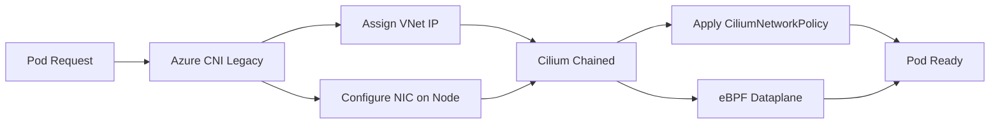

# Plan Azure CNI Legacy Chaining with Cilium

Author: [nawazdhandala](https://github.com/nawazdhandala)

Tags: Cilium, Kubernetes, AKS, Azure, eBPF

Description: Learn how to plan Cilium deployment in chained mode on top of Azure CNI (legacy) in AKS clusters, enabling advanced network policy enforcement while retaining Azure VNet IP assignment.

---

## Introduction

AKS clusters using the legacy Azure CNI plugin assign Azure VNet IP addresses directly to pods, providing native integration with Azure network security groups and route tables. While Azure CNI handles IP management well, it does not support advanced Cilium features like FQDN-based policies, L7 enforcement, or fine-grained egress controls.

Chaining Cilium on top of Azure CNI (legacy mode) lets you add these capabilities without migrating to a different IP management strategy. This is particularly useful for AKS clusters with existing VNet designs and IP allocation constraints that make a full CNI replacement difficult.

This guide covers the planning phase for Azure CNI legacy chaining, including compatibility requirements, IP planning considerations, and the Helm configuration needed to deploy the chain.

## Prerequisites

- AKS cluster with Azure CNI (legacy) configured
- Node pool OS: Ubuntu 20.04 or later
- Kubernetes 1.24+
- `az` CLI and `kubectl` configured
- `cilium` CLI installed
- Sufficient VNet IP space for pod direct assignment

## Step 1: Identify the Current Azure CNI Mode

Verify you are running Azure CNI in legacy mode, not Azure CNI Overlay.
```bash
# Get the network profile of your AKS cluster
az aks show \
  --resource-group <resource-group> \
  --name <cluster-name> \
  --query networkProfile

# Verify CNI version on nodes
kubectl describe daemonset azure-cni-networkmonitor -n kube-system
```

## Step 2: Understand the Chaining Architecture



Key constraints in Azure CNI legacy chaining:
- Cilium kube-proxy replacement is not supported in chain mode
- Each pod consumes a VNet IP - IP exhaustion risk at scale
- Azure Network Security Groups may overlap with Cilium policies

## Step 3: Pre-Flight IP Planning

Azure CNI legacy allocates VNet IPs directly, so verify sufficient address space.
```bash
# Check current IP utilization in the node subnet
az network vnet subnet show \
  --resource-group <resource-group> \
  --vnet-name <vnet-name> \
  --name <subnet-name> \
  --query "{ addressPrefix: addressPrefix, ipConfigurations: ipConfigurations | length(@) }"

# Estimate required IPs: (max_pods_per_node * node_count) + node_count
echo "Required IPs: $((30 * 10 + 10))"
```

## Step 4: Install Cilium in Azure CNI Legacy Chain Mode

Deploy Cilium configured for Azure CNI legacy chaining.
```bash
# Install Cilium in azure-cni chaining mode
helm install cilium cilium/cilium \
  --version 1.14.0 \
  --namespace kube-system \
  --set cni.chainingMode=azure-cni \
  --set cni.exclusive=false \
  --set enableIPv4Masquerade=false \
  --set azure.resourceGroup=<resource-group>
```

## Step 5: Verify Deployment

Confirm Cilium agents are running and the chain is active on all nodes.
```bash
# Check Cilium DaemonSet status
kubectl get daemonset cilium -n kube-system

# Verify Cilium status
cilium status --wait

# Run the built-in connectivity test
cilium connectivity test
```

## Best Practices

- Consider Azure CNI Overlay mode for new AKS clusters - it removes the VNet IP exhaustion problem and supports full Cilium standalone mode
- Disable Azure Network Policy Manager (azure-npm) if running Cilium for network policy enforcement
- Use Cilium's `CiliumClusterwideNetworkPolicy` to implement default-deny at cluster scope
- Monitor VNet IP utilization dashboards - Azure CNI legacy can exhaust IPs faster than expected
- Keep Cilium version aligned with the AKS Kubernetes version support matrix
- Test policy enforcement with `cilium connectivity test --test network-policies` after chain deployment

## Conclusion

Azure CNI legacy chaining with Cilium provides a pragmatic upgrade path for AKS clusters that cannot immediately migrate to overlay or standalone CNI mode. You gain Cilium's policy enforcement and eBPF observability while keeping your existing Azure VNet IP assignment intact. Plan IP space carefully, disable redundant Azure network policy tooling, and establish a long-term roadmap toward standalone Cilium for the best operational experience.
