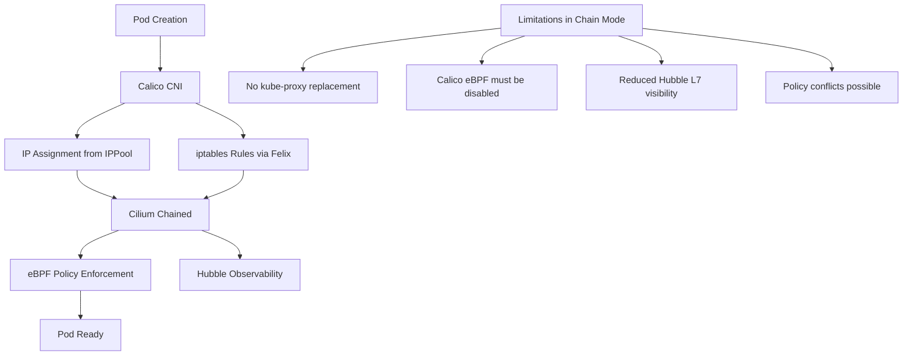

# Plan Calico Chaining with Cilium

Author: [nawazdhandala](https://github.com/nawazdhandala)

Tags: cilium, calico, kubernetes, cni-chaining, networking, migration

Description: Learn how to plan a Cilium-over-Calico CNI chaining configuration, enabling a phased migration from Calico to Cilium while maintaining network continuity. This guide covers the architecture, compatibility considerations, and step-by-step planning for Calico chaining.

---

## Introduction

Organizations running Calico often want to adopt Cilium's eBPF dataplane and enhanced observability without a disruptive, all-at-once CNI replacement. CNI chaining allows Cilium to operate alongside Calico — Calico handles IP assignment and basic routing while Cilium provides eBPF-based network policy enforcement and Hubble visibility.

This approach is most useful as a transitional architecture during migrations. Rather than replacing Calico entirely in a maintenance window, you can chain Cilium on top of Calico, validate that Cilium policies work correctly, and then incrementally remove Calico's policy components before completing the full migration to standalone Cilium.

However, Calico chaining has significant limitations compared to standalone Cilium — understanding these trade-offs is essential before committing to this architecture.

## Prerequisites

- Kubernetes 1.24+
- Calico v3.24+ installed as the primary CNI
- `calicoctl` CLI installed
- `cilium` CLI v0.15+ installed
- Node kernel 5.4+ for Cilium eBPF support

## Step 1: Audit Current Calico Configuration

Before adding Cilium to the chain, understand what Calico is currently doing.
```bash
# Review current Calico IP pools
calicoctl get ippools -o yaml

# List active network policies
calicoctl get networkpolicies --all-namespaces

# Check Calico's dataplane mode
calicoctl get felixconfiguration default -o yaml | grep -E "bpfEnabled|iptablesBackend"
```

## Step 2: Understand the Architecture Trade-offs



## Step 3: Disable Calico eBPF Before Chaining

Calico eBPF and Cilium eBPF cannot coexist. Disable Calico's eBPF dataplane first.
```yaml
# felixconfig-iptables.yaml
# Disable Calico eBPF mode — required before adding Cilium to the chain
apiVersion: projectcalico.org/v3
kind: FelixConfiguration
metadata:
  name: default
spec:
  # Revert to iptables dataplane for compatibility with Cilium chaining
  bpfEnabled: false
  iptablesBackend: Auto
```

```bash
# Apply the iptables mode configuration
calicoctl apply -f felixconfig-iptables.yaml

# Verify Calico is running in iptables mode
kubectl logs -n calico-system ds/calico-node | grep -i "bpf\|iptables"
```

## Step 4: Install Cilium in Generic Veth Chaining Mode

Deploy Cilium in a mode compatible with Calico's veth-based networking.
```bash
# Install Cilium configured for generic veth chaining (compatible with Calico)
helm install cilium cilium/cilium \
  --version 1.14.0 \
  --namespace kube-system \
  --set cni.chainingMode=generic-veth \
  --set cni.exclusive=false \
  --set enableIPv4Masquerade=false \
  --set enableIdentityMark=false
```

## Step 5: Validate the Chain

Verify both CNI plugins are running and policy enforcement is active.
```bash
# Check both Calico and Cilium DaemonSets
kubectl get daemonset -n calico-system
kubectl get daemonset cilium -n kube-system

# Run Cilium connectivity test
cilium connectivity test

# Verify a CiliumNetworkPolicy is enforced
kubectl apply -f test-cilium-policy.yaml
cilium policy get
```

## Best Practices

- Use Calico-Cilium chaining only as a transitional architecture, not a permanent solution
- Disable all Calico network policies before enabling Cilium policy enforcement to avoid conflicts
- Run `cilium monitor --type policy-verdict` to verify Cilium is making policy decisions
- Plan the full migration to standalone Cilium with a defined timeline
- Test failover behavior — what happens if Cilium agents crash while Calico is still active?
- Document which CNI plugin owns each responsibility during the transition period

## Conclusion

Calico-to-Cilium chaining is a useful migration strategy that allows phased adoption of Cilium without a hard cutover. By carefully disabling Calico eBPF, deploying Cilium in generic veth mode, and validating policy enforcement at each step, you can migrate incrementally while maintaining network stability. Commit to a timeline for completing the full migration to standalone Cilium to avoid the operational complexity of a permanent dual-CNI setup.
