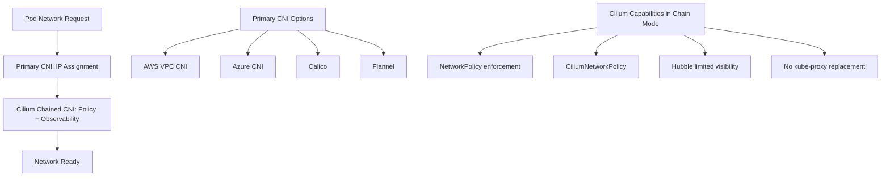

# Plan CNI Chaining with Cilium

Author: [nawazdhandala](https://github.com/nawazdhandala)

Tags: cilium, kubernetes, cni, networking, cni-chaining

Description: Learn how to plan and architect CNI chaining configurations with Cilium, understanding when chaining is appropriate, what capabilities are available in chained mode, and how to design a migration path to standalone Cilium. This guide covers the key planning considerations before deploying chained CNI configurations.

---

## Introduction

CNI chaining allows multiple CNI plugins to operate together, where each plugin in the chain handles a different aspect of pod networking. Cilium supports running as a chained CNI on top of other plugins like AWS VPC CNI, Azure CNI, or Calico, enabling you to add Cilium's network policy enforcement and observability without replacing the primary IP management plugin.

While chaining unlocks powerful capabilities for incremental Cilium adoption, it comes with architectural trade-offs. Not all Cilium features are available in chained mode — eBPF-based kube-proxy replacement, Hubble flow visibility, and bandwidth management may have limited support depending on the primary CNI. Careful planning before deployment prevents operational surprises.

This guide helps you assess your environment, understand capability constraints, and design a chaining architecture that meets your security and observability goals.

## Prerequisites

- Kubernetes 1.24+
- An existing CNI plugin in place (AWS VPC CNI, Azure CNI, Calico, or similar)
- `cilium` CLI installed
- Familiarity with your cloud provider's networking model
- Review of Cilium's chaining compatibility matrix

## Step 1: Assess Your Current CNI and Chaining Compatibility

Before planning the chain, understand what your current CNI provides and what Cilium will add.



Check the current CNI configuration:
```bash
# Identify the current CNI plugin configuration
kubectl get cm -n kube-system | grep cni

# View the current CNI configuration on a node
kubectl debug node/<node-name> -it --image=busybox -- \
  cat /etc/cni/net.d/10-*.conf
```

## Step 2: Define Your Chaining Goals

Document which Cilium capabilities you need and verify they are available in chained mode.
```bash
# Check Cilium's chaining support for your primary CNI
cilium install --help | grep chain

# Review Cilium feature compatibility for your Kubernetes version
cilium version
```

Key questions to answer before proceeding:
- Do you need eBPF-based kube-proxy replacement? (Not available in chain mode)
- Do you need full Hubble L7 visibility? (Limited in chain mode)
- Is the primary CNI cloud-managed (EKS, AKS)? (Constraints may apply)
- What is your eventual migration target — full Cilium, or permanent chaining?

## Step 3: Plan the Configuration Strategy

Design the CNI configuration chain before applying it to any nodes.
```json
{
  "name": "cilium-chain",
  "cniVersion": "0.3.1",
  "plugins": [
    {
      "type": "primary-cni-plugin",
      "comment": "Primary CNI handles IP assignment and basic routing"
    },
    {
      "type": "cilium-cni",
      "comment": "Cilium adds network policy enforcement and eBPF observability"
    }
  ]
}
```

## Step 4: Validate Prerequisites on Nodes

Verify the node kernel and system requirements before deploying the chain.
```bash
# Check kernel version — Cilium requires 4.19.57+ for basic chaining
uname -r

# Verify BPF filesystem is mounted
mount | grep bpf

# Check if required kernel modules are available
modprobe --dry-run bpf
```

## Best Practices

- Always test CNI chaining in a non-production cluster before deploying to production
- Plan a migration strategy to standalone Cilium if you need full eBPF capabilities
- Document which features are active in chained mode versus standalone mode
- Monitor Cilium agent logs closely during and after the initial chain deployment
- Use `cilium connectivity test` to validate policy enforcement after chaining is active
- Keep the primary CNI and Cilium version pinned — avoid upgrading both simultaneously

## Conclusion

Planning is the most important phase of CNI chaining deployment. Understanding the capability constraints, compatibility matrix, and operational implications before you begin ensures a smooth deployment and prevents surprises in production. Use this planning guide to build a clear architecture document before writing any configuration files.
