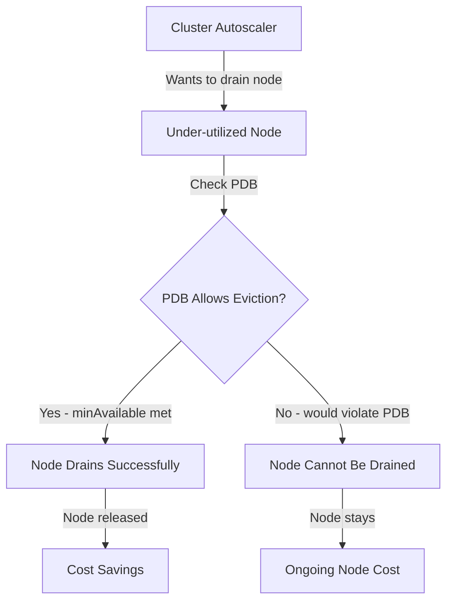

# How to Configure Pod Disruption Budgets for Cost Efficiency with Flux

Author: [nawazdhandala](https://github.com/nawazdhandala)

Tags: Flux CD, Kubernetes, GitOps, PodDisruptionBudget, Cost Management, High Availability, Node Drain, Cluster Autoscaler

Description: Use PodDisruptionBudgets managed by Flux CD to balance cost efficiency with availability, enabling safe node draining for spot instance usage and cluster autoscaler scale-downs.

---

## Introduction

PodDisruptionBudgets (PDBs) are a Kubernetes mechanism that limits how many pods of a deployment can be simultaneously unavailable during voluntary disruptions — node drains, cluster upgrades, and Cluster Autoscaler scale-downs. Without PDBs, voluntary disruptions can take down more pods than your application can tolerate. With overly strict PDBs, Cluster Autoscaler cannot efficiently consolidate workloads onto fewer nodes, costing you money on idle capacity.

Getting PDB configuration right is essential for both availability and cost. A PDB that allows Cluster Autoscaler to drain nodes efficiently enables better bin-packing, reduced node count, and significant compute savings. Combined with spot instance usage, well-configured PDBs are a critical component of a cost-efficient Kubernetes platform.

Flux CD lets you manage PDBs as code alongside the workloads they protect, ensuring every service has appropriate disruption tolerance defined and reviewed before it reaches production.

## Prerequisites

- A Kubernetes cluster with Flux CD bootstrapped
- Cluster Autoscaler deployed and configured
- kubectl with cluster-admin access
- A Git repository containing your workload definitions
- Basic understanding of Kubernetes availability concepts

## Step 1: Understand PDB Impact on Cost

Before creating PDBs, understand how they interact with cost-optimization mechanisms.



A PDB with `minAvailable: "100%"` effectively blocks all node drains, preventing Cluster Autoscaler from reclaiming any nodes. This is a common misconfiguration that destroys cost efficiency.

## Step 2: Define PDBs Appropriate to Workload Criticality

Create PDB templates based on service tier and criticality.

```yaml
# apps/web-api/pdb.yaml
# High-traffic stateless service - allow 25% disruption
apiVersion: policy/v1
kind: PodDisruptionBudget
metadata:
  name: web-api-pdb
  namespace: backend
  labels:
    app: web-api
    pdb-tier: standard
spec:
  # Keep at least 75% of pods available
  # With 4 replicas, this allows 1 pod to be evicted at a time
  minAvailable: "75%"
  selector:
    matchLabels:
      app: web-api
```

```yaml
# apps/critical-service/pdb.yaml
# Critical service - stricter but still allows drains with enough replicas
apiVersion: policy/v1
kind: PodDisruptionBudget
metadata:
  name: critical-service-pdb
  namespace: backend
  labels:
    pdb-tier: critical
spec:
  # Always keep at least 2 pods running
  # Requires at least 3 replicas for any drain to succeed
  minAvailable: 2
  selector:
    matchLabels:
      app: critical-service
```

```yaml
# apps/batch-worker/pdb.yaml
# Batch workers - very tolerant, prioritize cost over availability
apiVersion: policy/v1
kind: PodDisruptionBudget
metadata:
  name: batch-worker-pdb
  namespace: workers
  labels:
    pdb-tier: batch
spec:
  # Only guarantee 1 worker stays up during disruptions
  # Allows aggressive node consolidation
  minAvailable: 1
  selector:
    matchLabels:
      app: batch-worker
```

## Step 3: Use maxUnavailable for Rolling Deployments

`maxUnavailable` complements `minAvailable` and is better for services where a known number of pods can be disrupted simultaneously.

```yaml
# apps/cache-service/pdb.yaml
apiVersion: policy/v1
kind: PodDisruptionBudget
metadata:
  name: cache-service-pdb
  namespace: backend
spec:
  # Allow at most 1 pod to be disrupted at a time
  # Better for small replica counts where percentages don't work well
  maxUnavailable: 1
  selector:
    matchLabels:
      app: cache-service
```

## Step 4: Apply PDBs with Flux Kustomization

Manage all PDBs through Flux to ensure they are always in sync with their workloads.

```yaml
# clusters/production/apps-kustomization.yaml
apiVersion: kustomize.toolkit.fluxcd.io/v1
kind: Kustomization
metadata:
  name: backend-apps
  namespace: flux-system
spec:
  interval: 10m
  path: ./apps/backend
  prune: true
  sourceRef:
    kind: GitRepository
    name: flux-system
  # Include PDB validation in health checks
  healthChecks:
    - apiVersion: apps/v1
      kind: Deployment
      name: web-api
      namespace: backend
    - apiVersion: policy/v1
      kind: PodDisruptionBudget
      name: web-api-pdb
      namespace: backend
```

## Step 5: Validate PDB Effectiveness

Test that your PDBs allow Cluster Autoscaler to drain nodes while preventing unacceptable disruption.

```bash
# List all PDBs and their current status
kubectl get pdb -A

# Check if any PDBs are blocking evictions (DISRUPTIONS ALLOWED should be > 0)
kubectl get pdb -A -o wide

# Simulate a node drain to test PDB behavior (dry run)
kubectl drain <node-name> --ignore-daemonsets --delete-emptydir-data --dry-run

# Check PDB status for a specific workload
kubectl describe pdb web-api-pdb -n backend

# Verify Cluster Autoscaler can scale down
kubectl get events -n kube-system | grep "ScaleDown\|node-group"

# Check Flux reconciliation status
flux get kustomization backend-apps
```

## Step 6: Audit PDB Configuration Regularly

Create a CronJob to audit PDB configurations and alert on problematic settings.

```yaml
# infrastructure/monitoring/pdb-audit-cronjob.yaml
apiVersion: batch/v1
kind: CronJob
metadata:
  name: pdb-audit
  namespace: monitoring
spec:
  schedule: "0 9 * * 1"  # Every Monday at 9 AM
  jobTemplate:
    spec:
      template:
        spec:
          restartPolicy: OnFailure
          serviceAccountName: pdb-auditor
          containers:
            - name: auditor
              image: bitnami/kubectl:1.29
              command:
                - /bin/bash
                - -c
                - |
                  echo "=== PDB Audit Report ==="
                  echo "Date: $(date)"
                  echo ""
                  echo "=== PDBs with 0 allowed disruptions ==="
                  kubectl get pdb -A -o json | \
                    jq -r '.items[] | select(.status.disruptionsAllowed == 0) |
                      "\(.metadata.namespace)/\(.metadata.name): minAvailable=\(.spec.minAvailable // "N/A")"'
                  echo ""
                  echo "=== PDBs with minAvailable=100% (blocking all drains) ==="
                  kubectl get pdb -A -o json | \
                    jq -r '.items[] | select(.spec.minAvailable == "100%") |
                      "WARNING: \(.metadata.namespace)/\(.metadata.name) blocks all node drains"'
              resources:
                requests:
                  cpu: 50m
                  memory: 64Mi
                limits:
                  cpu: 200m
                  memory: 128Mi
```

## Best Practices

- Never set `minAvailable: "100%"` on services with only one replica — this makes the pod completely undrainable and blocks all Cluster Autoscaler scale-downs on the hosting node.
- For single-replica services that must not be disrupted, accept that they will block node drains; use this sparingly and only for truly critical, irreplaceable services.
- Scale up replicas to at least 3 before setting `minAvailable: 2`; a 2-replica service with `minAvailable: 2` behaves like `100%` and blocks all drains.
- Test PDB behavior during cluster upgrades — this is when strict PDBs most commonly cause prolonged upgrade windows and increased costs.
- Review PDB configurations whenever you change replica counts; a PDB that was appropriate for 10 replicas may be too strict or too loose for 3.
- Use `maxUnavailable` instead of `minAvailable` for small replica counts where percentage-based values round unexpectedly.

## Conclusion

Pod Disruption Budgets are the bridge between high availability and cost efficiency in Kubernetes. Managed through Flux CD, they become part of your GitOps workflow — reviewed in pull requests, applied consistently, and audited programmatically. The right PDB configuration allows Cluster Autoscaler to aggressively consolidate workloads and drain underutilized nodes, turning idle compute into realized savings without compromising the availability your users depend on.
