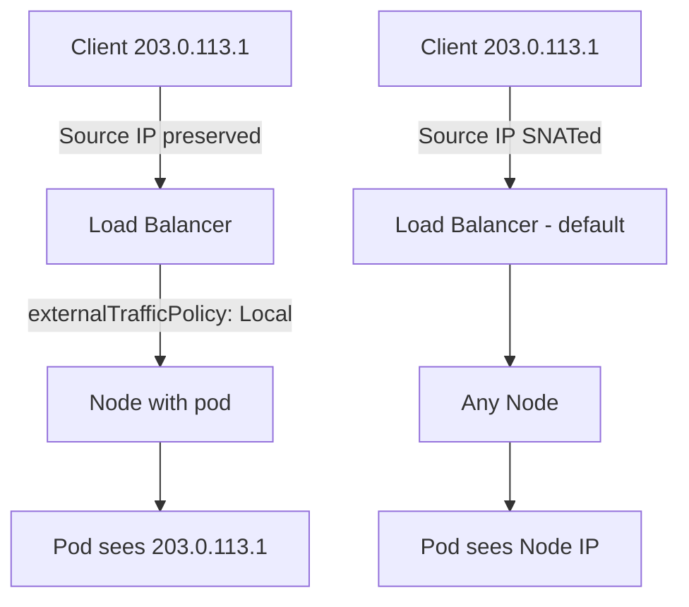

# How to Preserve Client Source IP with the Cilium Gateway API

Author: [nawazdhandala](https://github.com/nawazdhandala)

Tags: Cilium, Kubernetes, Gateway API, Source IP, Networking

Description: Configure Cilium Gateway API to preserve the original client source IP address in ingress traffic using externalTrafficPolicy and X-Forwarded-For headers.

---

## Introduction

Preserving client source IP is critical for applications that need to make access control decisions, rate limit by IP, log accurate client information, or comply with audit requirements. By default, Kubernetes load balancers may SNAT source IPs as traffic crosses nodes.

Cilium's Gateway API implementation provides two mechanisms for source IP preservation: `externalTrafficPolicy: Local` on the underlying Service, and application-level forwarding via the `X-Forwarded-For` header. Each has different tradeoffs in terms of traffic distribution and load balancer behavior.

## Prerequisites

- Cilium with Gateway API enabled
- A Gateway with an external IP
- HTTP backend that logs request headers

## Method 1: externalTrafficPolicy Local

Set the load balancer service policy to Local to bypass SNAT:

```yaml
apiVersion: gateway.networking.k8s.io/v1
kind: Gateway
metadata:
  name: cilium-gateway
  namespace: default
  annotations:
    service.beta.kubernetes.io/aws-load-balancer-type: "external"
spec:
  gatewayClassName: cilium
  listeners:
    - name: http
      protocol: HTTP
      port: 80
```

Annotate or configure `externalTrafficPolicy: Local` on the created LoadBalancer service:

```bash
kubectl patch svc -n default $(kubectl get svc -n default -l cilium.io/gateway-name=cilium-gateway -o name) \
  -p '{"spec":{"externalTrafficPolicy":"Local"}}'
```

## Architecture



## Verify Source IP in Pod

```bash
kubectl run debug --image=nginx --port=80
# Check access logs
kubectl logs <nginx-pod> | grep "client_ip\|remote_addr"
```

## Method 2: X-Forwarded-For Header

For HTTP routes, add a header filter to inject the source IP:

```yaml
spec:
  rules:
    - filters:
        - type: RequestHeaderModifier
          requestHeaderModifier:
            add:
              - name: X-Real-IP
                value: "%{client_ip}s"
    - backendRefs:
        - name: my-app
          port: 8080
```

## Tradeoffs

| Method | Pros | Cons |
|--------|------|------|
| externalTrafficPolicy: Local | True source IP, no SNAT | Uneven load distribution |
| X-Forwarded-For | Even distribution | Application must trust header |

## Test Source IP Visibility

```bash
GATEWAY_IP=$(kubectl get gateway cilium-gateway \
  -o jsonpath='{.status.addresses[0].value}')
curl -v http://${GATEWAY_IP}/ 2>&1 | grep "client\|X-Real-IP"
```

## Conclusion

Preserving client source IP with Cilium Gateway API requires choosing between `externalTrafficPolicy: Local` for true source IP visibility or header-based forwarding for even load distribution. The right choice depends on whether your application can handle uneven traffic distribution or needs header-based IP identification.
