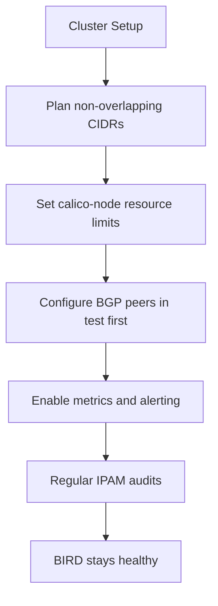

# How to Prevent BIRD Not Ready Errors in Calico

Author: [nawazdhandala](https://github.com/nawazdhandala)

Tags: Calico, Kubernetes, Networking, Troubleshooting

Description: Proactive configuration practices and resource management strategies that prevent BIRD not ready errors from occurring in Calico deployments.

---

## Introduction

Preventing BIRD not-ready errors in Calico is far less disruptive than responding to them during an incident. BIRD, the BGP daemon inside each calico-node pod, is sensitive to configuration drift, resource pressure, and networking mismatches. Most recurring BIRD failures share a common thread: the cluster was modified without validating the impact on BGP routing.

Prevention starts at cluster provisioning. Choosing non-overlapping CIDRs, setting realistic resource limits, and enabling health checks from the start eliminates the majority of BIRD failures before they happen. Ongoing prevention involves change-management practices like validating BGP peer configuration in staging and auditing IP pool utilization before scaling.

This guide covers preventative measures across the full lifecycle: initial setup, day-two operations, and cluster upgrades. Implementing even a subset of these practices significantly reduces the frequency of BIRD not-ready events.

## Symptoms

- Recurring BIRD not-ready events after node additions or IP pool changes
- BGP peers repeatedly cycling between `Established` and `Idle`
- calico-node pods OOMKilled during cluster scaling events

## Root Causes

- CIDR planning done without accounting for future node subnets
- Resource limits on calico-node set too low for the cluster size
- BGP peer configuration not validated after AS number or peer IP changes
- No alerting on calico-node readiness, allowing failures to go unnoticed

## Diagnosis Steps

```bash
# Audit current IP pool CIDRs for overlaps with node subnets
calicoctl get ippool -o yaml

# Check node subnet allocations
kubectl get nodes -o jsonpath='{range .items[*]}{.metadata.name}{"\t"}{.spec.podCIDR}{"\n"}{end}'

# Verify calico-node resource usage
kubectl top pods -n kube-system -l k8s-app=calico-node
```

## Solution

**Prevention 1: Plan non-overlapping CIDRs at install time**

Reserve distinct address space for pods, nodes, and services. Document this in a network design record before cluster creation.

```bash
# Example safe allocation
# Node subnet:    10.0.0.0/16
# Pod CIDR:       192.168.0.0/16
# Service CIDR:   10.96.0.0/12
```

**Prevention 2: Set resource limits based on cluster scale**

```yaml
# In calico-node DaemonSet
resources:
  requests:
    cpu: 250m
    memory: 256Mi
  limits:
    cpu: 500m
    memory: 512Mi
```

Scale limits upward for clusters with more than 50 nodes or dense BGP peer configurations.

**Prevention 3: Use node-to-node mesh for small clusters; configure explicit peers for large ones**

```bash
# For clusters > 100 nodes, disable mesh and use route reflectors
calicoctl patch bgpconfiguration default \
  --patch='{"spec": {"nodeToNodeMeshEnabled": false}}'
```

**Prevention 4: Validate BGP peer config in a test environment before production**

```bash
# Test peer connectivity before applying to production
calicoctl apply -f bgppeer-staging.yaml
calicoctl node status | grep -A 5 "BGP peer"
```

**Prevention 5: Enable Kubernetes liveness alerts on calico-node**

```yaml
# PodMonitor for Prometheus
apiVersion: monitoring.coreos.com/v1
kind: PodMonitor
metadata:
  name: calico-node
  namespace: kube-system
spec:
  selector:
    matchLabels:
      k8s-app: calico-node
  podMetricsEndpoints:
  - port: metrics
    interval: 30s
```



## Prevention

- Run `calicoctl ipam check` as a recurring CronJob to detect block fragmentation
- Use GitOps to version-control all Calico CRDs; review changes before merge
- Conduct capacity reviews before scaling node count significantly

## Conclusion

Preventing BIRD not-ready errors requires deliberate CIDR planning, appropriate resource allocation, and continuous visibility into BGP peer state. Investing in these practices at cluster inception pays dividends throughout the cluster lifecycle, eliminating a class of hard-to-diagnose networking incidents.
