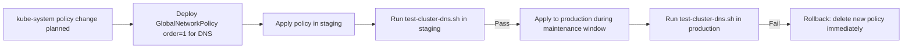

# How to Prevent Calico from Blocking kube-dns

Author: [nawazdhandala](https://github.com/nawazdhandala)

Tags: Calico, Kubernetes, Networking, Troubleshooting

Description: Protective policies and change management practices that prevent Calico from blocking kube-dns pod traffic and disrupting cluster-wide DNS resolution.

---

## Introduction

Preventing Calico from blocking kube-dns requires treating CoreDNS as protected infrastructure that must always be reachable. The primary mechanism is a high-priority GlobalNetworkPolicy that explicitly allows UDP/TCP 53 ingress to CoreDNS pods before any other policy is evaluated.

Additionally, applying any policy changes to the kube-system namespace requires a post-change DNS test from multiple namespaces, since kube-system policy changes have cluster-wide DNS impact.

## Symptoms

- kube-system policy changes frequently breaking DNS
- No standard review process for kube-system policy changes

## Root Causes

- kube-system treated like a regular namespace for policy management
- No DNS regression test run after kube-system policy changes

## Diagnosis Steps

```bash
# Verify current kube-system policies
kubectl get networkpolicy -n kube-system
calicoctl get globalnetworkpolicy | grep kube-dns
```

## Solution

**Prevention 1: Immutable DNS allow GlobalNetworkPolicy**

```yaml
apiVersion: projectcalico.org/v3
kind: GlobalNetworkPolicy
metadata:
  name: immutable-allow-kube-dns
  annotations:
    policy.kubernetes.io/description: "DO NOT DELETE: Protects kube-dns from being blocked"
spec:
  order: 1  # Absolute highest priority
  selector: k8s-app == 'kube-dns'
  types:
  - Ingress
  ingress:
  - action: Allow
    protocol: UDP
    destination:
      ports: [53]
  - action: Allow
    protocol: TCP
    destination:
      ports: [53]
  - action: Allow  # Allow CoreDNS health check port
    protocol: TCP
    destination:
      ports: [8080, 8181]
```

**Prevention 2: kube-system policy change process**

Before applying ANY policy to kube-system:
1. Test in staging cluster first
2. Apply during maintenance window
3. Run DNS test from all namespaces immediately after
4. Have rollback procedure ready (delete the new policy)

**Prevention 3: Post-change DNS test script**

```bash
#!/bin/bash
# test-cluster-dns.sh - run after any kube-system policy change
echo "Testing DNS from all namespaces..."
FAILED=0
for NS in $(kubectl get namespaces -o jsonpath='{.items[*].metadata.name}'); do
  RESULT=$(kubectl run dns-test-$RANDOM --image=busybox -n $NS \
    --restart=Never --rm -i --timeout=10s \
    -- nslookup kubernetes.default 2>&1)
  if echo "$RESULT" | grep -q "Address"; then
    echo "PASS: $NS"
  else
    echo "FAIL: $NS"
    FAILED=1
  fi
done
exit $FAILED
```



## Prevention

- Store `immutable-allow-kube-dns` GlobalNetworkPolicy in GitOps and protect it from deletion
- Require DNS regression test approval in kube-system policy change PRs
- Set up cluster-wide DNS monitoring as a primary SLI

## Conclusion

Preventing Calico from blocking kube-dns requires an order-1 GlobalNetworkPolicy protecting CoreDNS traffic plus a strict change management process for kube-system policies. The GlobalNetworkPolicy acts as a cluster-wide safety net that cannot be overridden by other policies.
