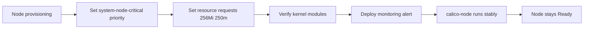

# How to Prevent Calico Node Not Ready Status

Author: [nawazdhandala](https://github.com/nawazdhandala)

Tags: Calico, Kubernetes, Networking, Troubleshooting

Description: Proactive measures to prevent Kubernetes node NotReady status caused by Calico including resource management, kernel preparation, and monitoring setup.

---

## Introduction

Preventing node NotReady status from Calico failures requires ensuring the calico-node pod always has the resources it needs to run, that node prerequisites are in place, and that early warning monitoring detects calico-node health degradation before it escalates to node NotReady.

The most impactful preventive measure is setting appropriate resource requests and limits on the calico-node DaemonSet. Without resource requests, calico-node can be evicted during node pressure events — and an evicted calico-node means a NotReady node.

## Symptoms

- calico-node evicted during high-memory events, causing node NotReady
- Nodes become NotReady after adding new workloads that consume available memory
- calico-node pod not scheduled due to resource constraints after node pressure

## Root Causes

- No resource requests on calico-node DaemonSet
- Node resource pressure causing calico-node eviction
- Missing kernel modules causing repeated calico-node failures

## Diagnosis Steps

```bash
# Check current calico-node resource configuration
kubectl get daemonset calico-node -n kube-system \
  -o jsonpath='{.spec.template.spec.containers[0].resources}'
```

## Solution

**Prevention 1: Set appropriate resource requests and limits**

```bash
kubectl patch daemonset calico-node -n kube-system --type=json \
  -p='[{
    "op": "replace",
    "path": "/spec/template/spec/containers/0/resources",
    "value": {
      "requests": {"cpu": "250m", "memory": "256Mi"},
      "limits": {"cpu": "1000m", "memory": "512Mi"}
    }
  }]'
```

**Prevention 2: Set priorityClassName to prevent eviction**

```bash
kubectl patch daemonset calico-node -n kube-system --type=json \
  -p='[{"op":"add","path":"/spec/template/spec/priorityClassName","value":"system-node-critical"}]'
```

The `system-node-critical` priority class ensures calico-node is the last pod evicted under resource pressure.

**Prevention 3: Node pre-flight kernel checks**

```bash
# DaemonSet to verify kernel modules before calico-node starts
# (see CrashLoopBackOff Prevention post for full DaemonSet YAML)
```

**Prevention 4: Alert on calico-node readiness before node goes NotReady**

```yaml
apiVersion: monitoring.coreos.com/v1
kind: PrometheusRule
metadata:
  name: calico-node-readiness-alerts
  namespace: kube-system
spec:
  groups:
  - name: calico.node
    rules:
    - alert: CalicoNodeNotReady
      expr: |
        kube_pod_status_ready{namespace="kube-system",container="calico-node"} == 0
      for: 3m
      labels:
        severity: critical
      annotations:
        summary: "calico-node not ready on {{ $labels.pod }}"
        description: "calico-node pod {{ $labels.pod }} has been not ready for 3 minutes"
```



## Prevention

- Include `system-node-critical` priorityClass in the Calico DaemonSet from installation
- Monitor node resource utilization and ensure calico-node resources are reserved
- Verify kernel module readiness as part of node acceptance testing

## Conclusion

Preventing Calico-induced node NotReady status requires setting `system-node-critical` priority on calico-node to prevent eviction, configuring appropriate resource requests, and alerting on calico-node readiness degradation before it propagates to node NotReady status.
