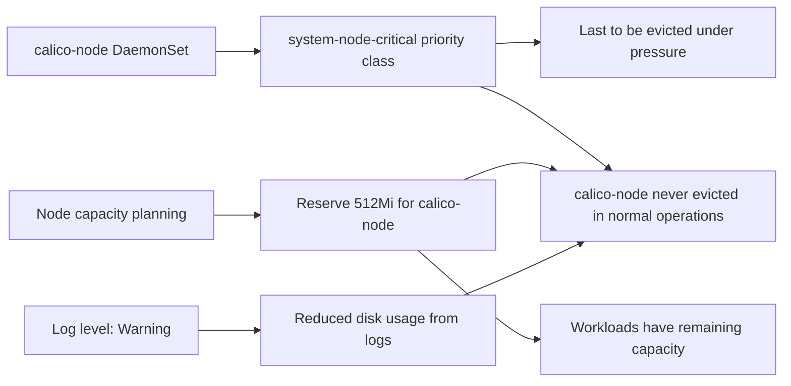

# How to Prevent Calico Node Pod Eviction

Author: [nawazdhandala](https://github.com/nawazdhandala)

Tags: Calico, Kubernetes, Networking, Troubleshooting

Description: Prevent calico-node pod eviction with priority class configuration, resource management, and node capacity planning.

---

## Introduction

Preventing calico-node eviction is primarily about ensuring the pod has the `system-node-critical` priority class and appropriate resource configuration. The priority class ensures Kubernetes treats calico-node as essential infrastructure that should only be evicted as an absolute last resort - and even then, only after all user workloads have been evicted first.

## Symptoms

- calico-node repeatedly evicted during node resource pressure events
- Calico networking disrupted during application scaling events

## Root Causes

- calico-node lacks system-node-critical priority class
- Node capacity not accounted for calico-node's resource requirements

## Diagnosis Steps

```bash
kubectl get daemonset calico-node -n kube-system \
  -o jsonpath='{.spec.template.spec.priorityClassName}'
# Expected: system-node-critical
```

## Solution

**Prevention 1: Apply system-node-critical priority class**

```yaml
# Include in your calico-node DaemonSet patch or initial manifest
apiVersion: apps/v1
kind: DaemonSet
metadata:
  name: calico-node
  namespace: kube-system
spec:
  template:
    spec:
      priorityClassName: system-node-critical  # Critical line
      containers:
      - name: calico-node
        resources:
          requests:
            cpu: 250m
            memory: 256Mi
          limits:
            cpu: 1000m
            memory: 512Mi
```

**Prevention 2: Node capacity planning for calico-node**

```bash
# Ensure nodes have enough capacity for calico-node PLUS workloads
# Minimum node memory: workload memory + 512Mi for calico-node + system overhead
# Example: for 4 replicas needing 2Gi each: 8Gi + 0.5Gi + 1Gi = ~10Gi node
```

**Prevention 3: Set eviction threshold higher for calico-node namespace**

```bash
# Configure kubelet to use higher eviction thresholds for system pods
# In kubelet config:
# evictionHard:
#   memory.available: "200Mi"
#   nodefs.available: "10%"
# evictionSoft:
#   memory.available: "500Mi"
```

**Prevention 4: Reduce calico-node log verbosity proactively**

```bash
kubectl patch felixconfiguration default \
  --type merge \
  --patch '{"spec":{"logSeverityScreen":"Warning"}}'
```



## Prevention

- Apply system-node-critical priority class before any production workloads are deployed
- Account for calico-node resource requirements in node sizing decisions
- Set Warning log level in FelixConfiguration to reduce log volume

## Conclusion

Preventing calico-node eviction is primarily accomplished by setting the `system-node-critical` priority class. This single change ensures calico-node is treated as essential infrastructure. Supplement with appropriate resource limits and reduced log verbosity to minimize calico-node's resource footprint.
