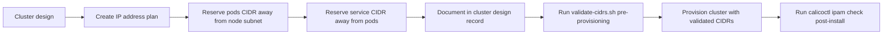

# How to Prevent Calico Pod CIDR Conflicts

Author: [nawazdhandala](https://github.com/nawazdhandala)

Tags: Calico, Kubernetes, Networking, Troubleshooting

Description: Network address planning practices that prevent pod CIDR conflicts in Calico deployments by establishing clear address space separation at cluster design time.

---

## Introduction

Preventing pod CIDR conflicts in Calico is fundamentally an address planning problem. Conflicts are completely avoidable with deliberate address space allocation at cluster design time. The investment of 30 minutes in CIDR planning before cluster creation saves days of troubleshooting and production disruption later.

The key principle is address space separation: pod CIDR, node subnet, and service CIDR should use completely non-overlapping address ranges with enough space to grow. Choose ranges that do not overlap with corporate network ranges, cloud VPC subnets, or other clusters that may eventually be connected via VPN or peering.

## Symptoms

- CIDR conflicts discovered during cluster expansion when new nodes are in a different subnet
- Conflicts when connecting clusters across regions via VPC peering

## Root Causes

- No IP address plan created before cluster provisioning
- Default CIDRs used without checking for overlap with existing infrastructure
- Multiple clusters using the same default pod CIDR (192.168.0.0/16)

## Diagnosis Steps

```bash
# Pre-provisioning CIDR audit
# List existing subnets in your infrastructure
# Compare against planned pod, node, and service CIDRs
```

## Solution

**Prevention 1: Standard CIDR allocation plan**

```
# Example multi-cluster CIDR plan
# Cluster 1 (Production):
#   Node subnet:    10.10.0.0/16
#   Pod CIDR:       10.200.0.0/16
#   Service CIDR:   10.100.0.0/16
#
# Cluster 2 (Staging):
#   Node subnet:    10.20.0.0/16
#   Pod CIDR:       10.210.0.0/16
#   Service CIDR:   10.110.0.0/16
#
# Corporate network:  172.16.0.0/12
# VPN range:         192.168.1.0/24
```

**Prevention 2: Pre-provisioning validation script**

```bash
#!/bin/bash
# validate-cidrs.sh

POD_CIDR=$1      # e.g., 10.200.0.0/16
NODE_CIDR=$2     # e.g., 10.10.0.0/16
SVC_CIDR=$3      # e.g., 10.100.0.0/16

echo "Validating CIDRs: pods=$POD_CIDR nodes=$NODE_CIDR services=$SVC_CIDR"

# Check for obvious overlap (simplified check)
POD_FIRST=$(echo $POD_CIDR | cut -d. -f1-2)
NODE_FIRST=$(echo $NODE_CIDR | cut -d. -f1-2)
SVC_FIRST=$(echo $SVC_CIDR | cut -d. -f1-2)

if [ "$POD_FIRST" = "$NODE_FIRST" ] || [ "$POD_FIRST" = "$SVC_FIRST" ] || \
   [ "$NODE_FIRST" = "$SVC_FIRST" ]; then
  echo "ERROR: CIDR ranges overlap! Review your address plan."
  exit 1
fi

echo "PASS: CIDRs appear non-overlapping (verify with full subnet calculator)"
```

**Prevention 3: Run calicoctl check after IP pool creation**

```bash
# After creating IP pools, immediately run IPAM check
calicoctl ipam check

# Also verify no routes conflict
ip route show | sort | head -30
```

**Prevention 4: Label nodes with subnet information**

```bash
# Document the node subnet in node labels for easy reference
kubectl label node <node-name> network.example.com/subnet=10.10.0.0/16
```



## Prevention

- Create an IP address management (IPAM) spreadsheet for all clusters before provisioning
- Use a different pod CIDR per cluster to avoid conflicts when clusters are connected
- Document chosen CIDRs in cluster metadata and review them before scaling

## Conclusion

Preventing Calico CIDR conflicts requires creating an explicit IP address plan before cluster provisioning. Use distinct, non-overlapping CIDRs for pods, nodes, and services, and reserve enough space for future growth. A 30-minute CIDR planning exercise prevents days of troubleshooting.
