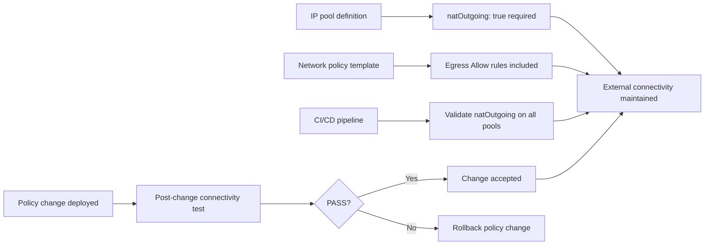

# How to Prevent Calico Pods from Losing External Service Connectivity

Author: [nawazdhandala](https://github.com/nawazdhandala)

Tags: Calico, Kubernetes, Networking, Troubleshooting, External Services

Description: Prevent pods from losing access to external services by setting natOutgoing on all IP pools, structuring network policies with explicit egress rules, and testing connectivity after policy changes.

---

## Introduction

Preventing pods from losing external service connectivity in Calico requires establishing safe defaults and enforcing them through infrastructure-as-code practices. The two most common causes of external connectivity loss - disabled natOutgoing and missing egress rules in network policies - are both preventable through configuration standards and automated validation.

Setting `natOutgoing: true` as a required field in all IP pool manifests eliminates the most common cause. For network policies, a structured approach where every default-deny policy includes an explicit egress allowlist prevents implicit blocks from cutting off external connectivity silently.

## Symptoms

- External connectivity lost after network policy changes
- New pods unable to reach external services from day one

## Root Causes

- IP pool templates missing natOutgoing field (defaults to false)
- Network policies applied without egress rules reviewed
- No automated connectivity tests after policy changes

## Solution

**Prevention 1: Enforce natOutgoing in all IP pool definitions**

```yaml
# Standard IP pool template with natOutgoing explicitly set
apiVersion: projectcalico.org/v3
kind: IPPool
metadata:
  name: default-ipv4-ippool
spec:
  cidr: 192.168.0.0/16
  ipipMode: CrossSubnet
  natOutgoing: true   # REQUIRED: always include this explicitly
  nodeSelector: all()
```

**Prevention 2: Always include egress rules in default-deny policies**

```yaml
# Safe default-deny policy template that includes external egress
apiVersion: projectcalico.org/v3
kind: GlobalNetworkPolicy
metadata:
  name: default-deny-with-egress
spec:
  order: 9999
  selector: all()
  types:
  - Ingress
  - Egress
  egress:
  # Always allow DNS
  - action: Allow
    protocol: UDP
    destination:
      ports: [53]
  - action: Allow
    protocol: TCP
    destination:
      ports: [53]
  # Allow external HTTPS/HTTP
  - action: Allow
    protocol: TCP
    destination:
      notNets:
      - 10.0.0.0/8
      - 172.16.0.0/12
      - 192.168.0.0/16
      ports: [80, 443]
```

**Prevention 3: Validate natOutgoing in CI/CD**

```bash
#!/bin/bash
# validate-calico-config.sh - run in CI before applying changes
POOLS=$(calicoctl get ippool -o yaml)
MISSING_NAT=$(echo "$POOLS" | python3 -c "
import sys, yaml
pools = yaml.safe_load(sys.stdin)
for item in pools.get('items', []):
  name = item['metadata']['name']
  nat = item.get('spec', {}).get('natOutgoing', False)
  if not nat:
    print(f'FAIL: IP pool {name} has natOutgoing: false')
")

if [ -n "$MISSING_NAT" ]; then
  echo "$MISSING_NAT"
  exit 1
fi
echo "PASS: All IP pools have natOutgoing enabled"
```

**Prevention 4: Test external connectivity after every policy change**

```bash
# Post-policy-change test script
kubectl run post-change-test --image=busybox --restart=Never -- sh -c \
  "wget -qO- --timeout=10 http://1.1.1.1 && echo DNS_OK && nslookup google.com | grep -q Address && echo PASS"

kubectl wait pod post-change-test --for=condition=Ready --timeout=30s
kubectl logs post-change-test
kubectl delete pod post-change-test
```

**Prevention 5: Deploy a persistent external connectivity probe**

```bash
# Deploy a CronJob that continuously validates external connectivity
cat <<'EOF' | kubectl apply -f -
apiVersion: batch/v1
kind: CronJob
metadata:
  name: external-connectivity-check
  namespace: monitoring
spec:
  schedule: "*/5 * * * *"
  jobTemplate:
    spec:
      template:
        spec:
          restartPolicy: Never
          containers:
          - name: check
            image: busybox
            command: ["sh", "-c"]
            args:
            - |
              wget -qO- --timeout=10 http://1.1.1.1 > /dev/null && echo "PASS" || echo "FAIL: external connectivity lost"
EOF
```



## Prevention

- Store IP pool and GlobalNetworkPolicy manifests in version control with required fields documented
- Add external connectivity tests as a required gate in the CI/CD pipeline
- Run the persistent connectivity CronJob and alert on FAIL output

## Conclusion

Preventing external connectivity failures in Calico requires explicit `natOutgoing: true` in all IP pool definitions, egress Allow rules in every default-deny policy, and automated post-change connectivity tests. These three controls together eliminate the most common causes of pods losing external service access.
