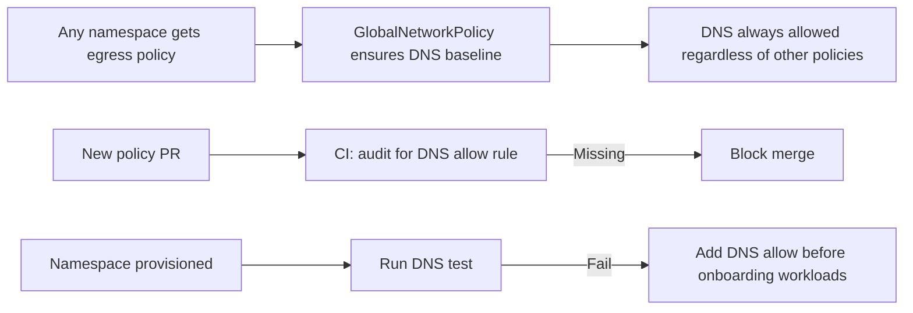

# How to Prevent Calico Policy from Blocking DNS

Author: [nawazdhandala](https://github.com/nawazdhandala)

Tags: Calico, Kubernetes, Networking, Troubleshooting

Description: Policy design practices that ensure DNS always works when Calico default-deny egress policies are in effect, including baseline allow patterns.

---

## Introduction

Preventing Calico policies from blocking DNS requires making UDP/TCP port 53 to kube-system an untouchable baseline in every egress policy deployment. DNS is so fundamental that blocking it is almost never intentional - it is always an omission error. Making DNS allow a required element of any default-deny policy template prevents this omission.

## Symptoms

- DNS failures each time a new namespace gets default-deny egress policies
- DNS works in staging but fails in production (different policy templates used)

## Root Causes

- Namespace policy template omits DNS allow
- Different teams using different policy templates without DNS as a required element

## Diagnosis Steps

```bash
# Audit all namespaces for missing DNS allow
for NS in $(kubectl get namespaces -o jsonpath='{.items[*].metadata.name}'); do
  HAS_POLICY=$(kubectl get networkpolicy -n $NS --no-headers 2>/dev/null | wc -l)
  HAS_DNS=$(kubectl get networkpolicy -n $NS -o yaml 2>/dev/null | grep -c "port: 53" || true)
  if [ "$HAS_POLICY" -gt 0 ] && [ "$HAS_DNS" -eq 0 ]; then
    echo "WARNING: $NS has policies but no DNS allow rule"
  fi
done
```

## Solution

**Prevention 1: GlobalNetworkPolicy DNS baseline**

```yaml
apiVersion: projectcalico.org/v3
kind: GlobalNetworkPolicy
metadata:
  name: allow-dns-baseline
spec:
  order: 5  # Very high priority
  selector: all()
  types:
  - Egress
  egress:
  - action: Allow
    protocol: UDP
    destination:
      ports: [53]
  - action: Allow
    protocol: TCP
    destination:
      ports: [53]
```

**Prevention 2: Audit script in CI/CD**

```bash
#!/bin/bash
# Check all NetworkPolicy manifests in the repo for DNS allow
POLICY_FILES=$(find . -name "*.yaml" -exec grep -l "NetworkPolicy" {} \;)
MISSING_DNS=0
for FILE in $POLICY_FILES; do
  if grep -q "policyTypes" $FILE; then
    if ! grep -q "port: 53" $FILE; then
      echo "WARNING: $FILE has NetworkPolicy without DNS allow"
      MISSING_DNS=1
    fi
  fi
done
exit $MISSING_DNS
```

**Prevention 3: Namespace provisioning DNS test**

```bash
# Always test DNS after creating a namespace with policies
NS=$1
kubectl run dns-test --image=busybox -n $NS --restart=Never --rm -i \
  --timeout=15s -- nslookup kubernetes.default \
  && echo "DNS OK in $NS" || echo "FAIL: DNS blocked in $NS"
```



## Prevention

- Deploy the `allow-dns-baseline` GlobalNetworkPolicy as permanent cluster infrastructure
- Add DNS allow audit to CI/CD for all NetworkPolicy file changes
- Test DNS resolution as the first step of namespace onboarding

## Conclusion

The most effective prevention for Calico policy DNS blocking is a cluster-wide GlobalNetworkPolicy with order 5 that allows DNS before any other policy is evaluated. This acts as a safety net that makes DNS failures impossible through normal policy operations.
