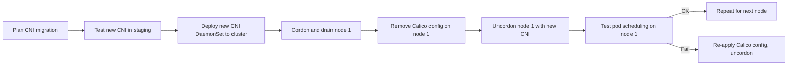

# How to Prevent ContainerCreating After Uninstalling Calico

Author: [nawazdhandala](https://github.com/nawazdhandala)

Tags: Calico, Kubernetes, Networking, Troubleshooting

Description: Procedural safeguards that prevent pods from getting stuck in ContainerCreating when removing Calico by ensuring a replacement CNI is ready before removal begins.

---

## Introduction

The core prevention for ContainerCreating after Calico uninstall is ensuring that pod networking is never in an undefined state. There must always be a working CNI configuration on every node. This means either installing the replacement CNI before removing Calico, or performing a rolling replacement where nodes are migrated one at a time.

Most CNI migration guides recommend the "big bang" approach of removing the old CNI and installing the new one. In practice, this creates a window where no CNI is functional and all new pod scheduling fails. A rolling approach eliminates this window by cordon-and-drain per node.

## Symptoms

- ContainerCreating across multiple nodes simultaneously during CNI migration
- Production workloads unable to restart during migration

## Root Causes

- Calico removed cluster-wide before replacement CNI is installed
- No pre-migration test of replacement CNI on isolated node
- CNI migration performed without maintenance window

## Diagnosis Steps

```bash
# Pre-migration CNI state
kubectl get pods --all-namespaces | grep ContainerCreating | wc -l
ls /etc/cni/net.d/
```

## Solution

**Prevention 1: Rolling CNI migration procedure**

```bash
#!/bin/bash
# rolling-cni-migration.sh
# Migrate one node at a time to minimize ContainerCreating window

for NODE in $(kubectl get nodes -o jsonpath='{.items[*].metadata.name}'); do
  echo "=== Migrating node: $NODE ==="

  # Step 1: Cordon node to stop new pods
  kubectl cordon $NODE

  # Step 2: Drain node
  kubectl drain $NODE --ignore-daemonsets --delete-emptydir-data --timeout=120s

  # Step 3: Remove Calico CNI config on this node
  ssh $NODE "rm -f /etc/cni/net.d/10-calico.conflist"

  # Step 4: Install new CNI config on this node
  # (This varies by CNI; example for Flannel)
  # The DaemonSet will handle this automatically after uncordon

  # Step 5: Uncordon node
  kubectl uncordon $NODE

  # Step 6: Wait for node to be ready with new CNI
  kubectl wait node/$NODE --for=condition=Ready --timeout=120s

  # Step 7: Test a pod on this node
  kubectl run migration-test --image=busybox --restart=Never \
    --overrides="{\"spec\":{\"nodeName\":\"$NODE\"}}" -- sleep 10
  kubectl wait pod/migration-test --for=condition=Ready --timeout=60s
  kubectl delete pod migration-test

  echo "Node $NODE migrated successfully"
done
```

**Prevention 2: Staged migration with fallback**

```bash
# Install new CNI FIRST (before removing Calico)
# Most CNI plugins can coexist briefly during migration
kubectl apply -f new-cni-manifests.yaml

# Test new CNI on one node
kubectl label node <test-node> network-cni=new

# Only proceed with full Calico removal after testing
```

**Prevention 3: Maintenance window with verification gate**

Before starting migration:
1. Verify new CNI manifests work in staging cluster
2. Test pod scheduling on one node with old CNI removed
3. Have rollback procedure ready (re-apply Calico manifests)
4. Communicate maintenance window to application teams



## Prevention

- Never remove Calico without having replacement CNI installed and tested first
- Test the migration procedure in staging before production
- Use a rolling replacement to maintain pod scheduling availability throughout migration

## Conclusion

Preventing ContainerCreating during CNI migration requires ensuring at least one CNI is always functional on every node. The rolling migration pattern - cordon, drain, migrate, uncordon - eliminates the window of no CNI coverage that causes ContainerCreating at scale.
