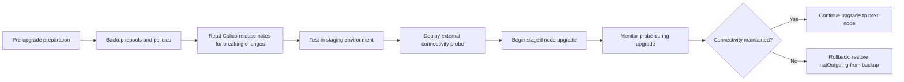

# How to Prevent External Connectivity Breaking After Calico Upgrade

Author: [nawazdhandala](https://github.com/nawazdhandala)

Tags: Calico, Kubernetes, Networking, Troubleshooting

Description: Prevent external connectivity failures during Calico upgrades by backing up IP pool config, testing in staging, and monitoring natOutgoing and iptables rules throughout the upgrade process.

---

## Introduction

External connectivity failures after Calico upgrades are preventable with proper pre-upgrade preparation and a staged rollout process. The key prevention measures are backing up current Calico configuration, testing upgrades in a staging environment, and monitoring external connectivity probes throughout the upgrade process.

Understanding which Calico versions have changed default behaviors is essential. Calico's changelog documents breaking changes to natOutgoing defaults, encapsulation modes, and default GlobalNetworkPolicy behavior. Reading release notes before upgrading prevents unexpected connectivity disruptions in production.

## Symptoms

- No proactive monitoring detected the upgrade degraded external connectivity
- Post-upgrade regression discovered by end users rather than monitoring

## Root Causes

- No pre-upgrade backup of IP pool and network policy configuration
- Calico upgrades applied directly to production without staging validation
- No external connectivity monitoring during upgrade window

## Solution

**Prevention 1: Back up Calico configuration before upgrade**

```bash
# Before every Calico upgrade, export current configuration
mkdir -p /backup/calico-pre-upgrade
calicoctl get ippool -o yaml > /backup/calico-pre-upgrade/ippools.yaml
calicoctl get globalnetworkpolicy -o yaml > /backup/calico-pre-upgrade/gnps.yaml
calicoctl get bgpconfiguration -o yaml > /backup/calico-pre-upgrade/bgp.yaml
calicoctl get felixconfiguration -o yaml > /backup/calico-pre-upgrade/felix.yaml

echo "Backup complete: $(ls /backup/calico-pre-upgrade/)"
```

**Prevention 2: Verify natOutgoing pre and post upgrade**

```bash
# Before upgrade - record current setting
BEFORE=$(calicoctl get ippool -o yaml | grep natOutgoing)
echo "Pre-upgrade natOutgoing: $BEFORE"

# After upgrade - verify setting unchanged
AFTER=$(calicoctl get ippool -o yaml | grep natOutgoing)
echo "Post-upgrade natOutgoing: $AFTER"

[ "$BEFORE" = "$AFTER" ] && echo "PASS: natOutgoing unchanged" || echo "WARN: natOutgoing changed - verify intent"
```

**Prevention 3: Test external connectivity in staging after upgrade**

```bash
# Deploy external connectivity test pod
kubectl run ext-probe --image=busybox --restart=Never -- sh -c \
  "while true; do wget -qO- --timeout=5 http://1.1.1.1 > /dev/null && echo OK || echo FAIL; sleep 10; done"

# Monitor during upgrade
kubectl logs -f ext-probe
kubectl delete pod ext-probe
```

**Prevention 4: Deploy a persistent external connectivity probe**

```yaml
apiVersion: apps/v1
kind: Deployment
metadata:
  name: external-connectivity-probe
  namespace: monitoring
spec:
  replicas: 1
  selector:
    matchLabels:
      app: ext-probe
  template:
    metadata:
      labels:
        app: ext-probe
    spec:
      containers:
      - name: probe
        image: busybox
        command: ["sh", "-c"]
        args:
        - |
          while true; do
            if wget -qO- --timeout=5 http://1.1.1.1 > /dev/null 2>&1; then
              echo "$(date): external connectivity OK"
            else
              echo "$(date): external connectivity FAILED"
            fi
            sleep 30
          done
```

**Prevention 5: Use staged node upgrades**

```bash
# Cordon one node, upgrade it, verify, then proceed
kubectl cordon <node-1>
# Upgrade calico-node on node-1 only by draining and upgrading
kubectl drain <node-1> --ignore-daemonsets --delete-emptydir-data

# Verify external connectivity from pods on other nodes
kubectl exec <test-pod> -- wget -qO- http://1.1.1.1

# Only proceed when node-1 is verified healthy
kubectl uncordon <node-1>
```



## Prevention

- Store Calico configuration in version control alongside application manifests
- Add external connectivity validation to upgrade runbooks
- Set up persistent external connectivity probes in monitoring namespace

## Conclusion

Preventing external connectivity failures during Calico upgrades requires pre-upgrade configuration backups, staging validation, and real-time monitoring during the upgrade window. Staged node-by-node upgrades with connectivity validation between each node provide the earliest detection of connectivity regressions.
