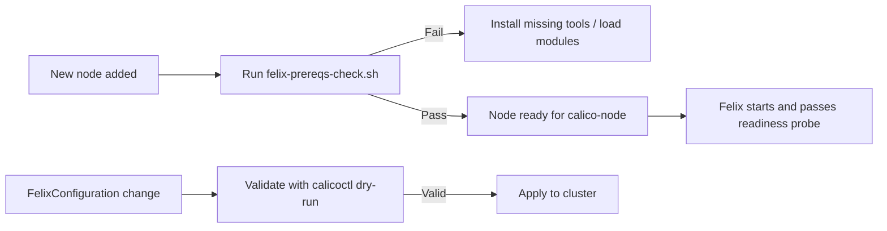

# How to Prevent Felix from Not Starting in Calico

Author: [nawazdhandala](https://github.com/nawazdhandala)

Tags: Calico, Kubernetes, Networking, Troubleshooting

Description: Node preparation and configuration validation practices that prevent Felix startup failures in Calico deployments.

---

## Introduction

Preventing Felix startup failures requires the same pre-flight preparation as preventing calico-node CrashLoopBackOff, but with additional focus on iptables tooling and FelixConfiguration validation. Felix is more sensitive to iptables version compatibility than other components — in particular, newer kernels may require iptables-legacy rather than nftables-based iptables.

## Symptoms

- Felix startup failures recurring on new node types added to the cluster
- Felix fails to start after kernel upgrades that change iptables implementation

## Root Causes

- New node image uses nftables instead of iptables-legacy
- Kernel upgrade changes iptables backend Felix expects

## Diagnosis Steps

```bash
ssh <node-name> "iptables --version && ls -la /usr/sbin/iptables*"
```

## Solution

**Prevention 1: Node pre-flight check script for Felix requirements**

```bash
#!/bin/bash
# felix-prereqs-check.sh
echo "=== Felix Prerequisites Check ==="

# Check iptables
if ! which iptables > /dev/null 2>&1; then
  echo "FAIL: iptables not found"
  exit 1
fi
echo "PASS: iptables: $(iptables --version)"

# Check iptables-save/restore
which iptables-save && which iptables-restore \
  && echo "PASS: iptables-save/restore available" \
  || echo "FAIL: iptables-save/restore missing"

# Check kernel modules for Felix
for MOD in nf_conntrack ip_tables xt_conntrack xt_set; do
  lsmod | grep -q "^$MOD" && echo "PASS: $MOD loaded" || {
    echo "Loading: $MOD"
    modprobe $MOD && echo "PASS: $MOD loaded" || echo "FAIL: $MOD cannot be loaded"
  }
done

echo "=== Felix prereqs check complete ==="
```

**Prevention 2: Use system-node-critical priority for calico-node**

```bash
# Ensure Felix's parent pod (calico-node) is not evicted
kubectl patch daemonset calico-node -n kube-system --type=json \
  -p='[{"op":"add","path":"/spec/template/spec/priorityClassName","value":"system-node-critical"}]'
```

**Prevention 3: Validate FelixConfiguration in CI/CD**

```bash
# Before applying FelixConfiguration changes
calicoctl apply -f felixconfig.yaml --dry-run
calicoctl get felixconfiguration default -o yaml | python3 -c "import sys, yaml; yaml.safe_load(sys.stdin)" \
  && echo "FelixConfiguration YAML is valid"
```

**Prevention 4: iptables-legacy setup for modern kernels**

```bash
# In node bootstrap - handle both legacy and modern iptables
if command -v update-alternatives > /dev/null 2>&1; then
  update-alternatives --set iptables /usr/sbin/iptables-legacy 2>/dev/null || true
  update-alternatives --set ip6tables /usr/sbin/ip6tables-legacy 2>/dev/null || true
fi
```



## Prevention

- Run the Felix prereqs check as part of node provisioning automation
- Handle iptables-legacy vs. nftables in node bootstrap scripts
- Validate all FelixConfiguration changes before production application

## Conclusion

Preventing Felix startup failures requires verifying iptables availability and kernel module support on each node as part of provisioning. Modern kernels may require iptables-legacy configuration. FelixConfiguration validation in CI/CD prevents configuration errors from reaching production.
