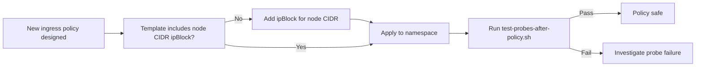

# How to Prevent Health Checks from Failing After Enabling Calico Policies

Author: [nawazdhandala](https://github.com/nawazdhandala)

Tags: Calico, Kubernetes, Networking, Troubleshooting

Description: Policy design practices that ensure Kubernetes liveness and readiness probes continue working when Calico NetworkPolicies with default-deny ingress are applied.

---

## Introduction

Preventing health check failures from Calico NetworkPolicies requires understanding the kubelet probe traffic model before designing ingress policies. The key principle is: kubelet probes are not pod-to-pod traffic. They come from the node itself, which means pod and namespace selectors cannot match them. Only ipBlock rules that cover the node subnet work.

By making node CIDR ipBlock a mandatory element of every ingress NetworkPolicy template, health check failures become impossible through normal policy authoring. This is the most impactful prevention measure.

## Symptoms

- Health check failures in multiple namespaces after a cluster-wide policy change
- Pod restarts spiking after Calico policies are rolled out to new namespaces
- Readiness probes consistently failing on specific probe paths

## Root Causes

- NetworkPolicy template does not include node CIDR allow
- Node CIDR changes after cluster expansion and existing policies are not updated
- Different node subnets per availability zone not all covered by ipBlock CIDR

## Diagnosis Steps

```bash
# Verify node CIDRs cover all nodes
kubectl get nodes -o jsonpath='{range .items[*]}{.metadata.name}{"\t"}{.status.addresses[?(@.type=="InternalIP")].address}{"\n"}{end}'
# Confirm all IPs fall within the CIDR used in policies
```

## Solution

**Prevention 1: Standard ingress policy template with node allow**

```yaml
# Template: default-ingress-policy.yaml
apiVersion: networking.k8s.io/v1
kind: NetworkPolicy
metadata:
  name: default-ingress-policy
  namespace: NAMESPACE_PLACEHOLDER
spec:
  podSelector: {}
  policyTypes:
  - Ingress
  ingress:
  # Allow intra-namespace traffic
  - from:
    - podSelector: {}
  # Allow kubelet health check probes from nodes
  - from:
    - ipBlock:
        cidr: NODE_CIDR_PLACEHOLDER  # e.g., 10.0.0.0/8
  # Allow monitoring namespace
  - from:
    - namespaceSelector:
        matchLabels:
          kubernetes.io/metadata.name: monitoring
```

**Prevention 2: GlobalNetworkPolicy for kubelet probes cluster-wide**

```yaml
apiVersion: projectcalico.org/v3
kind: GlobalNetworkPolicy
metadata:
  name: allow-kubelet-probes-global
spec:
  order: 10
  selector: all()
  types:
  - Ingress
  ingress:
  - action: Allow
    source:
      nets:
      - 10.0.0.0/8  # Node network CIDR
```

**Prevention 3: Pre-deployment health check test**

```bash
#!/bin/bash
# test-probes-after-policy.sh <namespace> <deployment>
NS=$1
DEPLOY=$2

# Get pod
POD=$(kubectl get pods -n $NS -l app=$DEPLOY -o name | head -1)

echo "Testing readiness probe..."
kubectl exec $POD -n $NS -- \
  curl -s -o /dev/null -w "%{http_code}" http://localhost:8080/health \
  || echo "Internal probe path test only (kubelet test requires node access)"

# Monitor for probe failures for 60 seconds
echo "Monitoring probe status for 60s..."
FAILURES=0
for i in $(seq 1 12); do
  READY=$(kubectl get pod $POD -n $NS \
    -o jsonpath='{.status.containerStatuses[0].ready}')
  if [ "$READY" != "true" ]; then
    FAILURES=$((FAILURES+1))
    echo "Probe failure at $((i*5))s"
  fi
  sleep 5
done

if [ $FAILURES -eq 0 ]; then
  echo "PASS: No probe failures in 60s"
else
  echo "FAIL: $FAILURES probe failures detected - check NetworkPolicy"
fi
```



## Prevention

- Store the node CIDR as a cluster-level constant in your policy template system
- Update all policies if node CIDR changes due to cluster expansion
- Run probe tests in CI/CD for infrastructure changes that include NetworkPolicies

## Conclusion

Preventing health check failures from Calico NetworkPolicies requires including a node CIDR ipBlock in every ingress policy template. The kubelet probe model — where probes come from the node rather than from pods — makes this a non-negotiable element of any default-deny ingress policy. A cluster-wide GlobalNetworkPolicy for kubelet probes provides a safety net for all namespaces.
