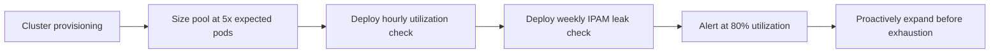

# How to Prevent IP Pool Exhaustion in Calico

Author: [nawazdhandala](https://github.com/nawazdhandala)

Tags: Calico, Kubernetes, Networking, Troubleshooting

Description: IP pool sizing practices, leak prevention, and utilization monitoring that prevent Calico IPAM exhaustion before it impacts pod scheduling.

---

## Introduction

Preventing Calico IP pool exhaustion requires a combination of adequate initial sizing, IPAM leak prevention, and utilization monitoring. Each of these addresses a different failure mode: undersized pools fail as clusters grow, leaks cause gradual exhaustion over time, and without monitoring neither is detected until pods begin failing.

## Symptoms

- IP pool utilization reaches 90%+ without triggering any alerts
- IPAM leaks accumulate over months and eventually cause exhaustion
- Cluster scaled for peak load and IP pool not pre-expanded

## Root Causes

- IP pool CIDR undersized at provisioning
- No IPAM utilization monitoring or alerting
- Pod termination without IPAM cleanup causing leaks

## Diagnosis Steps

```bash
calicoctl ipam show
calicoctl ipam show --show-blocks | grep -E "free|used"
```

## Solution

**Prevention 1: Size IP pools for 5x current pod count**

```yaml
# For a cluster expecting 500 pods, use /16 (65536 addresses)
# For 50 pods, /24 is risky - use /22 (1024) minimum
apiVersion: projectcalico.org/v3
kind: IPPool
metadata:
  name: default-ipv4-ippool
spec:
  cidr: 10.200.0.0/16  # 65536 addresses - ample for growth
  blockSize: 26         # Default block size
  ipipMode: Always
  natOutgoing: true
```

**Prevention 2: IP utilization monitoring**

```yaml
apiVersion: batch/v1
kind: CronJob
metadata:
  name: ipam-utilization-check
  namespace: kube-system
spec:
  schedule: "0 * * * *"  # Hourly
  jobTemplate:
    spec:
      template:
        spec:
          serviceAccountName: calico-node
          containers:
          - name: checker
            image: calico/ctl:v3.27.0
            command:
            - /bin/sh
            - -c
            - |
              RESULT=$(calicoctl ipam show 2>/dev/null)
              echo "$RESULT"
              FREE=$(echo "$RESULT" | grep -i "free" | grep -oP '\d+' | head -1)
              TOTAL=$(echo "$RESULT" | grep -i "total" | grep -oP '\d+' | head -1)
              if [ -n "$FREE" ] && [ -n "$TOTAL" ] && [ "$TOTAL" -gt 0 ]; then
                PCT_USED=$(( (TOTAL - FREE) * 100 / TOTAL ))
                echo "IP pool utilization: $PCT_USED%"
                if [ "$PCT_USED" -gt 80 ]; then
                  echo "ALERT: IP pool over 80% utilized"
                  exit 1
                fi
              fi
          restartPolicy: Never
```

**Prevention 3: Regular IPAM leak cleanup**

```yaml
apiVersion: batch/v1
kind: CronJob
metadata:
  name: ipam-cleanup
  namespace: kube-system
spec:
  schedule: "0 3 * * 0"  # Weekly Sunday 3am
  jobTemplate:
    spec:
      template:
        spec:
          serviceAccountName: calico-node
          containers:
          - name: cleaner
            image: calico/ctl:v3.27.0
            command: ["/bin/sh", "-c"]
            args: ["calicoctl ipam check && echo 'IPAM check complete'"]
          restartPolicy: Never
```



## Prevention

- Never size an IP pool at less than 2x maximum expected pod count
- Run IPAM utilization checks hourly and alert at 70%
- Run IPAM leak checks weekly to prevent gradual exhaustion

## Conclusion

Preventing IP pool exhaustion requires three practices: generous initial sizing, regular leak cleanup, and utilization monitoring with early alerts. Alert at 70-80% utilization to have time to expand the pool before pods begin failing at 100%.
