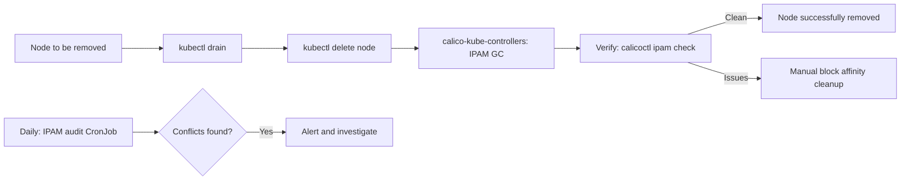

# How to Prevent IPAM Block Conflicts in Calico

Author: [nawazdhandala](https://github.com/nawazdhandala)

Tags: Calico, Kubernetes, Networking, Troubleshooting

Description: Procedural and operational practices that prevent Calico IPAM block conflicts including proper node removal procedures and regular IPAM audits.

---

## Introduction

Preventing IPAM block conflicts in Calico primarily involves following correct node lifecycle procedures. Block conflicts most commonly arise from improper node removal — deleting a node from Kubernetes without allowing Calico to clean up its IPAM allocations. The correct procedure is to drain the node, delete it from Kubernetes, and confirm IPAM cleanup before the node is decommissioned.

## Symptoms

- IPAM conflicts appearing after node replacement operations
- Recurring IPAM check failures correlating with cluster maintenance events

## Root Causes

- Nodes removed with `kubectl delete node` without draining first
- Node VM terminated at cloud provider without Kubernetes node deletion
- Calico-kube-controllers not running, preventing automatic IPAM GC

## Diagnosis Steps

```bash
calicoctl ipam check
kubectl get deployment calico-kube-controllers -n kube-system
```

## Solution

**Prevention 1: Correct node removal procedure**

```bash
#!/bin/bash
# remove-node.sh <node-name>
NODE=$1

echo "=== Step 1: Drain node ==="
kubectl drain $NODE --ignore-daemonsets --delete-emptydir-data --timeout=300s

echo "=== Step 2: Delete node from Kubernetes ==="
kubectl delete node $NODE

echo "=== Step 3: Wait for Calico IPAM cleanup ==="
# calico-kube-controllers will clean up IPAM allocations automatically
sleep 30

echo "=== Step 4: Verify IPAM cleanup ==="
calicoctl ipam check

echo "=== Step 5: Remove any orphaned block affinities ==="
for BA in $(calicoctl get blockaffinity -o jsonpath='{.items[*].metadata.name}' 2>/dev/null); do
  BA_NODE=$(calicoctl get blockaffinity $BA -o jsonpath='{.spec.node}' 2>/dev/null)
  if [ "$BA_NODE" = "$NODE" ]; then
    calicoctl delete blockaffinity $BA
  fi
done

echo "Node $NODE removal complete"
```

**Prevention 2: Ensure calico-kube-controllers is running**

```bash
# Verify controllers pod is healthy - it runs IPAM GC
kubectl get deployment calico-kube-controllers -n kube-system
kubectl get pods -n kube-system -l k8s-app=calico-kube-controllers
```

**Prevention 3: Scheduled IPAM audits**

```yaml
apiVersion: batch/v1
kind: CronJob
metadata:
  name: ipam-audit
  namespace: kube-system
spec:
  schedule: "0 2 * * *"  # Daily at 2am
  jobTemplate:
    spec:
      template:
        spec:
          serviceAccountName: calico-node
          containers:
          - name: auditor
            image: calico/ctl:v3.27.0
            command: ["/bin/sh", "-c"]
            args: ["calicoctl ipam check && echo 'IPAM audit: clean'"]
          restartPolicy: Never
```



## Prevention

- Use the node removal script for all planned node decommissions
- Monitor calico-kube-controllers health (it runs IPAM GC)
- Run daily IPAM audits and alert on failures

## Conclusion

Preventing IPAM block conflicts requires following a structured node removal procedure that includes draining before deletion and verifying IPAM cleanup. calico-kube-controllers performs automatic IPAM garbage collection, so keeping it healthy is essential. Daily IPAM audits provide early detection of any emerging conflicts.
