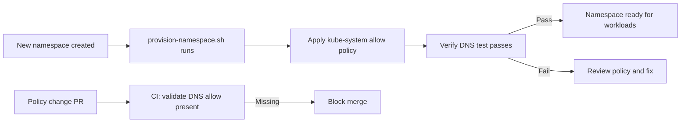

# How to Prevent kube-system Access Problems with Calico NetworkPolicy

Author: [nawazdhandala](https://github.com/nawazdhandala)

Tags: Calico, Kubernetes, Networking, Troubleshooting

Description: Policy design patterns and namespace onboarding practices that ensure kube-system services remain accessible when Calico NetworkPolicies enforce namespace isolation.

---

## Introduction

Preventing kube-system access failures from Calico NetworkPolicies requires building kube-system allow rules into the standard namespace policy template used across your organization. This is not a one-time fix - it must be part of the default policy set applied to every new namespace.

The key insight is that kube-system provides cluster-wide infrastructure services (DNS, metrics, admission webhooks) that every application namespace must be able to reach. Treating these as baseline network requirements - as fundamental as outbound internet access - ensures they are never accidentally omitted.

This guide establishes a namespace bootstrapping pattern that includes kube-system access from day one.

## Symptoms

- DNS failures in newly created namespaces
- Metrics collection broken in namespaces with new egress policies
- Admission webhook failures because pods cannot reach webhook services in kube-system

## Root Causes

- Namespace policy template does not include kube-system egress allows
- New namespaces provisioned without network policy review
- kube-system label not documented in network policy design guide

## Diagnosis Steps

```bash
# Audit all namespaces for missing DNS allow
for NS in $(kubectl get namespaces -o jsonpath='{.items[*].metadata.name}'); do
  HAS_DNS=$(kubectl get networkpolicy -n $NS -o yaml 2>/dev/null \
    | grep -c "port: 53" || true)
  if [ "$HAS_DNS" = "0" ]; then
    POLICIES=$(kubectl get networkpolicy -n $NS --no-headers 2>/dev/null | wc -l)
    if [ "$POLICIES" -gt 0 ]; then
      echo "WARNING: Namespace $NS has NetworkPolicies but no DNS allow rule"
    fi
  fi
done
```

## Solution

**Prevention 1: Standard namespace bootstrap with kube-system allows**

```yaml
# namespace-bootstrap-policy.yaml - apply to every new namespace
apiVersion: networking.k8s.io/v1
kind: NetworkPolicy
metadata:
  name: allow-kube-system-access
  namespace: NAMESPACE_PLACEHOLDER
spec:
  podSelector: {}
  policyTypes:
  - Egress
  egress:
  # DNS
  - to:
    - namespaceSelector:
        matchLabels:
          kubernetes.io/metadata.name: kube-system
    ports:
    - protocol: UDP
      port: 53
    - protocol: TCP
      port: 53
  # Kubernetes API
  - to:
    - namespaceSelector:
        matchLabels:
          kubernetes.io/metadata.name: default
    - podSelector:
        matchLabels:
          component: apiserver
    ports:
    - protocol: TCP
      port: 443
```

**Prevention 2: Namespace provisioning script**

```bash
#!/bin/bash
# provision-namespace.sh <namespace-name>
NS=$1
kubectl create namespace $NS --dry-run=client -o yaml | kubectl apply -f -

# Apply baseline policies
sed "s/NAMESPACE_PLACEHOLDER/$NS/g" namespace-bootstrap-policy.yaml \
  | kubectl apply -f -

echo "Namespace $NS provisioned with baseline network policies"

# Verify DNS works
kubectl run test-dns --image=busybox -n $NS --restart=Never --rm -i \
  --timeout=30s -- nslookup kubernetes.default 2>/dev/null \
  && echo "DNS: OK" || echo "DNS: FAIL - check policies"
```

**Prevention 3: Admission webhook or OPA policy to enforce DNS allow**

```yaml
# OPA/Gatekeeper ConstraintTemplate example (simplified)
# Enforce that any namespace with a default-deny NetworkPolicy
# must also have a DNS allow rule
apiVersion: constraints.gatekeeper.sh/v1beta1
kind: RequiresDNSAllow
metadata:
  name: require-dns-allow-with-deny
spec:
  match:
    kinds:
    - apiGroups: ["networking.k8s.io"]
      kinds: ["NetworkPolicy"]
```



## Prevention

- Store namespace bootstrap policies in a Helm chart or Kustomize base applied by Flux/ArgoCD
- Add a CI check that validates DNS allow rules are present in any PR adding NetworkPolicies
- Document the `kubernetes.io/metadata.name` label as the canonical selector for kube-system

## Conclusion

Preventing kube-system access failures requires making DNS and API allow rules part of every namespace's baseline NetworkPolicy configuration. Automated namespace provisioning scripts and CI validation ensure these rules are never accidentally omitted when new namespaces or policies are introduced.
