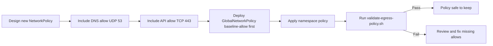

# How to Prevent Kubernetes API Access Problems with Calico Egress Policy

Author: [nawazdhandala](https://github.com/nawazdhandala)

Tags: Calico, Kubernetes, Networking, Troubleshooting

Description: Proactive NetworkPolicy design patterns that ensure Kubernetes API access is never accidentally blocked by Calico egress policies.

---

## Introduction

Preventing Calico egress policies from blocking Kubernetes API access requires including API server allow rules as a standard element of every default-deny policy deployment. This class of failure is almost always accidental: an operator applies a default-deny egress policy to improve security but neglects to account for the cluster's own API communication requirements.

The solution is to treat Kubernetes API access as a baseline egress allow that is always present, regardless of other egress restrictions. This can be implemented as a GlobalNetworkPolicy with a low order number (higher priority) that explicitly allows API and DNS traffic before any default-deny policy is evaluated.

This guide covers creating a reusable baseline allow policy, template patterns for namespace-level policies, and testing procedures that validate API access before and after policy changes.

## Symptoms

- Operators break silently after namespace egress policies are applied
- Service account token validation fails inside pods after policy changes
- DNS and API access both fail simultaneously (common when both UDP 53 and TCP 443 are missing)

## Root Causes

- Default-deny egress templates do not include kubernetes API and DNS allows
- GlobalNetworkPolicy applied to all pods without exempting control plane communication
- Policy ordering causes deny rules to be evaluated before API allow rules

## Diagnosis Steps

```bash
# Check policy order (lower order = higher priority in Calico)
calicoctl get globalnetworkpolicy -o yaml \
  | grep -E "name:|order:" | paste - -
```

## Solution

**Prevention 1: Always-apply baseline egress allow GlobalNetworkPolicy**

```yaml
apiVersion: projectcalico.org/v3
kind: GlobalNetworkPolicy
metadata:
  name: baseline-allow-k8s-internals
spec:
  order: 10  # Low order = highest priority, evaluated first
  selector: all()
  types:
  - Egress
  egress:
  # Allow DNS
  - action: Allow
    protocol: UDP
    destination:
      ports: [53]
  - action: Allow
    protocol: TCP
    destination:
      ports: [53]
  # Allow Kubernetes API server
  - action: Allow
    protocol: TCP
    destination:
      ports: [443, 6443]
      nets:
      - 10.96.0.0/12  # Service CIDR - adjust to your cluster
```

**Prevention 2: Use a NetworkPolicy template that includes API access**

```yaml
# Namespace NetworkPolicy template with required allows
apiVersion: networking.k8s.io/v1
kind: NetworkPolicy
metadata:
  name: default-namespace-policy
  namespace: NAMESPACE_NAME  # Replace with actual namespace
spec:
  podSelector: {}
  policyTypes:
  - Ingress
  - Egress
  ingress:
  - from:
    - podSelector: {}  # Allow intra-namespace
  egress:
  # DNS
  - to:
    - namespaceSelector:
        matchLabels:
          kubernetes.io/metadata.name: kube-system
    ports:
    - protocol: UDP
      port: 53
  # Kubernetes API
  - to:
    - ipBlock:
        cidr: 10.96.0.1/32  # kubernetes Service IP
    ports:
    - protocol: TCP
      port: 443
```

**Prevention 3: Pre-deployment validation script**

```bash
#!/bin/bash
# validate-egress-policy.sh
# Run before applying any new NetworkPolicy

NAMESPACE=${1:-default}
echo "Validating API access in namespace: $NAMESPACE"

# Deploy a test pod
kubectl run egress-test --image=curlimages/curl -n $NAMESPACE \
  --restart=Never --rm -i --timeout=30s \
  -- curl -sk https://kubernetes.default.svc.cluster.local/api/v1 \
     --header "Authorization: Bearer $(cat /var/run/secrets/kubernetes.io/serviceaccount/token)" \
  2>/dev/null | python3 -m json.tool | grep '"kind"'

if [ $? -eq 0 ]; then
  echo "PASS: API access confirmed in $NAMESPACE"
else
  echo "FAIL: API access blocked in $NAMESPACE - review egress policy"
  exit 1
fi
```



## Prevention

- Add API access validation to your CI/CD pipeline for infrastructure changes
- Store the baseline GlobalNetworkPolicy in your GitOps repo as a protected resource
- Document the service CIDR and API server IPs in your network policy design guide

## Conclusion

Preventing Kubernetes API access failures from Calico egress policies requires making API server and DNS allow rules a non-negotiable baseline in every default-deny deployment. The `baseline-allow-k8s-internals` GlobalNetworkPolicy pattern provides a cluster-wide safety net that protects API access regardless of namespace-level policy changes.
