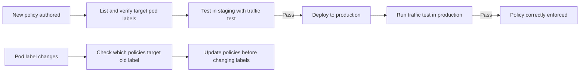

# How to Prevent Network Policy from Not Taking Effect in Calico

Author: [nawazdhandala](https://github.com/nawazdhandala)

Tags: Calico, Kubernetes, Networking, Troubleshooting

Description: Policy authoring and testing practices that ensure Calico NetworkPolicies take effect as intended including selector validation and traffic testing.

---

## Introduction

Preventing NetworkPolicy not taking effect requires building verification into the policy authoring process. Every NetworkPolicy change should include a traffic test that confirms the policy is enforcing the intended behavior — this is the only way to catch selector mismatches and ordering issues before they become production problems.

## Symptoms

- Policies deployed without traffic testing
- Selector mismatches discovered in production

## Root Causes

- No testing process for NetworkPolicy changes
- pod labels changed after policy was written

## Diagnosis Steps

```bash
kubectl get pods -n <namespace> --show-labels
```

## Solution

**Prevention 1: Policy authoring checklist**

Before applying any NetworkPolicy:
1. List target pod labels: `kubectl get pods -n <ns> --show-labels`
2. Verify selector matches labels
3. Confirm policyTypes are explicit
4. Test in staging with the same pod labels

**Prevention 2: Policy testing with netcat/curl**

```bash
# Before applying policy: confirm baseline traffic
kubectl run pre-test --image=busybox --restart=Never -- sleep 120
TARGET_IP=$(kubectl get pod <target-pod> -o jsonpath='{.status.podIP}')
kubectl exec pre-test -- nc -zv $TARGET_IP <port> 2>&1

# Apply policy
kubectl apply -f policy.yaml

# After applying: confirm policy takes effect
kubectl exec pre-test -- nc -zv $TARGET_IP <port> 2>&1
# Expected: blocked if deny policy, accessible if allow policy
kubectl delete pod pre-test
```

**Prevention 3: Use Calico network policy audit mode**

```yaml
# Deploy with Log action to audit before enforcement
apiVersion: projectcalico.org/v3
kind: NetworkPolicy
metadata:
  name: audit-new-policy
  namespace: <namespace>
spec:
  order: 100
  selector: app == '<target>'
  types:
  - Ingress
  ingress:
  - action: Log   # Log traffic without blocking
  - action: Pass  # Then pass traffic
```

**Prevention 4: Label change notification**

```bash
# Before changing pod labels, check which policies target those labels
# This prevents accidental policy invalidation
kubectl get networkpolicy --all-namespaces -o json | \
  jq '.items[] | select(.spec.podSelector.matchLabels | to_entries[] | .value == "<old-label>") | .metadata.name'
```



## Prevention

- Require traffic tests as part of the NetworkPolicy change review process
- Alert when pod labels are changed that match existing NetworkPolicy selectors
- Use Calico audit mode for policy development before enforcement mode

## Conclusion

Preventing NetworkPolicy from not taking effect requires testing policy enforcement with actual traffic after every change. The two key checks are selector accuracy (do labels match?) and traffic behavior (does the policy block/allow as intended?). Building these into the policy change process eliminates most enforcement surprises.
