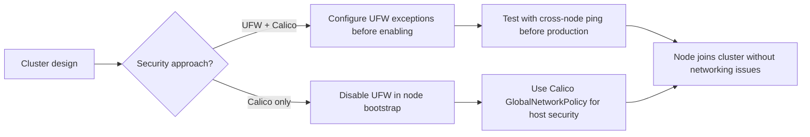

# How to Prevent UFW from Blocking Kubernetes When Using Calico

Author: [nawazdhandala](https://github.com/nawazdhandala)

Tags: Calico, Kubernetes, Networking, Troubleshooting

Description: Node configuration practices and UFW setup procedures that prevent UFW from conflicting with Calico Kubernetes networking.

---

## Introduction

Preventing UFW from blocking Calico traffic requires making a deliberate architectural decision about host security at cluster design time. UFW and Calico both manage iptables rules, and their interaction is only safe when explicitly configured. The most common mistake is enabling UFW on a Kubernetes node without considering its interaction with Calico's networking.

The safest prevention strategy is to make the choice explicit: either use UFW for host security and configure it to allow all Calico traffic, or disable UFW and rely on Calico NetworkPolicy and GlobalNetworkPolicy for both pod-level and host-level security. The latter is simpler and avoids the entire class of UFW-Calico conflicts.

## Symptoms

- UFW enabled during OS hardening breaks existing Kubernetes cluster
- New nodes added with UFW enabled fail to join the cluster
- Cross-node pod traffic breaks after automated OS hardening runbook is applied

## Root Causes

- OS hardening runbooks enable UFW without Kubernetes-specific exceptions
- Node images include UFW enabled by default
- UFW re-enabled after OS upgrade without restoring Kubernetes exceptions

## Diagnosis Steps

```bash
# Check UFW state on all nodes
for NODE in $(kubectl get nodes -o jsonpath='{.items[*].metadata.name}'); do
  echo -n "$NODE: "
  ssh $NODE "sudo ufw status" 2>/dev/null || echo "SSH failed"
done
```

## Solution

**Prevention 1: Disable UFW in node image or cloud-init**

```yaml
# cloud-init / user-data snippet
runcmd:
  - ufw disable
  - systemctl disable ufw
  - systemctl mask ufw
```

**Prevention 2: If UFW must stay enabled - pre-configure exceptions in node bootstrap**

```bash
#!/bin/bash
# kubernetes-ufw-config.sh - run during node setup

# Allow FORWARD (required for pod traffic)
sed -i 's/DEFAULT_FORWARD_POLICY="DROP"/DEFAULT_FORWARD_POLICY="ACCEPT"/' \
  /etc/default/ufw

# Allow Kubernetes and Calico traffic
ufw allow 6443/tcp       # Kubernetes API
ufw allow 179/tcp        # BGP
ufw allow proto 4 from <node-cidr>  # IPIP
ufw allow 4789/udp from <node-cidr> # VXLAN
ufw allow 5473/tcp       # Calico Typha
ufw allow 9091/tcp       # Calico Felix metrics
ufw allow 10250/tcp      # kubelet
ufw allow 10251/tcp      # kube-scheduler
ufw allow 10252/tcp      # kube-controller-manager
ufw allow 2379:2380/tcp  # etcd

ufw --force enable
```

**Prevention 3: Use Calico HostEndpoint policies instead of UFW**

```yaml
# Calico HostEndpoint provides host-level firewall without UFW
apiVersion: projectcalico.org/v3
kind: GlobalNetworkPolicy
metadata:
  name: allow-cluster-traffic
spec:
  selector: all()
  order: 10
  types:
  - Ingress
  - Egress
  ingress:
  - action: Allow
    protocol: TCP
    destination:
      ports: [6443, 179, 10250]
    source:
      nets:
      - <cluster-cidr>
  egress:
  - action: Allow
    destination:
      nets:
      - <cluster-cidr>
```



## Prevention

- Add UFW configuration to node provisioning automation with Kubernetes exceptions
- Test networking immediately after OS hardening before adding nodes to clusters
- Document the chosen security model (UFW or Calico-only) in cluster design docs

## Conclusion

Preventing UFW-Calico conflicts requires an explicit decision at cluster design time and pre-configuring UFW exceptions in node bootstrap scripts if UFW is required. Disabling UFW and using Calico's built-in host endpoint policies is simpler and eliminates the entire class of iptables rule ordering conflicts.
