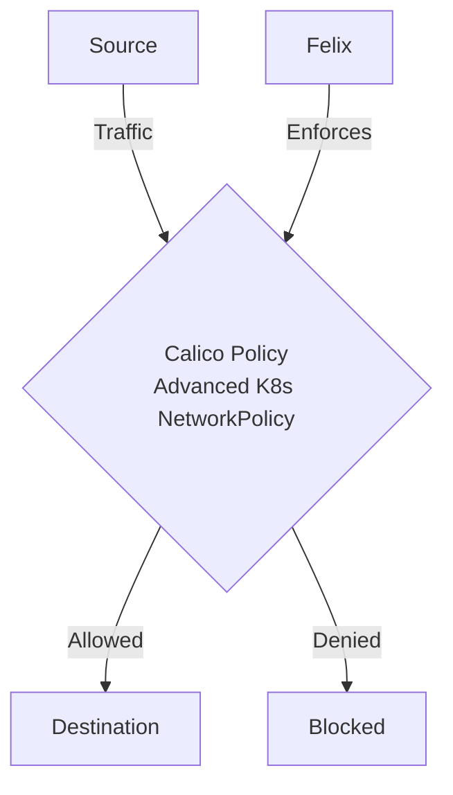

# How to Roll Out Advanced Kubernetes NetworkPolicy with Calico Safely

Author: [nawazdhandala](https://github.com/nawazdhandala)

Tags: Calico, Kubernetes, Network Policy, Advanced, Security

Description: Roll Out advanced Kubernetes NetworkPolicy patterns using Calico for complex cross-namespace traffic control.

---

## Introduction

Roll Out Advanced Kubernetes NetworkPolicy with Calico Safely requires careful policy design in Calico to balance security with performance and availability. The `projectcalico.org/v3` API provides the flexibility needed to handle advanced k8s networkpolicy while maintaining strict access controls.

This guide covers roll out Advanced K8s NetworkPolicy in Calico with production-ready configurations.

## Prerequisites

- Kubernetes cluster with Calico v3.26+
- `calicoctl` and `kubectl` installed

## Core Configuration

```yaml
# Advanced Kubernetes NetworkPolicy combining namespace and pod selectors
apiVersion: networking.k8s.io/v1
kind: NetworkPolicy
metadata:
  name: advanced-cross-namespace-policy
  namespace: production
spec:
  podSelector:
    matchLabels:
      app: api-server
      tier: backend
  policyTypes:
    - Ingress
    - Egress
  ingress:
    - from:
        - namespaceSelector:
            matchLabels:
              environment: production
          podSelector:
            matchLabels:
              app: frontend
        - namespaceSelector:
            matchLabels:
              team: observability
      ports:
        - port: 8080
        - port: 9090
  egress:
    - to:
        - namespaceSelector:
            matchLabels:
              environment: production
          podSelector:
            matchLabels:
              tier: data
      ports:
        - port: 5432
        - port: 6379
    - ports:
        - port: 53
          protocol: UDP
        - port: 443
          protocol: TCP
```

## Advanced Patterns

```bash
# Apply advanced policy
kubectl apply -f advanced-cross-namespace-policy.yaml

# Test cross-namespace access (production frontend -> production API)
kubectl exec -n production frontend-pod -- curl -s http://api-server.production.svc.cluster.local:8080
echo "Production frontend to API (should pass): $?"

# Test blocked cross-namespace access (staging frontend -> production API)
kubectl exec -n staging frontend-pod -- curl -s --max-time 5 http://api-server.production.svc.cluster.local:8080
echo "Staging frontend to prod API (should fail): $?"

# Use Calico NetworkPolicy for additional control beyond standard K8s
calicoctl apply -f calico-extension-policy.yaml
```

## Architecture



## Conclusion

Roll Out Advanced K8s NetworkPolicy in Calico requires balancing security controls with operational requirements. Use the patterns in this guide as a starting point, test thoroughly in staging, and monitor policy impact after deployment. Regular review of your policies ensures they remain appropriate as your workload requirements evolve.
