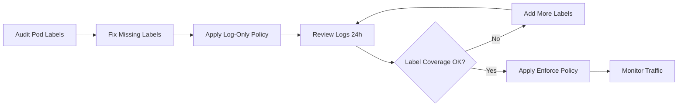

# How to Roll Out Calico Label-Based Network Policies Safely

Author: [nawazdhandala](https://github.com/nawazdhandala)

Tags: Calico, Kubernetes, Network Policy, Labels, Safe Rollout

Description: A phased rollout strategy for Calico label-based network policies that prevents outages by verifying label coverage before enforcing traffic rules.

---

## Introduction

Rolling out label-based Calico network policies introduces a unique challenge: the effectiveness of your policies depends entirely on labels being consistently applied to all workloads. If you apply a policy that allows traffic based on `tier=web` labels, but some of your web pods are missing that label, those pods will be silently denied.

The safe rollout approach for label-based policies has two phases: first ensure all workloads are correctly labeled, then apply the policies. Rushing either phase leads to either security gaps (unlabeled pods bypass policy) or outages (labeled pods blocked by incomplete allow rules).

This guide provides a structured rollout process that validates label coverage, applies policies in stages, and includes automated checks to catch labeling gaps before they cause problems.

## Prerequisites

- Kubernetes cluster with Calico v3.26+
- `calicoctl` and `kubectl` installed
- Agreed label taxonomy documented and approved by your team

## Phase 1: Audit and Apply Labels

```bash
# Audit all pods missing required labels
kubectl get pods --all-namespaces -o json | python3 << 'EOF'
import json, sys
data = json.load(sys.stdin)
required = ['app', 'tier', 'environment']
for pod in data['items']:
    labels = pod['metadata'].get('labels', {})
    missing = [l for l in required if l not in labels]
    if missing:
        name = pod['metadata']['name']
        ns = pod['metadata']['namespace']
        print(f"{ns}/{name}: missing labels: {missing}")
EOF
```

## Phase 2: Label All Deployments

```bash
# Script to add missing labels to all deployments
kubectl get deployments --all-namespaces -o json | jq -r '.items[] | "\(.metadata.namespace) \(.metadata.name)"' | while read ns name; do
  # Add required labels if missing
  kubectl patch deployment "$name" -n "$ns" --type=merge -p '{
    "spec": {"template": {"metadata": {"labels": {"tier": "unknown"}}}}
  }' --dry-run=client
done
```

## Phase 3: Apply Policies in Audit Mode First

Use a `Log` action before `Allow` to track what would be affected:

```yaml
apiVersion: projectcalico.org/v3
kind: NetworkPolicy
metadata:
  name: audit-web-to-api
  namespace: production
spec:
  order: 100
  selector: tier == 'api'
  ingress:
    - action: Log
      source:
        selector: tier == 'web'
    - action: Allow
      source:
        selector: tier == 'web'
  types:
    - Ingress
```

## Phase 4: Verify Label Coverage

```bash
# Verify all pods that should match the policy selector do match
EXPECTED_API_PODS=("backend-api" "payment-api" "user-api")
for pod in "${EXPECTED_API_PODS[@]}"; do
  LABELS=$(kubectl get pod "$pod" -n production -o jsonpath='{.metadata.labels.tier}')
  if [ "$LABELS" != "api" ]; then
    echo "WARNING: $pod is missing tier=api label (has: $LABELS)"
  else
    echo "OK: $pod has correct labels"
  fi
done
```

## Phase 5: Gradual Enforcement

```bash
# Roll out enforcement namespace by namespace
for namespace in dev staging production; do
  echo "Rolling out to: $namespace"

  # Count unlabeled pods first
  UNLABELED=$(kubectl get pods -n "$namespace" --no-headers | grep -v "Running" | wc -l)
  echo "Non-running pods: $UNLABELED"

  calicoctl apply -f "policies/$namespace-label-policy.yaml"
  sleep 60
  kubectl get events -n "$namespace" | grep -i "network\|denied" | tail -5
done
```

## Rollout Flow



## Conclusion

Safe rollout of label-based Calico policies requires label coverage validation as a prerequisite. Always audit your pod labels, fix gaps before applying policies, and use log-only mode to preview policy impact before enforcing. Automating the label audit step in your CI/CD pipeline ensures that future deployments maintain label consistency and don't silently bypass your security policies.
