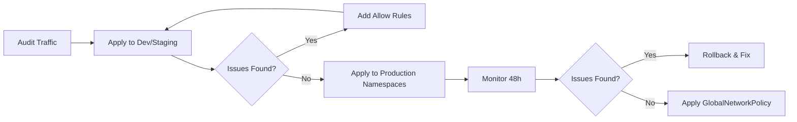

# How to Roll Out Default Deny Policies in Calico Safely

Author: [nawazdhandala](https://github.com/nawazdhandala)

Tags: Calico, Kubernetes, Network Policy, Zero Trust, Security, Staged Rollout

Description: A safe, phased approach to rolling out Calico default deny network policies in production clusters without causing downtime.

---

## Introduction

Applying a default deny policy to a production Kubernetes cluster without preparation is one of the fastest ways to cause a major outage. Every service that relies on implicit network access will immediately fail. A safe rollout requires careful planning, staged deployment, and the ability to roll back instantly.

Calico's `StagedGlobalNetworkPolicy` feature (available in Calico Enterprise) lets you preview the impact of a policy before enforcing it. In open-source Calico, you can simulate a safe rollout by applying policies namespace by namespace and monitoring impact at each stage.

This guide provides a phased rollout strategy that minimizes risk while progressively strengthening your security posture. Each phase is independently verifiable so you can catch problems before they affect the entire cluster.

## Prerequisites

- Kubernetes cluster with Calico v3.26+
- `kubectl` and `calicoctl` installed
- Monitoring and alerting configured (Prometheus, Grafana recommended)
- A complete traffic map of your cluster workloads

## Phase 1: Audit Existing Traffic

Before any policy changes, establish a traffic baseline using Calico flow logs:

```bash
# Enable flow logging in Felix
kubectl patch felixconfiguration default --type=merge -p '{"spec":{"flowLogsEnabled":true}}'

# Review logs after 24 hours
kubectl logs -n kube-system -l k8s-app=calico-node | grep CALICO
```

## Phase 2: Apply Default Deny to Non-Production Namespaces First

```yaml
apiVersion: projectcalico.org/v3
kind: NetworkPolicy
metadata:
  name: default-deny
  namespace: staging
spec:
  selector: all()
  types:
    - Ingress
    - Egress
```

```bash
calicoctl apply -f default-deny-staging.yaml
# Monitor staging for 24-48 hours
kubectl get events -n staging --sort-by='.lastTimestamp' | grep -i fail
```

## Phase 3: Build Allow Rules Before Expanding

For each blocked communication discovered in Phase 2, create an explicit allow rule:

```yaml
apiVersion: projectcalico.org/v3
kind: NetworkPolicy
metadata:
  name: allow-frontend-to-backend
  namespace: staging
spec:
  selector: app == 'backend'
  ingress:
    - action: Allow
      source:
        selector: app == 'frontend'
  types:
    - Ingress
```

## Phase 4: Apply to Production Namespaces

After validating in staging, roll out to production one namespace at a time:

```bash
for ns in production-a production-b production-c; do
  echo "Applying to namespace: $ns"
  sed "s/namespace: staging/namespace: $ns/" default-deny.yaml | calicoctl apply -f -
  sleep 300  # Wait 5 minutes and monitor
  kubectl get events -n $ns | tail -20
done
```

## Phase 5: Apply Global Policy Last

Only after all namespaces are covered with explicit allow rules:

```yaml
apiVersion: projectcalico.org/v3
kind: GlobalNetworkPolicy
metadata:
  name: default-deny-all
spec:
  order: 1000
  selector: all()
  types:
    - Ingress
    - Egress
```

## Rollout Strategy Diagram



## Conclusion

A safe rollout of default deny policies requires patience and a phased approach. Start with non-production environments, build your allow rules library, then progressively expand to production. Always monitor after each phase and have a rollback plan ready. The goal is zero downtime while achieving complete traffic control.
