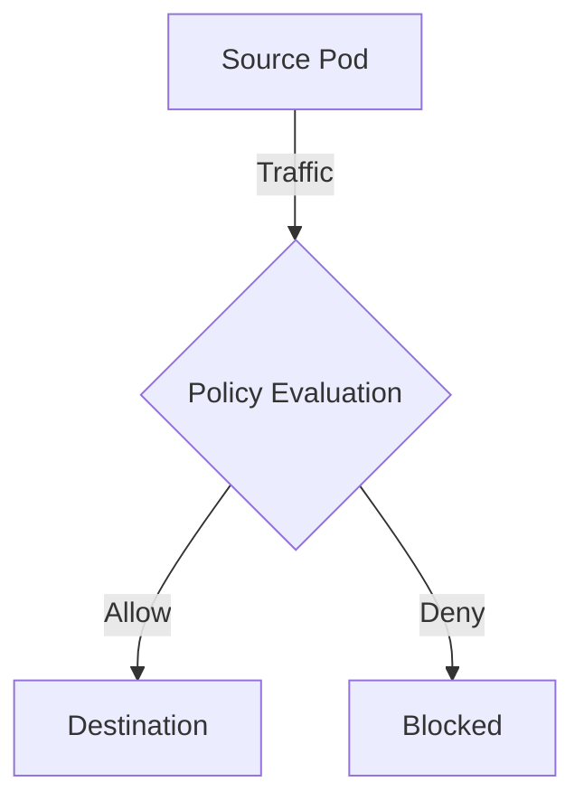

# How to Roll Out External IP Policies in Calico Safely

Author: [nawazdhandala](https://github.com/nawazdhandala)

Tags: Calico, Kubernetes, Network Policy, External IP, Safe Rollout

Description: A phased rollout strategy for Calico external IP network policies that prevents outages.

---

## Introduction

Roll Out External IP Policies in Calico provides fine-grained network traffic control using the `projectcalico.org/v3` API. This guide covers how to roll Roll Out External IP Policies effectively with production-ready configurations.

## Prerequisites

- Kubernetes cluster with Calico v3.26+
- `calicoctl` and `kubectl` installed

## Core Configuration

```yaml
apiVersion: projectcalico.org/v3
kind: NetworkPolicy
metadata:
  name: roll-roll-out-external-ip-policies
  namespace: production
spec:
  order: 100
  selector: all()
  ingress:
    - action: Allow
      source:
        selector: app == 'authorized'
  egress:
    - action: Allow
      protocol: UDP
      destination:
        ports: [53]
  types:
    - Ingress
    - Egress
```

## Implementation

```bash
calicoctl apply -f roll-policy.yaml
calicoctl get networkpolicies -n production -o wide
kubectl exec -n production test-pod -- curl -s --max-time 5 http://target:8080
echo "Result: $?"
```

## Architecture



## Conclusion

Roll Roll Out External IP Policies in Calico ensures your network security controls are correctly configured and enforced. Always validate in staging before production and maintain comprehensive logging for visibility.
