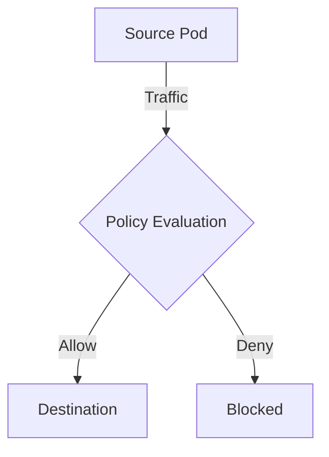

# How to Roll Out ICMP and Ping Rules in Calico Safely

Author: [nawazdhandala](https://github.com/nawazdhandala)

Tags: Calico, Kubernetes, Network Policy, ICMP, Safe Rollout

Description: A phased rollout strategy for Calico ICMP and ping rules that prevents disrupting diagnostic tools.

---

## Introduction

ICMP and Ping rules in Calico provide fine-grained control over diagnostic traffic using the `projectcalico.org/v3` API. This guide covers how to roll out ICMP and Ping rules effectively with production-ready configurations.

## Prerequisites

- Kubernetes cluster with Calico v3.26+
- `calicoctl` and `kubectl` installed

## Core Configuration

```yaml
apiVersion: projectcalico.org/v3
kind: NetworkPolicy
metadata:
  name: roll-out-icmp-and-ping-rules
  namespace: production
spec:
  order: 100
  selector: all()
  ingress:
    - action: Allow
      protocol: ICMP
      icmp:
        type: 8
      source:
        selector: app == 'authorized'
    - action: Allow
      protocol: ICMPv6
      icmp:
        type: 128
      source:
        selector: app == 'authorized'
  egress:
    - action: Allow
      protocol: ICMP
      icmp:
        type: 8
    - action: Allow
      protocol: UDP
      destination:
        ports: [53]
  types:
    - Ingress
    - Egress
```

## Implementation

```bash
calicoctl apply -f roll-out-icmp-and-ping-rules.yaml
calicoctl get networkpolicies -n production -o wide
kubectl exec -n production test-pod -- ping -c 3 -W 5 target
echo "Result: $?"
```

## Architecture



## Conclusion

Rolling out ICMP and Ping rules in Calico ensures your network security controls are correctly configured and enforced without breaking diagnostic tooling. Always validate in staging before production and maintain comprehensive logging for visibility.
