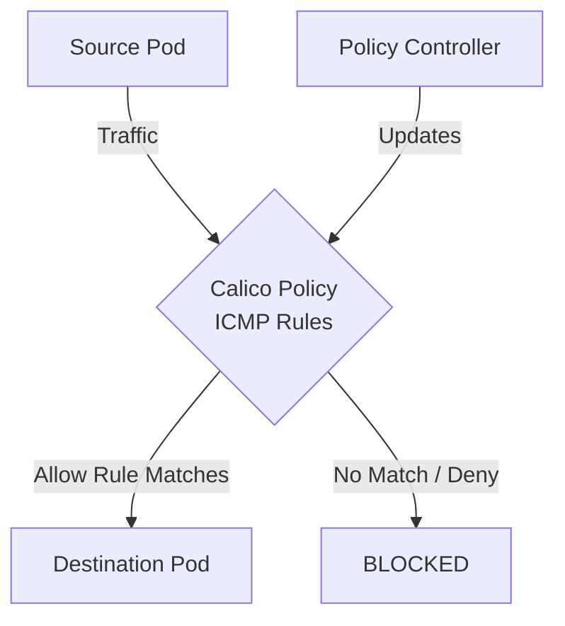

# How to Roll Out ICMP and Ping Rules Safely in Calico

Author: [nawazdhandala](https://github.com/nawazdhandala)

Tags: Calico, Kubernetes, Network Policy, ICMP, Security, Network

Description: A phased rollout strategy for ICMP and Ping Rules in Calico to prevent outages.

---

## Introduction

ICMP and Ping Rules in Calico provides fine-grained network security controls using the `projectcalico.org/v3` API. This guide covers how to roll out ICMP Rules effectively.

Calico's extensible policy model supports ICMP Rules through its `GlobalNetworkPolicy` and `NetworkPolicy` resources, giving you cluster-wide and namespace-scoped control over traffic that matches your ICMP Rules criteria.

This guide provides practical techniques for roll out ICMP Rules in your Kubernetes cluster, following security best practices and production-tested patterns.

## Prerequisites

- Kubernetes cluster with Calico v3.26+
- `calicoctl` and `kubectl` installed
- Basic understanding of Calico network policy concepts

## Phase 1: Audit Current State

```bash
calicoctl get networkpolicies --all-namespaces
kubectl get events --all-namespaces | grep -i network | tail -20
```

## Phase 2: Apply to Non-Production First

```bash
calicoctl apply -f icmp-rules-policy-staging.yaml
sleep 300
kubectl get events -n staging | tail -10
```

## Phase 3: Monitor and Verify

```bash
kubectl exec -n staging test-pod -- curl -s http://staging-service:8080
echo "Staging test: $?"
```

## Phase 4: Roll Out to Production

```bash
for ns in production-a production-b production-c; do
  calicoctl apply -f icmp-rules-policy.yaml -n $ns
  sleep 120
  kubectl get events -n $ns | tail -5
done
```

## Architecture



## Conclusion

Roll Out ICMP Rules policies in Calico requires attention to policy ordering, selector accuracy, and bidirectional rule coverage. Follow the patterns in this guide to ensure your ICMP Rules policies are correctly configured, tested, and monitored. Always validate in staging before applying to production, and maintain comprehensive logging for visibility into policy decisions.
