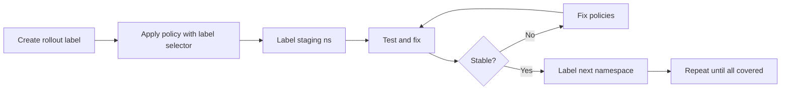

# How to Roll Out Namespace-Based Policies in Calico Safely

Author: [nawazdhandala](https://github.com/nawazdhandala)

Tags: Calico, Kubernetes, Network Policy, Namespace, Safe Rollout

Description: A phased rollout strategy for Calico namespace-based network policies that prevents outages by validating namespace labels before enforcing isolation.

---

## Introduction

Rolling out namespace isolation policies requires careful coordination because namespaces are shared boundaries between multiple teams and services. Applying a default deny policy to a namespace that hasn't yet had all its egress allow rules configured will immediately break the workloads inside.

Calico's `projectcalico.org/v3` namespace-based policies use namespace labels as their matching criteria. This means you control policy scope by controlling namespace labels - a powerful tool for staged rollouts. You can apply the policy globally but only have it match namespaces as you add the correct labels.

This guide provides a phased approach to rolling out namespace isolation in Calico, using namespace labels as the rollout gate mechanism so you can progress at a controlled pace.

## Prerequisites

- Kubernetes cluster with Calico v3.26+
- `calicoctl` and `kubectl` installed
- All namespaces documented and inventoried
- Traffic maps for each namespace

## Step 1: Create a Rollout Label Schema

```bash
# Use a rollout label to control which namespaces get the policy
kubectl label namespace staging calico-policy=enabled
# Only namespaces with calico-policy=enabled will be affected initially
```

## Step 2: Apply Namespace-Scoped Policy With Rollout Label

```yaml
apiVersion: projectcalico.org/v3
kind: GlobalNetworkPolicy
metadata:
  name: namespace-isolation
spec:
  order: 500
  namespaceSelector: calico-policy == 'enabled'
  selector: all()
  types:
    - Ingress
    - Egress
  egress:
    - action: Allow
      destination:
        ports: [53]
      protocol: UDP
```

## Step 3: Validate in Staging Namespace

```bash
# Label staging namespace to enable the policy
kubectl label namespace staging calico-policy=enabled

# Run validation tests
kubectl exec -n staging test-pod -- curl -s --max-time 5 http://staging-service:8080
echo "Result: $?"
```

## Step 4: Add Allow Rules Before Expanding

```yaml
apiVersion: projectcalico.org/v3
kind: NetworkPolicy
metadata:
  name: allow-intra-namespace
  namespace: staging
spec:
  order: 100
  selector: all()
  ingress:
    - action: Allow
      source:
        namespaceSelector: kubernetes.io/metadata.name == 'staging'
  egress:
    - action: Allow
      destination:
        namespaceSelector: kubernetes.io/metadata.name == 'staging'
  types:
    - Ingress
    - Egress
```

## Step 5: Progressively Label More Namespaces

```bash
for ns in production-a production-b production-c; do
  echo "Enabling policy for namespace: $ns"
  kubectl label namespace $ns calico-policy=enabled
  sleep 120  # Monitor for 2 minutes
  kubectl get events -n $ns | grep -i "fail\|error" | tail -5
done
```

## Rollout Strategy



## Conclusion

A label-gated rollout strategy for namespace isolation gives you precise control over which namespaces are affected at each stage. By using a `calico-policy=enabled` label as the rollout gate, you can progress at the pace your team can support - validating each namespace before moving to the next. Once all namespaces are labeled and tested, you have complete namespace isolation without a single outage.
