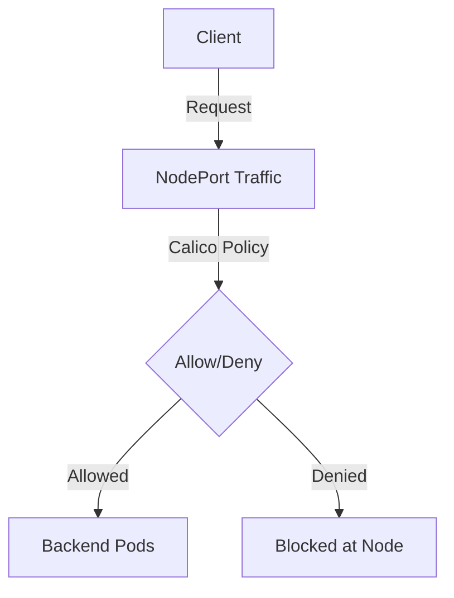

# How to Roll Out NodePort Traffic Policies in Calico Safely

Author: [nawazdhandala](https://github.com/nawazdhandala)

Tags: Calico, Kubernetes, Network Policy, NodePort, Security

Description: Roll Out Calico NodePort traffic policies to secure Kubernetes NodePort service access.

---

## Introduction

NodePort Traffic Policies in Calico gives you control over how traffic flows through Kubernetes service networking. The `projectcalico.org/v3` API provides the tools needed to secure NodePort Traffic traffic effectively while maintaining service availability.

Proper NodePort Traffic policy configuration is essential for clusters that expose services to external traffic. Without it, any source can reach your NodePort or ClusterIP services, creating significant attack surface.

This guide covers roll out NodePort Traffic policies in Calico with practical, production-tested configurations.

## Prerequisites

- Kubernetes cluster with Calico v3.26+
- `calicoctl` and `kubectl` installed
- Understanding of Kubernetes service networking

## Core Configuration

```yaml
apiVersion: projectcalico.org/v3
kind: GlobalNetworkPolicy
metadata:
  name: secure-nodeport-traffic
spec:
  order: 100
  preDNAT: true
  applyOnForward: true
  selector: has(kubernetes.io/hostname)
  ingress:
    - action: Allow
      source:
        nets:
          - 10.0.0.0/8
          - 172.16.0.0/12
      destination:
        ports: [30000-32767]
    - action: Deny
      destination:
        ports: [30000-32767]
  types:
    - Ingress
```


## Verification

```bash
# Apply the policy
calicoctl apply -f roll-out-nodeport-traffic.yaml

# Verify traffic behavior
kubectl exec -n test test-pod -- curl -s --max-time 5 http://service-name:8080
echo "Result: $?"
```

## Architecture



## Conclusion

NodePort Traffic Policies policies in Calico provide essential security controls for Kubernetes service traffic. Configure them carefully, test bidirectional traffic flows, and use staged policies to preview impact before enforcement. Regular monitoring of denial rates helps you detect misconfigurations and unauthorized access attempts before they impact service availability.
