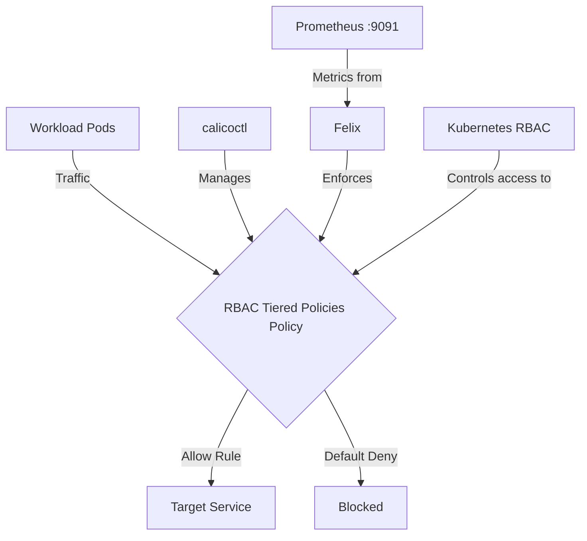

# How to Roll Out RBAC for Calico Tiered Policies Safely

Author: [nawazdhandala](https://github.com/nawazdhandala)

Tags: Calico, Kubernetes, Network Policy, RBAC, Policy Tiers, Security

Description: A phased rollout strategy for RBAC for Tiered Policies in Calico that prevents outages.

---

## Introduction

RBAC for Tiered Policies is an advanced Calico feature that provides fine-grained network security controls using the `projectcalico.org/v3` API. This guide covers how to roll out RBAC Tiered Policies effectively in your Kubernetes cluster.

Calico's `projectcalico.org/v3` API provides rich support for RBAC Tiered Policies through its `GlobalNetworkPolicy`, `NetworkPolicy`, and related resources. Proper configuration of RBAC Tiered Policies is essential for maintaining a secure, well-controlled network fabric.

This guide provides production-tested patterns for roll out RBAC Tiered Policies, including YAML examples, CLI commands, and troubleshooting techniques.

## Prerequisites

- Kubernetes cluster with Calico tiered policy support
- `calicoctl` and `kubectl` installed  
- Basic understanding of Calico network policy concepts
- Permissions to create Calico `Tier`, `NetworkPolicy`, and Kubernetes RBAC resources

## Core Configuration

The following YAML demonstrates the key pattern for RBAC Tiered Policies:

```yaml
apiVersion: projectcalico.org/v3
kind: Tier
metadata:
  name: security
spec:
  order: 300
  defaultAction: Deny
---
apiVersion: projectcalico.org/v3
kind: NetworkPolicy
metadata:
  name: security.roll-out-rbac-tiered-policies
  namespace: production
spec:
  tier: security
  order: 100
  selector: all()
  ingress:
    - action: Allow
      source:
        selector: app == 'authorized-source'
      destination:
        ports: [8080, 443]
  egress:
    - action: Allow
      protocol: UDP
      destination:
        ports: [53]
    - action: Allow
      protocol: TCP
      destination:
        ports: [53]
    - action: Allow
      destination:
        selector: app == 'authorized-destination'
  types:
    - Ingress
    - Egress
---
apiVersion: rbac.authorization.k8s.io/v1
kind: ClusterRole
metadata:
  name: production-security-tier-policy-writer
rules:
  - apiGroups: ["projectcalico.org"]
    resources: ["tiers"]
    resourceNames: ["security"]
    verbs: ["get"]
  - apiGroups: ["projectcalico.org"]
    resources: ["tier.networkpolicies"]
    resourceNames: ["security.*"]
    verbs: ["get", "list", "watch", "create", "update", "patch", "delete"]
---
apiVersion: rbac.authorization.k8s.io/v1
kind: RoleBinding
metadata:
  name: production-security-tier-policy-writers
  namespace: production
subjects:
  - kind: Group
    name: production-security-admins
    apiGroup: rbac.authorization.k8s.io
roleRef:
  kind: ClusterRole
  name: production-security-tier-policy-writer
  apiGroup: rbac.authorization.k8s.io
```

## Implementation Steps

```bash
# 1. Validate the policy and RBAC resources
kubectl apply --dry-run=server -f roll-out-rbac-tiered-policies.yaml

# 2. Apply the policy and RBAC resources
kubectl apply -f roll-out-rbac-tiered-policies.yaml

# 3. Verify it's active
calicoctl get networkpolicies -n production -o wide
kubectl get networkpolicies.p --field-selector spec.tier=security -n production

# 4. Test connectivity
kubectl exec -n production test-pod -- curl -s --max-time 5 http://target:8080
echo "Exit code: $?"

# 5. Check Felix metrics (if metrics reporting is enabled)
curl -s http://localhost:9091/metrics | grep felix_active_local_policies
```

## Operational Commands

```bash
# List all relevant policies
calicoctl get networkpolicies --all-namespaces
calicoctl get globalnetworkpolicies

# View policy details
calicoctl get networkpolicy security.roll-out-rbac-tiered-policies -n production -o yaml

# Delete a policy if needed
calicoctl delete networkpolicy security.roll-out-rbac-tiered-policies -n production
```

## Architecture



## Common Issues

1. **Policy not applying**: Verify API version is `projectcalico.org/v3` and run `kubectl apply --dry-run=server -f roll-out-rbac-tiered-policies.yaml` first
2. **Selector not matching**: Use `kubectl get pods -l app=authorized-source` to verify label matches
3. **Order conflicts**: Run `calicoctl get tiers -o wide` and `calicoctl get globalnetworkpolicies -o wide` to compare tier and policy order fields
4. **DNS failures**: Ensure egress to TCP and UDP port 53 is allowed when restricting egress

## Conclusion

Roll Out RBAC Tiered Policies in Calico requires careful attention to policy ordering, selector syntax, and bidirectional traffic rules. Use the patterns in this guide as a starting point, adapt them to your specific requirements, and always validate changes in a staging environment before applying to production. Consistent logging and monitoring will help you detect and resolve issues quickly when they occur.
