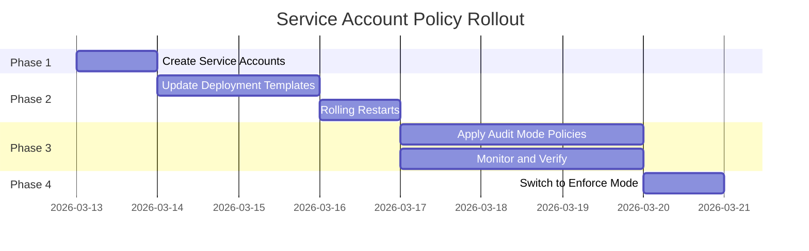

# How to Roll Out Calico Service Account-Based Policies Safely

Author: [nawazdhandala](https://github.com/nawazdhandala)

Tags: Calico, Kubernetes, Network Policy, Service Accounts, Safe Rollout

Description: A phased rollout strategy for Calico service account-based network policies that prevents outages by migrating workloads to dedicated service accounts first.

---

## Introduction

Rolling out service account-based policies safely requires a two-phase approach: first migrate workloads to dedicated service accounts, then enforce the policies. If you apply the policies before workloads are using the correct service accounts, you'll immediately block legitimate traffic.

The challenge is that changing a pod's service account requires a rolling restart, which means there will be a period where some pods have the new service account and some have the old one. Your rollout strategy needs to handle this mixed state gracefully.

## Prerequisites

- Kubernetes cluster with Calico v3.26+
- `calicoctl` and `kubectl` installed
- Ability to perform rolling restarts of all workloads

## Phase 1: Create Service Accounts

```bash
# Create all required service accounts
for sa in frontend-sa backend-sa db-sa monitoring-sa; do
  kubectl create serviceaccount $sa -n production --dry-run=client -o yaml | kubectl apply -f -
done
```

## Phase 2: Update Deployments to Use Dedicated SAs

```bash
# Update each deployment
for deploy in frontend backend; do
  kubectl patch deployment $deploy -n production --type=merge -p "{
    "spec": {
      "template": {
        "spec": {
          "serviceAccountName": "${deploy}-sa"
        }
      }
    }
  }"
done
# Wait for rollout
kubectl rollout status deployment/backend -n production
```

## Phase 3: Apply Policies in Audit Mode First

```yaml
apiVersion: projectcalico.org/v3
kind: NetworkPolicy
metadata:
  name: audit-sa-policy
  namespace: production
spec:
  order: 100
  selector: app == 'db'
  ingress:
    - action: Log
      source:
        serviceAccountSelector: name == 'backend-sa'
    - action: Allow
      source:
        serviceAccountSelector: name == 'backend-sa'
    - action: Log
    - action: Allow  # Still allow all during audit phase
  types:
    - Ingress
```

## Phase 4: Switch to Enforce Mode

After verifying all pods are using correct service accounts:

```yaml
apiVersion: projectcalico.org/v3
kind: NetworkPolicy
metadata:
  name: enforce-sa-policy
  namespace: production
spec:
  order: 100
  selector: app == 'db'
  ingress:
    - action: Allow
      source:
        serviceAccountSelector: name == 'backend-sa'
    - action: Deny
  types:
    - Ingress
```

## Rollout Timeline



## Conclusion

Safe rollout of service account-based policies requires treating the migration as two separate workstreams: infrastructure preparation (service accounts and deployment updates) and policy enforcement. Only after all workloads are confirmed to be running with the correct service accounts should you switch from audit mode to enforcement mode. This phased approach eliminates the risk of blocking legitimate traffic during the migration.
