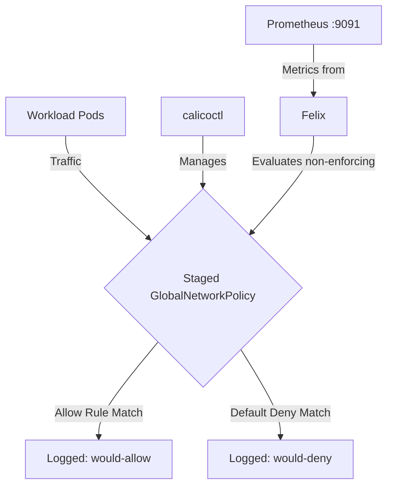

# How to Roll Out Staged GlobalNetworkPolicy in Calico Safely

Author: [nawazdhandala](https://github.com/nawazdhandala)

Tags: Calico, Kubernetes, Network Policy, Staged Policies, Global Policy

Description: A phased rollout strategy for Staged GlobalNetworkPolicy in Calico that prevents outages.

---

## Introduction

Staged GlobalNetworkPolicy is an advanced Calico feature that provides fine-grained network security controls using the `projectcalico.org/v3` API. This guide covers how to roll out Staged GlobalNetworkPolicy effectively in your Kubernetes cluster.

Calico's `projectcalico.org/v3` API provides rich support for Staged GlobalNetworkPolicy through its `GlobalNetworkPolicy`, `NetworkPolicy`, and related resources. Proper configuration of Staged GlobalNetworkPolicy is essential for maintaining a secure, well-controlled network fabric.

This guide provides production-tested patterns for roll out Staged GlobalNetworkPolicy, including YAML examples, CLI commands, and troubleshooting techniques.

## Prerequisites

- Kubernetes cluster with Calico v3.26+
- `calicoctl` and `kubectl` installed  
- Basic understanding of Calico network policy concepts
- Calico v3.26+ for full Staged GlobalNetworkPolicy feature support

## Core Configuration

The following YAML demonstrates the key pattern for Staged GlobalNetworkPolicy:

```yaml
apiVersion: projectcalico.org/v3
kind: StagedGlobalNetworkPolicy
metadata:
  name: roll-out-staged-globalnetworkpolicy
spec:
  order: 100
  selector: all()
  ingress:
    - action: Allow
      source:
        selector: app == 'authorized-source'
      destination:
        ports: [8080, 443]
  egress:
    - action: Allow
      protocol: UDP
      destination:
        ports: [53]
    - action: Allow
      destination:
        selector: app == 'authorized-destination'
  types:
    - Ingress
    - Egress
```

## Implementation Steps

```bash
# 1. Apply the policy

calicoctl apply -f roll-out-staged-globalnetworkpolicy.yaml

# 2. Verify it's active
calicoctl get stagedglobalnetworkpolicies -o wide

# 3. Test connectivity
kubectl exec -n production test-pod -- curl -s --max-time 5 http://target:8080
echo "Exit code: $?"

# 4. Check policy hit counters (if Felix metrics enabled)
curl -s http://localhost:9091/metrics | grep felix_denied
```

## Operational Commands

```bash
# List all relevant policies
calicoctl get stagedglobalnetworkpolicies
calicoctl get globalnetworkpolicies

# View policy details
calicoctl get stagedglobalnetworkpolicy roll-out-staged-globalnetworkpolicy -o yaml

# Delete a policy if needed
calicoctl delete stagedglobalnetworkpolicy roll-out-staged-globalnetworkpolicy
```

## Architecture



## Common Issues

1. **Policy not applying**: Verify API version is `projectcalico.org/v3` and run `kubectl apply --dry-run=server -f roll-out-staged-globalnetworkpolicy.yaml` first
2. **Selector not matching**: Use `kubectl get pods -l your-selector` to verify label matches
3. **Order conflicts**: Run `calicoctl get globalnetworkpolicies -o wide` and sort by order field
4. **DNS failures**: Always ensure egress to port 53 is allowed when restricting egress

## Conclusion

Roll Out Staged GlobalNetworkPolicy in Calico requires careful attention to policy ordering, selector syntax, and bidirectional traffic rules. Use the patterns in this guide as a starting point, adapt them to your specific requirements, and always validate changes in a staging environment before applying to production. Consistent logging and monitoring will help you detect and resolve issues quickly when they occur.
