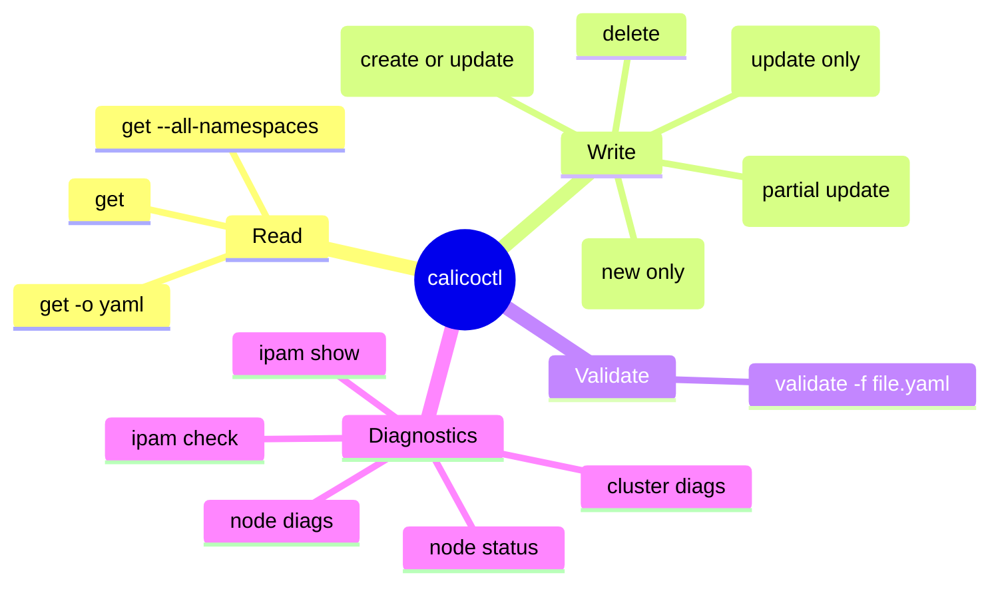

# calicoctl Command Guide - Rollback Delete

Author: [nawazdhandala](https://github.com/nawazdhandala)

Tags: Calico, Kubernetes, Networking, calicoctl

Description: Practical guide for using calicoctl commands safely and effectively in production Kubernetes clusters.

---

## Introduction

calicoctl is the primary CLI for managing Calico resources. This guide covers safe usage patterns for calicoctl commands in production environments.

## Key Commands

```bash
# List Calico resources
calicoctl get felixconfiguration
calicoctl get globalnetworkpolicy
calicoctl get bgppeer
calicoctl get ippool -o wide

# Apply a resource
calicoctl apply -f resource.yaml

# Create a resource (fails if exists)
calicoctl create -f resource.yaml

# Delete a resource
calicoctl delete globalnetworkpolicy my-policy

# Patch a resource
calicoctl patch felixconfiguration default \
  -p '{"spec":{"logSeverityScreen":"Info"}}'

# Validate a file without applying
calicoctl validate -f resource.yaml
```

## Safe Workflow Pattern

```bash
# Step 1: Backup current state
calicoctl get <resource> -o yaml > backup-$(date +%Y%m%d).yaml

# Step 2: Make the change
calicoctl apply -f new-config.yaml

# Step 3: Verify
calicoctl get <resource> -o yaml

# Step 4: Test connectivity
# Run your standard connectivity validation test

# Step 5: Rollback if needed
calicoctl apply -f backup-$(date +%Y%m%d).yaml
```

## calicoctl Command Reference



## Conclusion

calicoctl commands form the foundation of Calico resource management. Follow the backup-change-verify-rollback pattern for all write operations. Use `calicoctl apply` as the default for declarative management, `calicoctl get` for diagnostics, and `calicoctl delete` only with explicit intent and a verified backup. In production clusters, require change tickets for all write operations and integrate calicoctl with GitOps workflows for audit trails.
