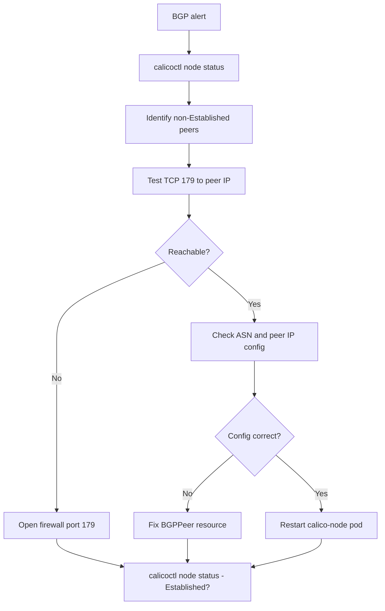

# Runbook: BGP Peer Not Established in Calico

Author: [nawazdhandala](https://github.com/nawazdhandala)

Tags: Calico, Kubernetes, Networking, Troubleshooting

Description: On-call runbook for restoring BGP peer sessions in Calico with triage procedures for configuration, connectivity, and BIRD health issues.

---

## Introduction

This runbook guides on-call engineers through restoring BGP peer sessions that are not in the Established state. BGP peer failures in Calico cause route withdrawal and cross-node pod connectivity failures. Resolution requires identifying whether the failure is a configuration, connectivity, or BIRD health issue.

## Symptoms

- Alert: `BGPPeerCheckFailing`
- Cross-node pod communication failing for some or all node pairs
- `calicoctl node status` shows non-Established peers

## Root Causes

- BGP peer IP unreachable, ASN mismatch, or BIRD stuck

## Diagnosis Steps

**Step 1: Check peer state**

```bash
calicoctl node status
# Note which peers are not Established and their state
```

**Step 2: Get BGP peer configuration**

```bash
calicoctl get bgppeer -o yaml
```

**Step 3: Test TCP connectivity**

```bash
# From the affected node
ssh <node-name> "nc -zv <peer-ip> 179"
```

**Step 4: Check BIRD logs**

```bash
NODE_POD=$(kubectl get pods -n kube-system -l k8s-app=calico-node \
  --field-selector spec.nodeName=<node-name> -o name)
kubectl logs $NODE_POD -n kube-system | grep -i "bird\|bgp\|peer" | tail -20
```

## Solution

**If TCP 179 not reachable:**

```bash
# Add firewall rule
sudo iptables -I INPUT -p tcp --dport 179 -j ACCEPT
sudo iptables -I OUTPUT -p tcp --dport 179 -j ACCEPT
```

**If ASN or peer IP wrong:**

```bash
calicoctl patch bgppeer <peer-name> \
  --patch='{"spec":{"peerIP":"<correct-ip>","asNumber":<correct-asn>}}'
```

**If BIRD stuck:**

```bash
kubectl delete pod $NODE_POD -n kube-system
kubectl wait pods -n kube-system -l k8s-app=calico-node \
  --field-selector spec.nodeName=<node-name> \
  --for=condition=Ready --timeout=120s
```

**Verify**

```bash
calicoctl node status
# Expected: all peers Established
```



## Prevention

- Pre-validate TCP 179 connectivity before configuring BGP peers
- Monitor BGP peer state with 10-minute alert threshold
- Document BGP topology in the cluster runbook

## Conclusion

BGP peer not established is resolved by identifying and fixing the specific failure: TCP 179 connectivity, BGP peer configuration, or BIRD daemon state. Verify recovery with `calicoctl node status` showing all peers as Established.
