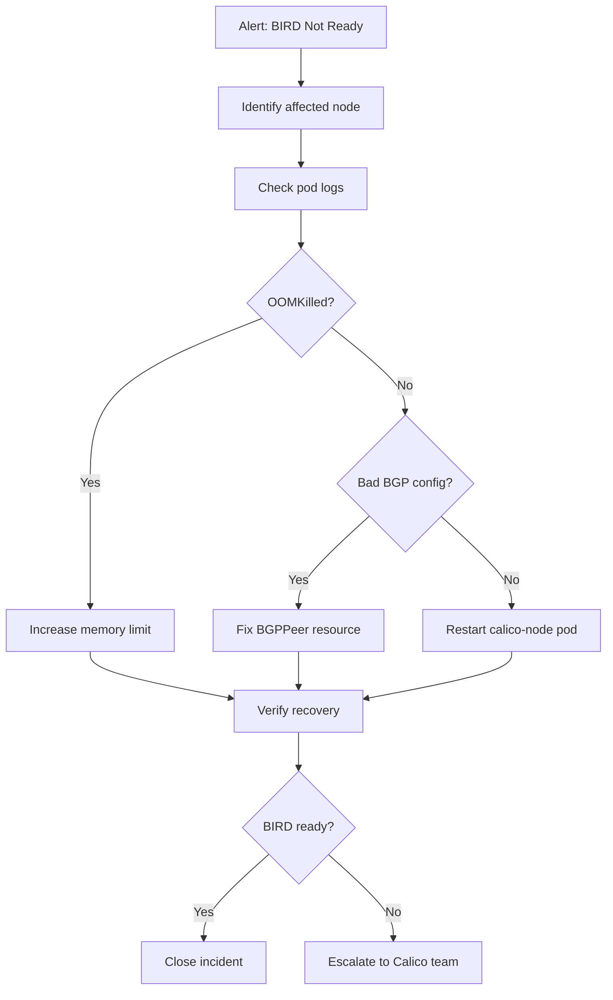

# Runbook: BIRD Not Ready Errors in Calico

Author: [nawazdhandala](https://github.com/nawazdhandala)

Tags: Calico, Kubernetes, Networking, Troubleshooting

Description: An on-call runbook for responding to BIRD not ready alerts in Calico, with triage steps, escalation paths, and recovery procedures.

---

## Introduction

This runbook provides structured on-call response procedures for BIRD not-ready alerts in Calico. It is intended for engineers who receive a `CalicoNodeBIRDNotReady` alert and need a guided path from alert triage to incident resolution. Following this runbook reduces cognitive load during stressful incidents and ensures consistent resolution steps across team members.

BIRD not-ready errors indicate that the BGP daemon within a calico-node pod has stopped functioning. This directly affects BGP route advertisement for the node, potentially causing pods on that node to become unreachable from other nodes. The severity depends on how many nodes are affected and whether redundant routing paths exist.

The runbook is organized as a decision tree: start at Step 1 and follow the branches based on what you observe. Each step includes the exact commands to run and the expected outputs.

## Symptoms

- Alert: `CalicoNodeBIRDNotReady` fires in Alertmanager
- calico-node pod shows `0/1 READY` for more than 2 minutes
- Users report intermittent cross-node pod connectivity failures
- `calicoctl node status` shows peers in non-Established states

## Root Causes

- BIRD subprocess crashed within calico-node container
- Misconfigured BGP peer or IP pool CIDR conflict
- calico-node OOMKilled due to insufficient memory limits
- Datastore (etcd or Kubernetes API) temporarily unreachable

## Diagnosis Steps

**Step 1: Identify affected node(s)**

```bash
kubectl get pods -n kube-system -l k8s-app=calico-node \
  --sort-by='.status.containerStatuses[0].ready' | grep -v "1/1"
```

**Step 2: Get the calico-node pod name**

```bash
export AFFECTED_NODE=<node-name-from-step-1>
export NODE_POD=$(kubectl get pods -n kube-system -l k8s-app=calico-node \
  --field-selector spec.nodeName=$AFFECTED_NODE -o name)
echo "Working with: $NODE_POD"
```

**Step 3: Check recent logs**

```bash
kubectl logs $NODE_POD -n kube-system --tail=100 | grep -i "bird\|not ready\|error\|fatal"
```

**Step 4: Check BGP peer state**

```bash
calicoctl node status
```

**Step 5: Check for OOMKill**

```bash
kubectl describe $NODE_POD -n kube-system | grep -i "OOM\|killed\|reason\|exit"
```

## Solution

**If OOMKilled:**

```bash
kubectl patch daemonset calico-node -n kube-system --type='json' \
  -p='[{"op":"replace","path":"/spec/template/spec/containers/0/resources/limits/memory","value":"512Mi"}]'
```

**If BGP peer misconfigured:**

```bash
calicoctl get bgppeer -o yaml
# Correct peer IP and AS number, then:
calicoctl apply -f corrected-bgppeer.yaml
```

**Safe restart procedure:**

```bash
# Only restart one node at a time to avoid routing disruption
kubectl delete pod $NODE_POD -n kube-system
kubectl wait --for=condition=Ready pod -l k8s-app=calico-node \
  -n kube-system --timeout=120s
# Verify BIRD is now ready
calicoctl node status
```



## Prevention

- Document the cluster's BGP topology and store it in the runbook wiki
- Set up a recurring `calicoctl node status` health check job
- Review calico-node resource limits quarterly as cluster grows

## Conclusion

This runbook provides a repeatable path from alert to resolution for BIRD not-ready incidents. By following these steps in order, on-call engineers can resolve the majority of BIRD failures within the first response window. For persistent failures not covered by this runbook, escalate with the collected logs and `calicoctl node status` output attached to the incident ticket.
