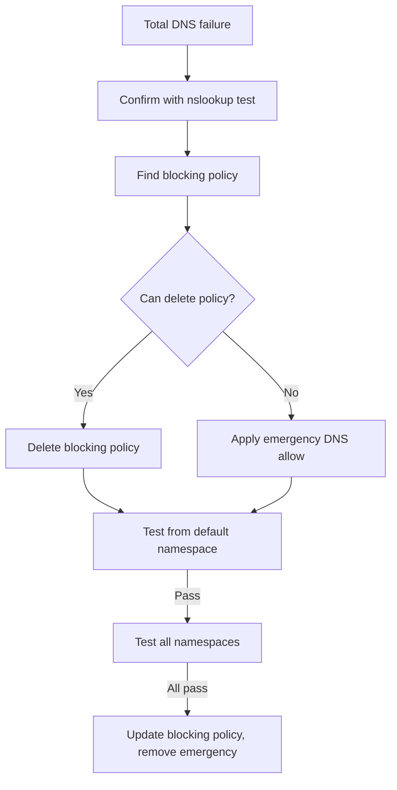

# Runbook: Calico Blocking kube-dns

Author: [nawazdhandala](https://github.com/nawazdhandala)

Tags: Calico, Kubernetes, Networking, Troubleshooting

Description: Emergency runbook for restoring cluster-wide DNS when Calico policies block kube-dns pods from receiving DNS queries.

---

## Introduction

Calico blocking kube-dns is a P1 incident — it causes total DNS failure across all namespaces. Response must be immediate. This runbook is optimized for the fastest possible DNS restoration.

## Symptoms

- Total cluster DNS failure
- Alert: `CoreDNSUnavailable` or `DNSProbeFailure` across all namespaces

## Root Causes

- Recently applied policy to kube-system or GlobalNetworkPolicy blocking UDP 53 to kube-dns

## Diagnosis Steps

**Immediate: Confirm cluster-wide DNS failure**

```bash
kubectl run dns-emergency --image=busybox --restart=Never --rm -i \
  --timeout=10s -- nslookup kubernetes.default 2>&1
# If this fails: cluster-wide DNS is down
```

**Find the blocking policy**

```bash
kubectl get networkpolicy -n kube-system \
  --sort-by='.metadata.creationTimestamp' | tail -3
calicoctl get globalnetworkpolicy \
  --sort-by='.metadata.creationTimestamp' 2>/dev/null | head
```

## Solution

**Option A: Delete the blocking policy (fastest)**

```bash
# If a recently added policy is the cause
kubectl delete networkpolicy <recently-added-policy> -n kube-system

# Or delete GlobalNetworkPolicy
calicoctl delete globalnetworkpolicy <policy-name>

# Verify immediately
kubectl run test --image=busybox --restart=Never --rm -i \
  --timeout=10s -- nslookup kubernetes.default
```

**Option B: Apply emergency DNS allow (if can't delete)**

```bash
cat <<EOF | kubectl apply -f -
apiVersion: networking.k8s.io/v1
kind: NetworkPolicy
metadata:
  name: emergency-allow-dns-queries
  namespace: kube-system
spec:
  podSelector:
    matchLabels:
      k8s-app: kube-dns
  policyTypes:
  - Ingress
  ingress:
  - from:
    - namespaceSelector: {}
    ports:
    - protocol: UDP
      port: 53
    - protocol: TCP
      port: 53
EOF
```

**Verify cluster-wide DNS restored**

```bash
for NS in default kube-system production; do
  kubectl run test --image=busybox -n $NS --restart=Never --rm -i \
    --timeout=10s -- nslookup kubernetes.default 2>&1 | grep -c "Address" \
    && echo "PASS: $NS" || echo "FAIL: $NS"
done
```



## Prevention

- Apply the immutable-allow-kube-dns GlobalNetworkPolicy immediately after this incident
- Never directly apply policies to kube-system without a post-change DNS test
- Test kube-system policy changes in staging before production

## Conclusion

Calico blocking kube-dns is resolved by either deleting the blocking policy or applying an emergency DNS allow to kube-system. DNS should restore within 60 seconds of the fix. After restoration, protect kube-dns with an order-1 GlobalNetworkPolicy to prevent recurrence.
