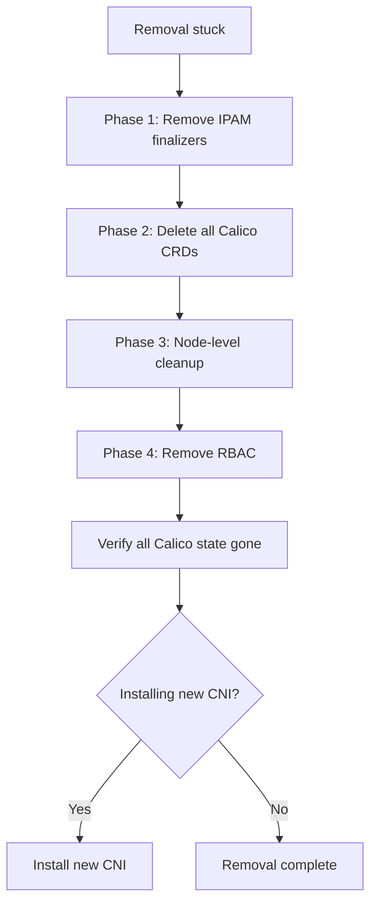

# Runbook: Problems During Calico CNI Removal

Author: [nawazdhandala](https://github.com/nawazdhandala)

Tags: Calico, Kubernetes, Networking, Troubleshooting

Description: Step-by-step runbook for resolving problems encountered during Calico CNI removal including stuck finalizers, incomplete CRD cleanup, and node-level state cleanup.

---

## Introduction

This runbook provides structured procedures for resolving issues encountered during Calico CNI removal. It is intended for cluster operators who have started a Calico removal and encountered stuck resources or incomplete cleanup. The runbook assumes the calico-node DaemonSet has already been deleted or is being deleted.

Work through the sections in order. Each section addresses a specific category of stuck state and provides the exact commands to resolve it.

## Symptoms

- Calico CRDs stuck in Terminating state
- `kubectl delete crd` times out or hangs
- New CNI cannot initialize because Calico CNI config still on nodes
- iptables cali-* chains still present on nodes

## Root Causes

- Finalizers on IPAM resources preventing CRD deletion
- calico-node pods deleted without waiting for proper termination
- Node-level cleanup not performed

## Diagnosis Steps

```bash
# Document the stuck state
echo "=== Stuck Calico resources ==="
kubectl get all -n kube-system | grep calico
kubectl get crd | grep calico
```

## Solution

**Phase 1: Resolve stuck IPAM finalizers**

```bash
# Force-remove all Calico CRD object finalizers
for CRD in $(kubectl get crd | grep calico | awk '{print $1}'); do
  echo "Processing CRD: $CRD"
  for OBJ in $(kubectl get $CRD -o jsonpath='{.items[*].metadata.name}' 2>/dev/null); do
    kubectl patch $CRD $OBJ \
      --type=json -p='[{"op":"remove","path":"/metadata/finalizers"}]' \
      2>/dev/null || true
  done
done
```

**Phase 2: Delete all Calico CRDs**

```bash
kubectl get crd | grep calico | awk '{print $1}' | while read CRD; do
  echo "Deleting CRD: $CRD"
  kubectl delete crd $CRD --timeout=30s 2>/dev/null || \
    kubectl patch crd $CRD --type=json \
      -p='[{"op":"remove","path":"/metadata/finalizers"}]' && \
    kubectl delete crd $CRD
done
```

**Phase 3: Node-level cleanup script**

```bash
#!/bin/bash
# Run on each node via SSH

# Remove CNI config files
rm -f /etc/cni/net.d/10-calico.conflist
rm -f /etc/cni/net.d/calico-kubeconfig

# Remove CNI binaries
rm -f /opt/cni/bin/calico
rm -f /opt/cni/bin/calico-ipam

# Remove tunnel interfaces
ip link delete tunl0 type ipip 2>/dev/null || true
ip link delete vxlan.calico 2>/dev/null || true

# Flush cali-* iptables chains
for CHAIN in $(iptables -L | grep "^Chain cali-" | awk '{print $2}'); do
  iptables -F $CHAIN 2>/dev/null && iptables -X $CHAIN 2>/dev/null || true
done

echo "Node cleanup complete"
```

**Phase 4: Clean up RBAC**

```bash
kubectl delete clusterrole calico-node calico-kube-controllers --ignore-not-found
kubectl delete clusterrolebinding calico-node calico-kube-controllers --ignore-not-found
kubectl delete sa calico-node calico-kube-controllers -n kube-system --ignore-not-found
kubectl delete configmap calico-config -n kube-system --ignore-not-found
```



## Prevention

- Follow the structured removal procedure from the Prevention post
- Test removal in staging before production
- Schedule a maintenance window with rollback time allocated

## Conclusion

Resolving Calico removal problems requires working through each layer of stuck state in order: IPAM resource finalizers, CRDs, node-level config and iptables, then RBAC. Each phase is independent - if one phase is already complete, skip to the next. After all phases, verify that no Calico resources remain before proceeding with new CNI installation.
