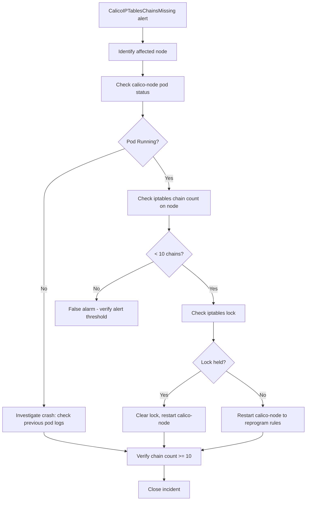

# Runbook: Calico iptables Rules Not Applied

Author: [nawazdhandala](https://github.com/nawazdhandala)

Tags: Calico, iptables, Networking, Troubleshooting, Kubernetes, Runbook

Description: On-call runbook for responding to Calico iptables rules not being applied on a node, including Felix health triage, chain verification, and targeted restart procedures.

---

## Introduction

This runbook guides on-call engineers through responding to incidents where Calico iptables rules are not being applied to one or more nodes. The most visible symptom is network policy enforcement failure or loss of pod NAT, both of which indicate Felix is not programming iptables chains correctly.

The response is typically fast: restarting calico-node on the affected node reprograms all chains within 30-60 seconds. Identifying why rules are missing prevents recurrence.

## Symptoms

- Network policies not enforced on specific node
- Pods on a node can bypass firewall rules
- MASQUERADE rules absent for pod CIDR on a node
- Alert: `CalicoIPTablesChainsMissing` firing

## Root Causes

- calico-node pod restarted and rules lost due to iptables flush
- iptables backend mismatch after kernel upgrade
- iptables lock held by another process
- Felix in error state from invalid configuration

## Diagnosis Steps

**Step 1: Identify affected node**

```bash
# If alert fired, check which node
kubectl get pods -n kube-system -l k8s-app=calico-node -o wide
# Look for pods in non-Running state

# Check Felix health on each node
kubectl exec -n kube-system <calico-node-pod> -- calico-node -felix-health-check 2>/dev/null
```

**Step 2: Check iptables chains on affected node**

```bash
ssh <node-name> "sudo iptables -L | grep '^Chain cali' | wc -l"
# Expected: >= 10
# If < 5: rules are missing
```

**Step 3: Check calico-node logs for errors**

```bash
NODE_POD=$(kubectl get pods -n kube-system -l k8s-app=calico-node \
  --field-selector spec.nodeName=<node-name> -o jsonpath='{.items[0].metadata.name}')
kubectl logs $NODE_POD -n kube-system -c calico-node | grep -i "error\|warn\|iptables" | tail -20
```

**Step 4: Check iptables lock**

```bash
ssh <node-name> "sudo fuser /run/xtables.lock 2>/dev/null && echo LOCK_HELD || echo NO_LOCK"
```

## Solution

**Primary fix - restart calico-node:**

```bash
NODE_POD=$(kubectl get pods -n kube-system -l k8s-app=calico-node \
  --field-selector spec.nodeName=<node-name> -o jsonpath='{.items[0].metadata.name}')
kubectl delete pod $NODE_POD -n kube-system

# Wait for rescheduling
kubectl get pods -n kube-system -l k8s-app=calico-node \
  --field-selector spec.nodeName=<node-name> -w
```

**If iptables lock is held:**

```bash
HOLDER=$(ssh <node-name> "sudo fuser /run/xtables.lock 2>/dev/null")
echo "Lock held by PID: $HOLDER"
# Investigate process, then clear lock if stale
ssh <node-name> "sudo rm -f /run/xtables.lock"
kubectl delete pod $NODE_POD -n kube-system
```

**If Felix configuration is invalid:**

```bash
kubectl logs $NODE_POD -n kube-system -c calico-node | grep "config\|invalid"
# Reset FelixConfiguration if corrupted
calicoctl delete felixconfiguration default
kubectl delete pod $NODE_POD -n kube-system
```

**Verify fix:**

```bash
sleep 30  # Allow Felix to reprogram rules
ssh <node-name> "sudo iptables -L | grep -c '^Chain cali'"
# Expected: >= 10

ssh <node-name> "sudo iptables -t nat -L POSTROUTING -n | grep MASQUERADE"
# Expected: at least one MASQUERADE rule
```



## Escalation

- 0-5 min: Restart calico-node on affected node
- 5-15 min: If rules not restored, check for iptables lock or backend mismatch
- 15+ min: Escalate to networking team lead

## Prevention

- Monitor iptables chain count per node with PrometheusRule
- Run post-maintenance validation after every node reboot
- Disable Docker iptables management to prevent iptables conflicts

## Conclusion

iptables rule restoration after Calico failures is almost always achieved by restarting calico-node. The key on-call action is identifying the affected node, restarting the calico-node pod, and verifying Calico chains are reprogrammed within 60 seconds.
