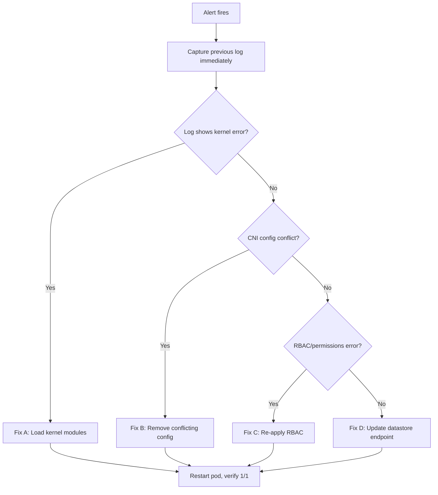

# Runbook: Calico Node CrashLoopBackOff

Author: [nawazdhandala](https://github.com/nawazdhandala)

Tags: Calico, Kubernetes, Networking, Troubleshooting

Description: On-call runbook for responding to calico-node CrashLoopBackOff alerts with triage commands, root cause identification, and remediation procedures.

---

## Introduction

This runbook guides on-call engineers through the response to a `CalicoNodeCrashLoopBackOff` alert. The calico-node DaemonSet is critical cluster infrastructure - when a pod enters CrashLoopBackOff, the affected node loses CNI functionality and new pods cannot be scheduled or receive network configuration. Rapid, structured response is essential.

The runbook is organized as a linear triage sequence. Each step narrows down the root cause. Once identified, jump to the corresponding fix section. The entire triage-to-fix sequence should complete within 15 minutes for well-understood failure modes.

Keep this runbook open alongside your incident management tool. Record the outputs of each command in the incident ticket to build a timeline for the post-incident review.

## Symptoms

- Alert: `CalicoNodeCrashLoopBackOff` fires
- `kubectl get pods -n kube-system` shows calico-node in CrashLoopBackOff
- Pods on the affected node stuck in `ContainerCreating`
- BGP routes withdrawn for the affected node's pod CIDR

## Root Causes

- Missing kernel module (ipip, xt_set, nf_conntrack)
- Conflicting CNI configuration in /etc/cni/net.d/
- RBAC permission error for calico-node ServiceAccount
- Stale or unreachable datastore endpoint

## Diagnosis Steps

**Triage Step 1: Identify affected node(s) - run immediately**

```bash
kubectl get pods -n kube-system -l k8s-app=calico-node \
  -o wide | grep -v "1/1"
```

**Triage Step 2: Capture previous container log - do this before next restart clears it**

```bash
export NODE_NAME=<node-name>
export NODE_POD=$(kubectl get pods -n kube-system -l k8s-app=calico-node \
  --field-selector spec.nodeName=$NODE_NAME -o name)

kubectl logs $NODE_POD -n kube-system --previous -c calico-node 2>/dev/null \
  | tail -50 | tee /tmp/calico-crash-$(date +%s).log
```

**Triage Step 3: Identify crash reason from log**

```bash
# Look for these key patterns:
grep -i "kernel\|module\|permission\|refused\|unauthorized\|etcd\|conflict" \
  /tmp/calico-crash-*.log | head -20
```

**Triage Step 4: Check init containers**

```bash
kubectl describe $NODE_POD -n kube-system \
  | grep -A 20 "Init Containers:" | grep -E "State|Reason|Exit Code"
```

## Solution

**Fix A (Kernel module missing):**

```bash
# SSH to affected node
ssh <node-name>
modprobe ipip && modprobe xt_set && modprobe nf_conntrack
echo -e "ipip\nxt_set\nnf_conntrack" >> /etc/modules
exit

# Restart the pod
kubectl delete pod $NODE_POD -n kube-system
```

**Fix B (CNI config conflict):**

```bash
# SSH to affected node
ssh <node-name>
ls /etc/cni/net.d/
# Remove non-Calico configs
rm /etc/cni/net.d/10-flannel.conflist  # or whatever is conflicting
exit
kubectl delete pod $NODE_POD -n kube-system
```

**Fix C (RBAC error):**

```bash
kubectl apply -f https://raw.githubusercontent.com/projectcalico/calico/v3.27.0/manifests/calico.yaml \
  --server-side --field-manager=calico --dry-run=server
# If no errors, apply for real
kubectl apply -f https://raw.githubusercontent.com/projectcalico/calico/v3.27.0/manifests/calico.yaml \
  --server-side --field-manager=calico
```

**Fix D (Datastore unreachable):**

```bash
kubectl patch configmap calico-config -n kube-system --type=merge \
  -p "{\"data\":{\"etcd_endpoints\":\"https://$(kubectl get endpoints kubernetes -o jsonpath='{.subsets[0].addresses[0].ip}'):2379\"}}"
kubectl rollout restart daemonset calico-node -n kube-system
```



## Prevention

- Document kernel module requirements in cluster onboarding docs
- Run pre-flight checks automatically when adding new nodes
- Review and lock RBAC manifests in version control

## Conclusion

Calico node CrashLoopBackOff incidents follow predictable patterns. Capturing the previous container log is the most important first action. Match the log error to one of the four fix categories, apply the targeted remediation, and verify the pod reaches 1/1 Ready. Document the root cause and fix in the incident ticket for future reference.
