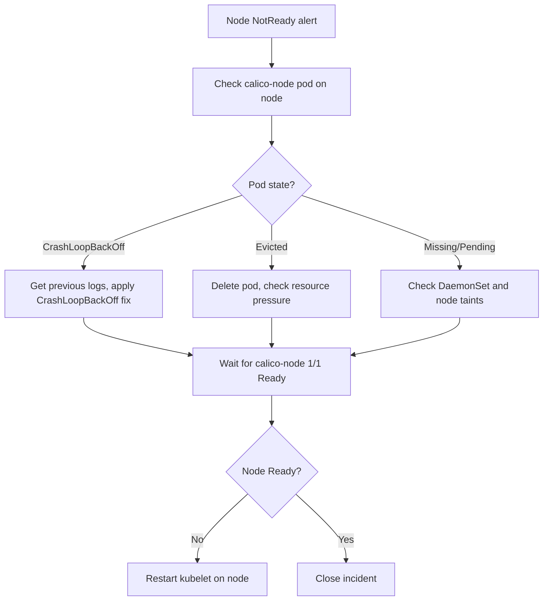

# Runbook: Calico Node Not Ready Status

Author: [nawazdhandala](https://github.com/nawazdhandala)

Tags: Calico, Kubernetes, Networking, Troubleshooting

Description: On-call runbook for resolving Kubernetes node NotReady status caused by Calico issues with fast triage commands and targeted remediation steps.

---

## Introduction

This runbook guides on-call engineers through resolving node NotReady status caused by Calico failures. The primary focus is identifying why the calico-node pod on the affected node is not healthy, then applying the matching fix. In most cases, the node will automatically recover once calico-node is restored.

## Symptoms

- Alert: `KubernetesNodeNotReady` or `CalicoNodePodNotReady`
- `kubectl get nodes` shows NotReady
- Pods not scheduling on the affected node

## Root Causes

- calico-node CrashLoopBackOff, eviction, or Pending
- Missing CNI binary or configuration

## Diagnosis Steps

**Step 1: Identify affected node**

```bash
kubectl get nodes | grep NotReady
export NODE=<notready-node>
```

**Step 2: Check calico-node pod**

```bash
kubectl get pods -n kube-system -l k8s-app=calico-node \
  --field-selector spec.nodeName=$NODE
```

**Step 3: Get pod details**

```bash
NODE_POD=$(kubectl get pods -n kube-system -l k8s-app=calico-node \
  --field-selector spec.nodeName=$NODE -o name)
kubectl describe $NODE_POD -n kube-system | tail -30
kubectl logs $NODE_POD -n kube-system --tail=30 2>/dev/null || \
kubectl logs $NODE_POD -n kube-system --previous --tail=30 2>/dev/null
```

## Solution

**If calico-node is CrashLoopBackOff:**

```bash
# See CrashLoopBackOff runbook for specific fix
# Quick restart attempt:
kubectl delete pod $NODE_POD -n kube-system
kubectl wait pods -n kube-system -l k8s-app=calico-node \
  --field-selector spec.nodeName=$NODE \
  --for=condition=Ready --timeout=120s
```

**If calico-node is Evicted or missing:**

```bash
# Check for eviction pressure
kubectl describe node $NODE | grep -i "pressure\|eviction"

# Delete evicted pod to allow reschedule
kubectl delete pod $NODE_POD -n kube-system 2>/dev/null || true

# If persistent eviction, cordon node and address resource pressure
kubectl cordon $NODE
# Address disk/memory pressure then uncordon
```

**If node still NotReady after calico-node is healthy:**

```bash
ssh $NODE "sudo systemctl restart kubelet"
sleep 30
kubectl get node $NODE
```



## Prevention

- Monitor calico-node readiness to get early warning before node NotReady
- Set system-node-critical priority to prevent eviction
- Include node readiness in primary on-call monitoring

## Conclusion

Node NotReady from Calico is resolved by restoring the calico-node pod. Identify the pod's failure state, apply the matching fix, and restart kubelet if the node status doesn't automatically recover. The entire sequence should complete within 15 minutes for known failure patterns.
