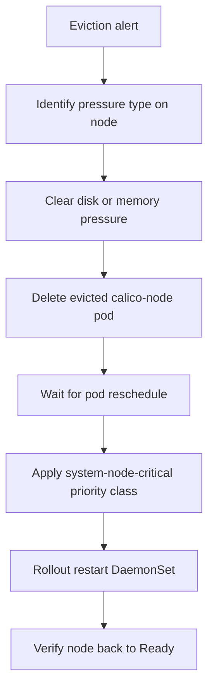

# Runbook: Calico Node Pod Evicted

Author: [nawazdhandala](https://github.com/nawazdhandala)

Tags: Calico, Kubernetes, Networking, Troubleshooting

Description: On-call runbook for recovering from calico-node pod eviction with node pressure relief and pod restoration procedures.

---

## Introduction

This runbook guides engineers through recovering from calico-node pod eviction. The first priority is clearing the node pressure condition to allow calico-node to reschedule. Then, prevent future evictions by setting the system-node-critical priority class.

## Symptoms

- Alert: `CalicoNodeEvicted` or `NodeDiskPressure`
- calico-node pod in Failed/Evicted state
- Node in DiskPressure or MemoryPressure

## Root Causes

- Node disk or memory pressure causing calico-node eviction

## Diagnosis Steps

**Step 1: Confirm eviction and identify pressure type**

```bash
kubectl get pods -n kube-system -l k8s-app=calico-node -o wide | grep -E "Evicted|Error|Failed"
kubectl describe node <node-name> | grep -A 10 "Conditions:"
```

**Step 2: Check node resource usage**

```bash
kubectl top node <node-name>
ssh <node-name> "df -h && free -m"
```

## Solution

**If disk pressure:**

```bash
ssh <node-name> << 'EOF'
# Clear journal logs
journalctl --vacuum-size=200M

# Clear container runtime cache
crictl rmi --prune 2>/dev/null || docker system prune -f 2>/dev/null

# Check and clear large log files
find /var/log -name "*.log" -size +100M -exec truncate -s 50M {} \;

df -h
EOF

# Delete evicted pod
kubectl delete pod <evicted-pod-name> -n kube-system

# Wait for reschedule
kubectl wait pods -n kube-system -l k8s-app=calico-node \
  --field-selector spec.nodeName=<node-name> \
  --for=condition=Ready --timeout=120s
```

**Apply permanent fix: priority class**

```bash
kubectl patch daemonset calico-node -n kube-system --type=json \
  -p='[{"op":"add","path":"/spec/template/spec/priorityClassName","value":"system-node-critical"}]'
kubectl rollout restart daemonset calico-node -n kube-system
```

**Verify**

```bash
kubectl get pods -n kube-system -l k8s-app=calico-node --field-selector spec.nodeName=<node>
kubectl describe node <node> | grep -i "pressure"
```



## Prevention

- Apply system-node-critical priority class immediately after this incident
- Set disk usage alerts at 80% threshold
- Monitor calico-node pod eviction events in real-time

## Conclusion

calico-node eviction is recovered by clearing the pressure condition, deleting the evicted pod, and applying the system-node-critical priority class permanently. This final step is the most important - it prevents the issue from recurring on the next pressure event.
