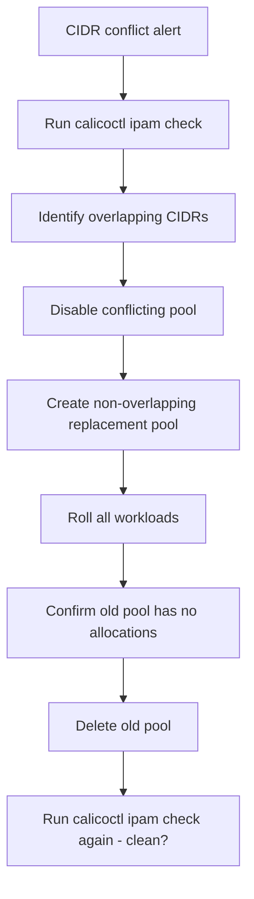

# Runbook: Calico Pod CIDR Conflicts

Author: [nawazdhandala](https://github.com/nawazdhandala)

Tags: Calico, Kubernetes, Networking, Troubleshooting

Description: On-call runbook for identifying and resolving Calico pod CIDR conflicts with step-by-step triage and IP pool migration procedures.

---

## Introduction

This runbook guides on-call engineers through diagnosing and resolving Calico pod CIDR conflicts. CIDR conflicts cause intermittent or directional connectivity failures that are difficult to diagnose without examining IP address allocation at the infrastructure level.

The triage sequence identifies the specific overlap, then guides through an IP pool migration to a non-conflicting CIDR.

## Symptoms

- Connectivity failures to specific IP ranges
- Alert: `calicoctl ipam check` CronJob failing
- Pod has same IP as a node

## Root Causes

- Pod CIDR overlaps with node subnet
- Two IP pools with overlapping ranges

## Diagnosis Steps

**Step 1: Run IPAM check**

```bash
calicoctl ipam check
```

**Step 2: List pools and node IPs**

```bash
calicoctl get ippool -o yaml | grep cidr:
kubectl get nodes -o wide | awk '{print $6}'
```

**Step 3: Identify the overlap**

```bash
# Compare manually or use the monitoring script from the Monitor post
```

## Solution

**Immediate mitigation: Disable conflicting IP pool**

```bash
# Stop new allocations from the conflicting pool
calicoctl patch ippool <conflicting-pool> \
  --patch='{"spec": {"disabled": true}}'
```

**Fix: Create new non-overlapping pool and migrate pods**

```bash
# Create new pool
cat <<EOF | calicoctl apply -f -
apiVersion: projectcalico.org/v3
kind: IPPool
metadata:
  name: replacement-pool
spec:
  cidr: 192.168.0.0/16
  ipipMode: Always
  natOutgoing: true
EOF

# Roll all workloads
kubectl rollout restart deployment --all --all-namespaces
kubectl rollout restart daemonset --all --all-namespaces

# Monitor until all pods have new IPs
watch kubectl get pods --all-namespaces -o wide
```

**Cleanup old pool**

```bash
# Wait for no pods to have IPs from old CIDR
calicoctl ipam show --show-blocks | grep <old-cidr>
# If empty:
calicoctl delete ippool <conflicting-pool>
```



## Prevention

- Create an IP address plan before cluster provisioning
- Schedule regular IPAM audit CronJobs
- Alert on IPAM check failures immediately

## Conclusion

Calico CIDR conflicts require identifying the overlap, disabling the conflicting pool, creating a replacement with a clean CIDR, rolling workloads to get new IPs, and deleting the old pool. The pod rolling step causes brief disruption but is the only way to fully migrate to a clean CIDR.
