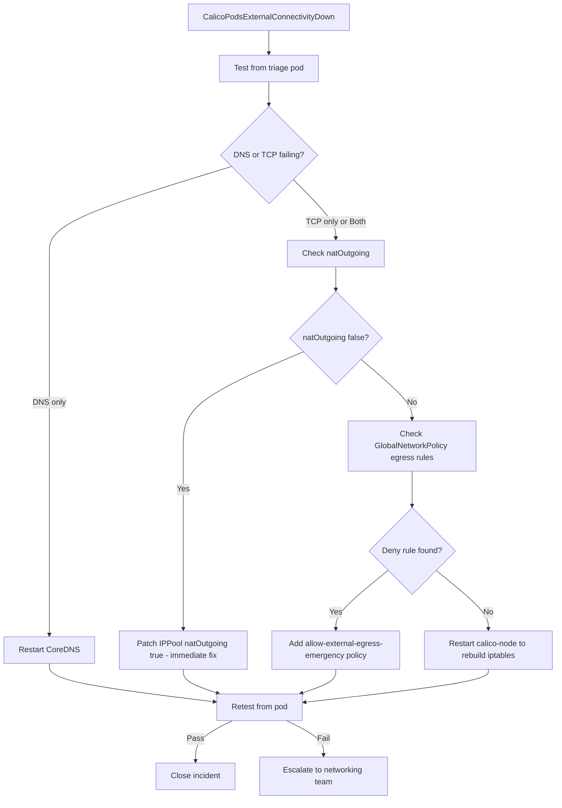

# Runbook: Calico Pods Cannot Reach External Services

Author: [nawazdhandala](https://github.com/nawazdhandala)

Tags: Calico, Kubernetes, Networking, Troubleshooting, Runbook

Description: On-call runbook for responding to Calico pods losing external service connectivity, including triage steps, targeted fixes for natOutgoing and egress policy issues, and validation criteria.

---

## Introduction

This runbook guides on-call engineers through responding to incidents where pods in a Calico cluster cannot reach external services. External connectivity loss affects API calls, database connections, and any outbound pod traffic. Rapid triage to identify the blocking layer - NAT, network policy, or DNS - enables a targeted fix within minutes.

## Symptoms

- Alert: `CalicoPodsExternalConnectivityDown` firing
- Application errors: connection refused or timeout to external services
- DNS resolution failures from pods

## Root Causes

- natOutgoing disabled on IP pool
- GlobalNetworkPolicy blocking egress
- Missing iptables cali-nat-outgoing chain
- CoreDNS unreachable

## Diagnosis Steps

**Step 1: Confirm scope - all pods or specific namespace/node?**

```bash
# Test from multiple pods
kubectl run triage-test --image=busybox --restart=Never -- sleep 60
kubectl exec triage-test -- wget -qO- --timeout=5 http://1.1.1.1 && echo "PASS" || echo "FAIL"
kubectl exec triage-test -- nslookup google.com && echo "DNS OK" || echo "DNS FAIL"
kubectl delete pod triage-test
```

**Step 2: Check natOutgoing**

```bash
calicoctl get ippool -o yaml | grep -E "name:|natOutgoing"
# natOutgoing: false means external NAT is disabled
```

**Step 3: Check egress network policies**

```bash
calicoctl get globalnetworkpolicy -o yaml | grep -E "egress:|action:"
kubectl get networkpolicies --all-namespaces | grep -v "^$"
```

**Step 4: Check DNS**

```bash
kubectl exec triage-test -- nslookup kubernetes.default.svc.cluster.local
kubectl get pods -n kube-system -l k8s-app=kube-dns
```

## Solution

**If natOutgoing disabled:**

```bash
calicoctl patch ippool default-ipv4-ippool \
  --patch='{"spec":{"natOutgoing":true}}'
```

**If GlobalNetworkPolicy blocking egress:**

```bash
# Check for deny egress rules
calicoctl get globalnetworkpolicy -o yaml | grep -B5 "action: Deny"

# Add allow rule with lower order number
cat <<EOF | calicoctl apply -f -
apiVersion: projectcalico.org/v3
kind: GlobalNetworkPolicy
metadata:
  name: allow-external-egress-emergency
spec:
  order: 10
  selector: all()
  egress:
  - action: Allow
    destination:
      notNets: ["10.0.0.0/8", "172.16.0.0/12", "192.168.0.0/16"]
EOF
```

**If iptables rules missing:**

```bash
kubectl rollout restart daemonset calico-node -n kube-system
kubectl rollout status daemonset calico-node -n kube-system --timeout=300s
```

**If CoreDNS down:**

```bash
kubectl rollout restart deployment coredns -n kube-system
```

**Verify resolution:**

```bash
kubectl run verify-test --image=busybox --restart=Never -- sh -c \
  "nslookup google.com && wget -qO- --timeout=10 http://1.1.1.1 && echo RESOLVED"
kubectl logs verify-test
kubectl delete pod verify-test
```



## Escalation

- 0-5 min: Fix natOutgoing or add emergency egress allow policy
- 5-15 min: If no improvement, restart calico-node across all nodes
- 15+ min: Escalate to networking team lead

## Prevention

- Set natOutgoing: true in all IP pool manifests
- Include egress Allow rules in every default-deny GlobalNetworkPolicy
- Run external connectivity probes from pods continuously

## Conclusion

Most external connectivity failures from Calico pods are resolved within 5 minutes by re-enabling natOutgoing or adding an emergency egress allow policy. Always verify from a freshly created test pod to confirm connectivity is fully restored before closing the incident.
