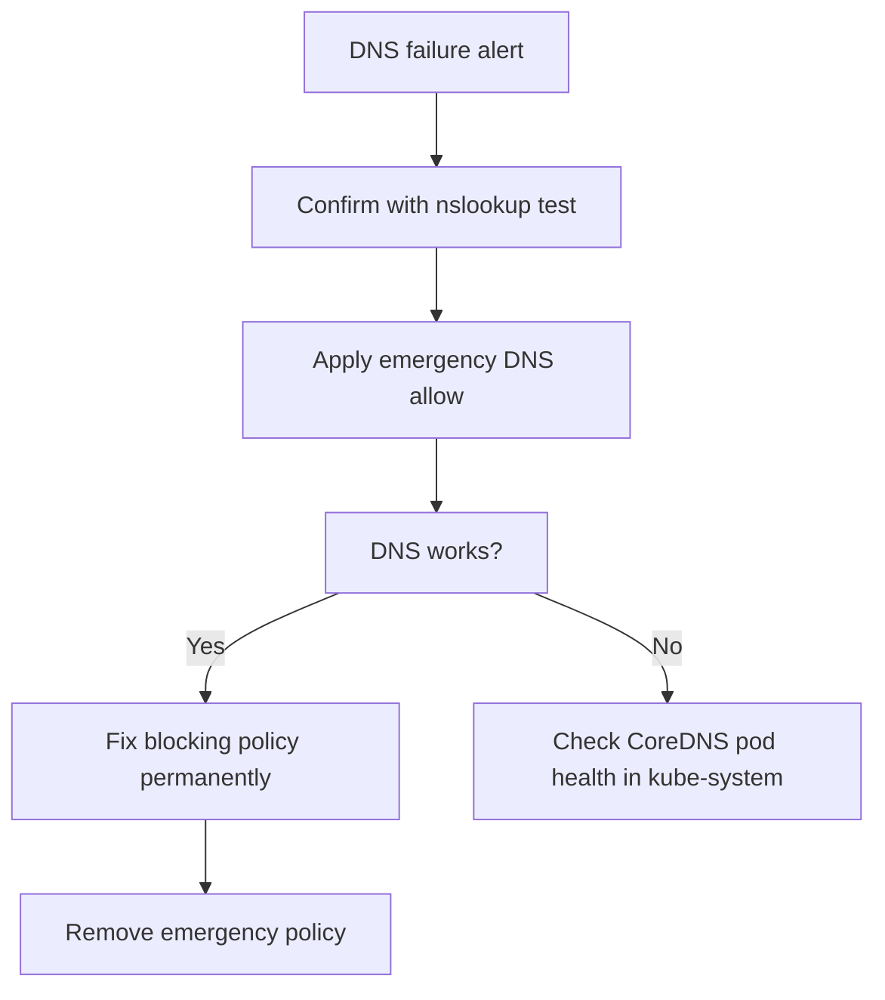

# Runbook: Calico Policy Blocking DNS

Author: [nawazdhandala](https://github.com/nawazdhandala)

Tags: Calico, Kubernetes, Networking, Troubleshooting

Description: On-call runbook for resolving DNS failures caused by Calico NetworkPolicies with immediate DNS restore procedures and permanent fix steps.

---

## Introduction

DNS blocking by Calico policies is a high-priority incident because it cascades into failures across all applications in the affected namespace. DNS must be restored within the first 5 minutes of response. This runbook is optimized for speed.

## Symptoms

- Alert: `DNSProbeFailure` or `CoreDNSHighServfailRate`
- Pods returning `no such host` errors
- nslookup fails from pod

## Root Causes

- Default-deny egress policy without DNS allow applied to namespace

## Diagnosis Steps

**Step 1: Confirm DNS failure**

```bash
NS=<affected-namespace>
kubectl run dns-check --image=busybox -n $NS --restart=Never --rm -i \
  --timeout=15s -- nslookup kubernetes.default 2>&1
```

**Step 2: Find the blocking policy**

```bash
kubectl get networkpolicy -n $NS \
  --sort-by='.metadata.creationTimestamp' | tail -5
```

## Solution

**Immediate: Apply DNS allow**

```bash
NS=<affected-namespace>
cat <<EOF | kubectl apply -f -
apiVersion: networking.k8s.io/v1
kind: NetworkPolicy
metadata:
  name: emergency-allow-dns
  namespace: $NS
spec:
  podSelector: {}
  policyTypes:
  - Egress
  egress:
  - to:
    - namespaceSelector:
        matchLabels:
          kubernetes.io/metadata.name: kube-system
    ports:
    - protocol: UDP
      port: 53
    - protocol: TCP
      port: 53
EOF

# Verify
kubectl run dns-test --image=busybox -n $NS --restart=Never --rm -i \
  --timeout=15s -- nslookup kubernetes.default
```

**Permanent: Fix blocking policy**

```bash
kubectl edit networkpolicy <blocking-policy> -n $NS
# Add DNS egress allow rule to the policy

# Remove emergency policy
kubectl delete networkpolicy emergency-allow-dns -n $NS
```



## Prevention

- Deploy GlobalNetworkPolicy DNS baseline as permanent cluster infrastructure
- Test DNS after every egress policy change
- Monitor DNS probe CronJobs continuously

## Conclusion

DNS blocking by Calico policies is resolved by applying an emergency DNS allow policy immediately (30 seconds to apply), then updating the blocking policy permanently. DNS should restore within 1-2 minutes of applying the emergency policy.
