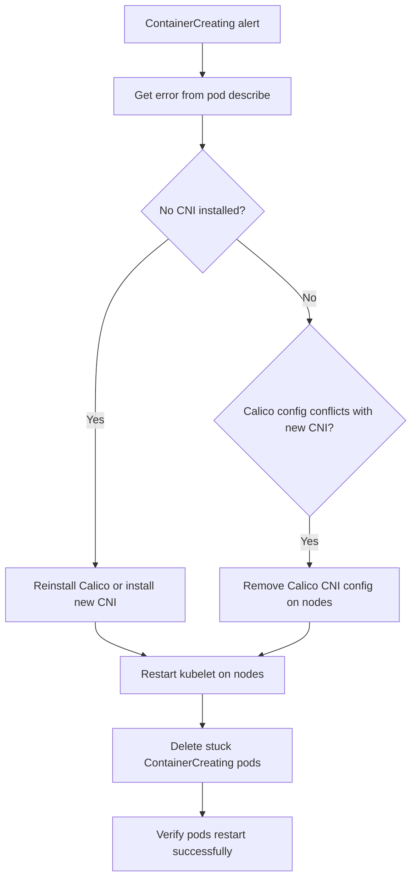

# Runbook: ContainerCreating After Uninstalling Calico

Author: [nawazdhandala](https://github.com/nawazdhandala)

Tags: Calico, Kubernetes, Networking, Troubleshooting

Description: On-call runbook for resolving pods stuck in ContainerCreating after Calico CNI removal with CNI repair and pod rescheduling procedures.

---

## Introduction

This runbook guides on-call engineers through resolving ContainerCreating failures caused by absent or broken CNI configuration after Calico removal. This typically occurs during or after a planned CNI migration that did not complete cleanly, or after an unintentional Calico removal.

The immediate goal is to restore a functioning CNI on all nodes. Once CNI is restored, stuck ContainerCreating pods must be deleted to trigger rescheduling with the new CNI configuration.

## Symptoms

- Alert: `PodsStuckContainerCreating` firing
- Pods stuck in ContainerCreating across multiple nodes
- `kubectl describe pod` shows plugin not found error

## Root Causes

- Calico removed without replacement CNI
- New CNI installed but Calico CNI config takes precedence on nodes

## Diagnosis Steps

**Step 1: Confirm scope**

```bash
kubectl get pods --all-namespaces | grep ContainerCreating
kubectl get nodes | grep NotReady
```

**Step 2: Get the CNI error**

```bash
POD=$(kubectl get pods --all-namespaces | grep ContainerCreating | head -1 | awk '{print $2}')
NS=$(kubectl get pods --all-namespaces | grep ContainerCreating | head -1 | awk '{print $1}')
kubectl describe pod $POD -n $NS | grep -A5 "Warning"
```

**Step 3: Check node CNI state**

```bash
NODE=$(kubectl get pod $POD -n $NS -o jsonpath='{.spec.nodeName}')
ssh $NODE "ls /etc/cni/net.d/ && ls /opt/cni/bin/ | head -20"
```

## Solution

**If no CNI installed - Quick reinstall Calico**

```bash
kubectl apply -f https://raw.githubusercontent.com/projectcalico/calico/v3.27.0/manifests/calico.yaml
kubectl rollout status daemonset calico-node -n kube-system --timeout=180s
```

**If new CNI installed but Calico config conflicts**

```bash
for NODE in $(kubectl get nodes -o jsonpath='{.items[*].metadata.name}'); do
  ssh $NODE "rm -f /etc/cni/net.d/10-calico.conflist && sudo systemctl restart kubelet"
done
```

**Delete stuck ContainerCreating pods after CNI is fixed**

```bash
kubectl get pods --all-namespaces | grep ContainerCreating | \
  awk '{print "kubectl delete pod " $2 " -n " $1}' | bash
```

**Verify pods restart successfully**

```bash
kubectl get pods --all-namespaces | grep ContainerCreating | wc -l
# Expected: 0
```



## Prevention

- Follow rolling migration procedure to avoid CNI coverage gaps
- Test pod scheduling immediately after each node's CNI is changed
- Have Calico reinstall manifest bookmarked for fast rollback

## Conclusion

ContainerCreating after Calico removal is resolved by restoring a functioning CNI — either reinstalling Calico or completing the replacement CNI installation. After CNI is fixed, delete all ContainerCreating pods to trigger rescheduling. The entire recovery should complete within 15-20 minutes.
