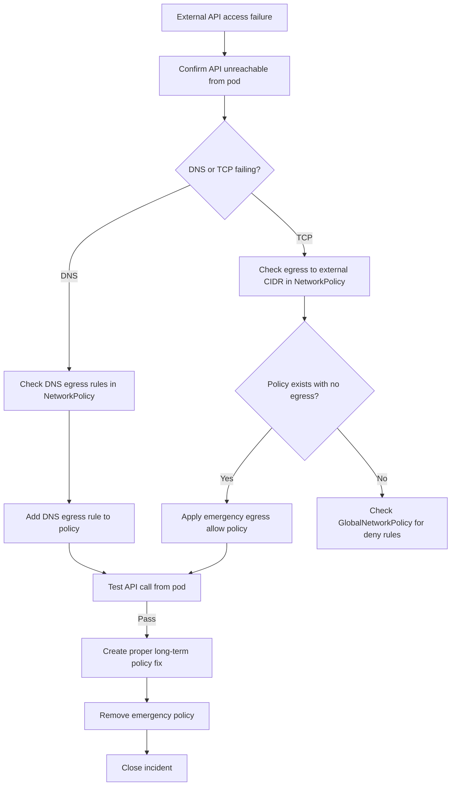

# Runbook: External API Access Failures from Calico Pods

Author: [nawazdhandala](https://github.com/nawazdhandala)

Tags: Calico, Kubernetes, Networking, Troubleshooting, API Access, Runbook

Description: On-call runbook for responding to external API access failures from Calico pods, covering triage steps, egress policy fixes, and escalation criteria for API connectivity incidents.

---

## Introduction

This runbook guides on-call engineers through responding to incidents where pods in a Calico cluster cannot reach external APIs. External API failures typically manifest as application errors - payment failures, authentication errors, or data ingestion stops - rather than direct network alerts.

The response focuses on quickly identifying whether Calico network policy is blocking the API calls, and applying targeted policy changes to restore access. Emergency egress allow policies can be applied in under 5 minutes while a proper long-term fix is prepared.

## Symptoms

- Application logs show connection refused or timeout to external API
- Specific namespace or pod cannot reach external HTTPS endpoints
- Recent NetworkPolicy or GlobalNetworkPolicy change preceded the incident

## Root Causes

- NetworkPolicy applied without egress rules for external APIs
- GlobalNetworkPolicy with default-deny blocking new API destinations
- DNS egress blocked, preventing hostname resolution

## Diagnosis Steps

**Step 1: Confirm API is unreachable from pod**

```bash
APP_POD=$(kubectl get pods -n <namespace> -l app=<app-name> -o jsonpath='{.items[0].metadata.name}')

# Test DNS first
kubectl exec $APP_POD -n <namespace> -- nslookup api.external.com 2>&1
# Then test TCP
kubectl exec $APP_POD -n <namespace> -- curl -v --connect-timeout 5 https://api.external.com 2>&1 | tail -20
```

**Step 2: Check for recent NetworkPolicy changes**

```bash
kubectl get networkpolicies -n <namespace> -o yaml | grep -E "creationTimestamp|name:"
kubectl get events -n <namespace> | grep NetworkPolicy
```

**Step 3: Check egress rules in NetworkPolicy**

```bash
kubectl get networkpolicies -n <namespace> -o yaml | grep -A 20 "egress:"
# If no egress section: policy blocks all egress
# If egress: [] (empty): policy explicitly blocks all egress
```

**Step 4: Check GlobalNetworkPolicy**

```bash
calicoctl get globalnetworkpolicy -o yaml | grep -B5 -A10 "action: Deny"
```

## Solution

**Emergency fix - allow external HTTPS egress:**

```bash
# Apply emergency egress allow while investigating proper fix
cat <<EOF | kubectl apply -f -
apiVersion: networking.k8s.io/v1
kind: NetworkPolicy
metadata:
  name: emergency-external-api-egress
  namespace: <namespace>
spec:
  podSelector: {}
  policyTypes:
  - Egress
  egress:
  - ports:
    - protocol: UDP
      port: 53
    - protocol: TCP
      port: 53
  - to:
    - ipBlock:
        cidr: 0.0.0.0/0
        except: ["10.0.0.0/8", "172.16.0.0/12", "192.168.0.0/16"]
    ports:
    - protocol: TCP
      port: 443
EOF
```

**Test after fix:**

```bash
kubectl exec $APP_POD -n <namespace> -- \
  curl -s --connect-timeout 10 https://api.external.com/health
```

**Proper fix - update existing NetworkPolicy:**

```bash
# Add specific egress rule to existing policy rather than emergency policy
kubectl patch networkpolicy <existing-policy> -n <namespace> \
  --type='json' \
  -p='[{"op":"add","path":"/spec/egress/-","value":{"to":[{"ipBlock":{"cidr":"0.0.0.0/0","except":["10.0.0.0/8","172.16.0.0/12","192.168.0.0/16"]}}],"ports":[{"protocol":"TCP","port":443}]}}]'

# Remove emergency policy after proper fix is in place
kubectl delete networkpolicy emergency-external-api-egress -n <namespace>
```



## Escalation

- 0-5 min: Apply emergency egress allow policy to restore API access
- 5-15 min: Identify correct permanent policy fix and apply it
- 15+ min: Escalate to network policy owner if policy intent unclear

## Prevention

- Include external API egress requirements in service onboarding checklist
- Require DNS egress rules in every NetworkPolicy template
- Test API connectivity in CI after every NetworkPolicy change

## Conclusion

External API access failures from Calico pods are almost always caused by missing egress rules in NetworkPolicy. The emergency egress allow policy restores access in under 5 minutes, providing time to craft the proper targeted fix. Remove the emergency policy once the permanent fix is validated.
