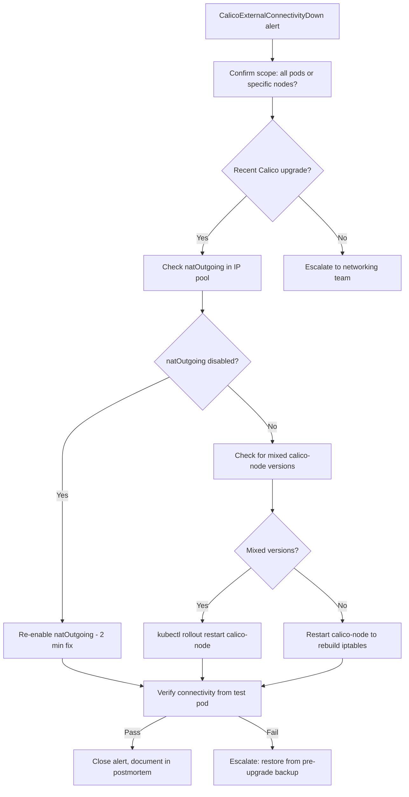

# Runbook: External Connectivity Broken After Calico Upgrade

Author: [nawazdhandala](https://github.com/nawazdhandala)

Tags: Calico, Kubernetes, Networking, Troubleshooting, Runbook

Description: On-call runbook for responding to external connectivity failures after Calico upgrades, including triage steps, escalation criteria, and rollback procedures.

---

## Introduction

This runbook guides on-call engineers through responding to external connectivity failures caused by Calico upgrades. External connectivity loss is a high-severity incident because it affects all pod-initiated outbound traffic - API calls, database connections, and egress webhooks all fail simultaneously.

The response focuses on quickly identifying whether the issue stems from a recent Calico upgrade and then applying the appropriate targeted fix. In most cases, re-enabling natOutgoing or completing an interrupted upgrade restores connectivity within minutes.

## Symptoms

- Alert: `CalicoExternalConnectivityDown` firing
- Pods cannot reach external IPs or DNS names
- Recent Calico upgrade in the last 24-48 hours

## Root Causes

- natOutgoing disabled or changed during upgrade
- Calico upgrade incomplete - mixed versions on nodes
- iptables MASQUERADE rules missing post-upgrade

## Diagnosis Steps

**Step 1: Confirm impact scope**

```bash
# Test from multiple pods across different nodes
for NODE in $(kubectl get nodes -o jsonpath='{.items[*].metadata.name}'); do
  POD=$(kubectl get pods -n kube-system -l k8s-app=calico-node \
    --field-selector spec.nodeName=$NODE -o jsonpath='{.items[0].metadata.name}')
  echo -n "Node $NODE: "
  kubectl exec $POD -n kube-system -- ping -c 1 -W 2 8.8.8.8 > /dev/null 2>&1 && echo "OK" || echo "FAIL"
done
```

**Step 2: Check if recent Calico upgrade occurred**

```bash
# Check recent daemonset changes
kubectl rollout history daemonset calico-node -n kube-system
kubectl describe daemonset calico-node -n kube-system | grep -i "image\|updated"
```

**Step 3: Check natOutgoing**

```bash
calicoctl get ippool -o yaml | grep -E "natOutgoing|name:"
# Expected: natOutgoing: true
```

**Step 4: Check for mixed versions**

```bash
kubectl get pods -n kube-system -l k8s-app=calico-node \
  -o jsonpath='{range .items[*]}{.metadata.name}{"\t"}{.spec.containers[0].image}{"\n"}{end}'
```

**Step 5: Verify iptables MASQUERADE rules**

```bash
ssh <node-name> "sudo iptables -t nat -L POSTROUTING -n | grep MASQUERADE"
```

## Solution

**If natOutgoing disabled - restore it:**

```bash
calicoctl patch ippool default-ipv4-ippool \
  --patch='{"spec":{"natOutgoing":true}}'
```

**If mixed versions - complete the upgrade:**

```bash
kubectl rollout restart daemonset calico-node -n kube-system
kubectl rollout status daemonset calico-node -n kube-system --timeout=300s
```

**If iptables rules missing - restart calico-node:**

```bash
kubectl rollout restart daemonset calico-node -n kube-system
```

**Emergency rollback - restore from backup:**

```bash
# If issue persists and you have pre-upgrade backup
calicoctl apply -f /backup/calico-pre-upgrade/ippools.yaml
```

**Verify resolution:**

```bash
kubectl run ext-test --image=busybox --restart=Never -- sleep 60
kubectl exec ext-test -- wget -qO- --timeout=10 http://1.1.1.1
kubectl delete pod ext-test
```



## Escalation

- 0-5 min: Re-enable natOutgoing or restart calico-node
- 5-15 min: If no improvement, restore from pre-upgrade backup
- 15+ min: Escalate to Calico / networking team lead

## Prevention

- Run pre-upgrade checklist with natOutgoing verification step
- Test external connectivity in staging before production upgrades
- Monitor connectivity probes during all Calico upgrade windows

## Conclusion

External connectivity failures after Calico upgrades are typically resolved in minutes by re-enabling natOutgoing or restarting calico-node to rebuild iptables rules. Always verify the fix from a test pod before closing the incident.
