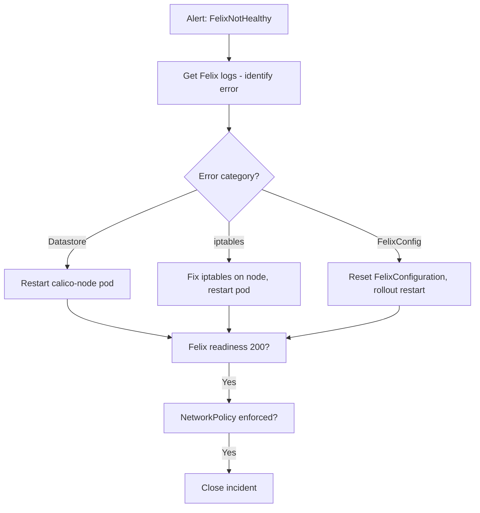

# Runbook: Felix Not Starting in Calico

Author: [nawazdhandala](https://github.com/nawazdhandala)

Tags: Calico, Kubernetes, Networking, Troubleshooting

Description: On-call runbook for diagnosing and resolving Felix startup failures in Calico with log analysis and targeted fix procedures.

---

## Introduction

This runbook guides engineers through resolving Felix startup failures. Felix not starting means NetworkPolicy is not being enforced on the affected node and routing may be impaired. The triage focuses on Felix-specific log analysis and iptables/kernel verification.

## Symptoms

- Alert: `FelixNotHealthy` firing
- calico-node pod Running but readiness probe failing
- NetworkPolicy changes not taking effect on the node

## Root Causes

- Datastore connectivity, iptables tools, or FelixConfiguration errors

## Diagnosis Steps

**Step 1: Identify affected node and pod**

```bash
kubectl get pods -n kube-system -l k8s-app=calico-node | grep "0/1"
export NODE_POD=<pod-name>
export NODE=$(kubectl get pod $NODE_POD -n kube-system -o jsonpath='{.spec.nodeName}')
```

**Step 2: Get Felix error from logs**

```bash
kubectl logs $NODE_POD -n kube-system | grep -i "felix\|ERROR\|FATAL\|panic" | tail -20
```

**Step 3: Check Felix readiness endpoint**

```bash
kubectl exec $NODE_POD -n kube-system -- \
  wget -qO- http://localhost:9099/readiness 2>/dev/null
```

## Solution

**If datastore error:**

```bash
# Restart calico-node to retry datastore connection
kubectl delete pod $NODE_POD -n kube-system
```

**If iptables error:**

```bash
ssh $NODE "iptables --version"
ssh $NODE "apt-get install -y iptables-legacy 2>/dev/null || yum install -y iptables 2>/dev/null"
kubectl delete pod $NODE_POD -n kube-system
```

**If FelixConfiguration error:**

```bash
calicoctl delete felixconfiguration default 2>/dev/null || true
kubectl rollout restart daemonset calico-node -n kube-system
kubectl rollout status daemonset calico-node -n kube-system
```

**Verify**

```bash
kubectl get pod $NODE_POD -n kube-system
kubectl exec $NODE_POD -n kube-system -- wget -qO- http://localhost:9099/readiness 2>/dev/null
```



## Prevention

- Run Felix prereqs check on new nodes
- Monitor Felix readiness metric with early alert
- Validate FelixConfiguration changes before production

## Conclusion

Felix startup failures are resolved by identifying the specific error from logs and applying the matching fix. The three common categories (datastore, iptables, FelixConfig) each have a specific resolution. Verify Felix readiness via the health endpoint after applying the fix.
