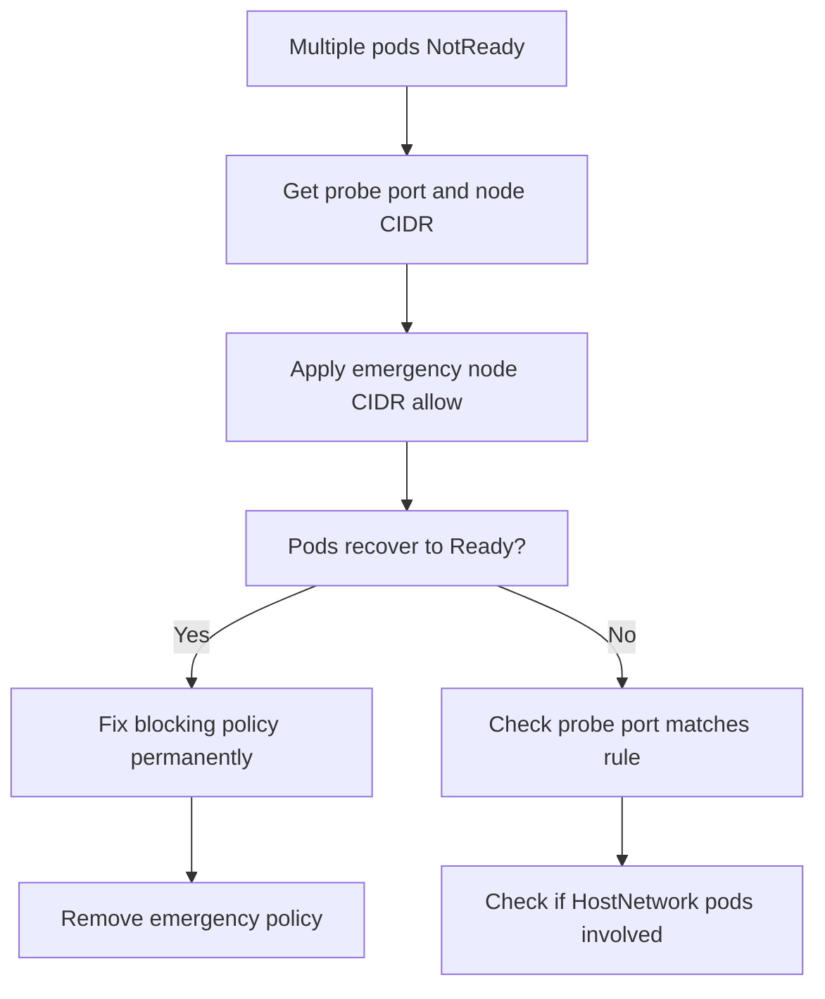

# Runbook: Health Checks Failing After Enabling Calico Policies

Author: [nawazdhandala](https://github.com/nawazdhandala)

Tags: Calico, Kubernetes, Networking, Troubleshooting

Description: On-call runbook for resolving health check probe failures caused by Calico NetworkPolicies with fast recovery procedures and root cause identification.

---

## Introduction

This runbook guides on-call engineers through resolving health check failures triggered by Calico NetworkPolicy changes. The defining symptom of this class of incident is multiple pods becoming NotReady simultaneously in a namespace shortly after a NetworkPolicy is applied or modified.

Because this failure pattern is fast and specific, the runbook is organized for speed: identify the namespace and the blocking policy, apply the node CIDR fix, and verify probe recovery. The entire sequence should complete within 10 minutes.

## Symptoms

- Alert: `MultiplePodsNotReady` firing for a specific namespace
- Pods cycling through NotReady with probe failure events
- `kubectl get events -n <ns>` shows `Liveness probe failed` or `Readiness probe failed`

## Root Causes

- Ingress NetworkPolicy applied without node CIDR ipBlock allow
- Recently deployed default-deny policy blocking kubelet probe traffic

## Diagnosis Steps

**Step 1: Identify affected namespace and probe failure details**

```bash
kubectl get pods --all-namespaces | grep "0/"
kubectl get events -n <namespace> | grep -i "probe\|unhealthy" | tail -10
```

**Step 2: Get probe port from pod spec**

```bash
kubectl describe pod <pod-name> -n <namespace> | grep -A 5 "Liveness:\|Readiness:"
# Note the port number used by the probe
```

**Step 3: Get node CIDR**

```bash
kubectl get nodes -o jsonpath='{range .items[*]}{.status.addresses[?(@.type=="InternalIP")].address}{"\n"}{end}'
# Identify the encompassing CIDR, e.g., 10.0.0.0/8
```

**Step 4: Find the blocking policy**

```bash
kubectl get networkpolicy -n <namespace> \
  --sort-by='.metadata.creationTimestamp'
```

## Solution

**Apply node CIDR allow immediately**

```bash
NS=<affected-namespace>
PROBE_PORT=<probe-port>
NODE_CIDR=<node-cidr>

cat <<EOF | kubectl apply -f -
apiVersion: networking.k8s.io/v1
kind: NetworkPolicy
metadata:
  name: emergency-allow-kubelet-probes
  namespace: $NS
spec:
  podSelector: {}
  policyTypes:
  - Ingress
  ingress:
  - from:
    - ipBlock:
        cidr: $NODE_CIDR
    ports:
    - protocol: TCP
      port: $PROBE_PORT
EOF

# Watch pods recover
kubectl get pods -n $NS --watch
```

**Verify probe recovery**

```bash
kubectl wait pods -n $NS --all --for=condition=Ready --timeout=120s
kubectl get events -n $NS | grep -i "probe" | tail -5
# Expected: no new probe failures
```

**Update the blocking policy permanently**

```bash
kubectl edit networkpolicy <blocking-policy> -n $NS
# Add ipBlock for node CIDR and probe port
# Then remove the emergency policy
kubectl delete networkpolicy emergency-allow-kubelet-probes -n $NS
```



## Prevention

- Include node CIDR ipBlock in all namespace ingress policy templates
- Test pod readiness immediately after applying any ingress NetworkPolicy
- Alert on namespace-level pod readiness drops as an early warning

## Conclusion

Health check failures from Calico NetworkPolicies are resolved by adding a node CIDR ipBlock ingress rule for the probe port. Apply the emergency allow first to restore pod readiness, then update the blocking policy permanently and remove the emergency workaround.
